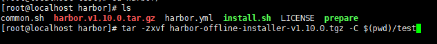

### [Harbor](https://github.com/goharbor/harbor)

​		使用Docker中的**registry**可以很轻松的搭建一个个人仓库，但是emmm还是略显简陋，网上找了下发现有个Harbor的软件不仅自带了页面，还把镜像展示、权限控制都一把梭的都带上了，最可恶的是打开github一看发现居然10.4k的star，emmm，真香。

---

**1.**下载harbor，在github中可以找到下载地址。eg. https://github.com/goharbor/harbor/releases/download/v1.10.0/harbor-offline-installer-v1.10.0.tgz，下载有离线版和在线版，这里给的是离线版(因为在线版老是失败，也不知道搞什么飞机)。

**2.**创建一个https证书，这样配置会简单一些

```shell
openssl req -newkey rsa:2048 -nodes -sha256 -keyout /root/zq/harbor/ssl/domain.key -x509 -days 365 -out /root/zq/harbor/ssl/domain.crt
```

给出提示一直按回车键就好，完成后会发现**/root/zq/harbor/ssl**目录下多出两个文件

**3.**上传harbor压缩包到服务器并解压

```shell
tar -zxvf harbor-offline-installer-v1.10.0.tgz
```



**4.**修改**harbor.yml**文件

```yaml
#修改为当前服务器的ip
hostname: 192.168.187.201
http:
  port: 80
https:
  #第二步中配置的证书位置
  certificate: /root/harbor/ssl/domain.crt
  private_key: /root/harbor/ssl/domain.key
#初始化的密码
harbor_admin_password: 123456
```

**5.**执行`install.sh`就好了，不出意外的话应该可以一路到成功。反正我成功了。访问192.168.187.201，你的ip地址就可以看到界面了


---

**Q1.**如何上传?

​		使用 **docker tag**命令将镜像改为 **ip/项目名/镜像名**的格式(eg.119.23.29.13/saber/jibtest1)。然后使用**docker push**将镜像推送上去即可。遇见401之类的错误可能是没有权限，需要执行**docker login 你的ip**操作一下，账号密码可以创建也可以使用admin。

