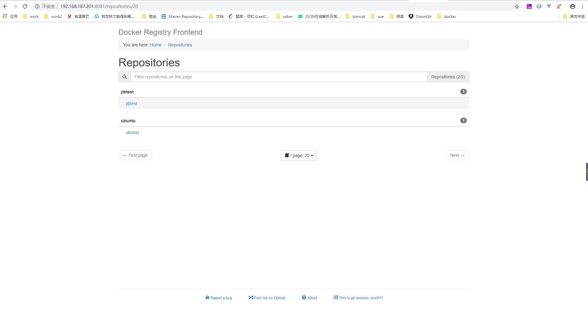
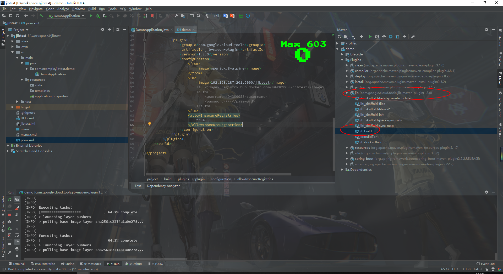
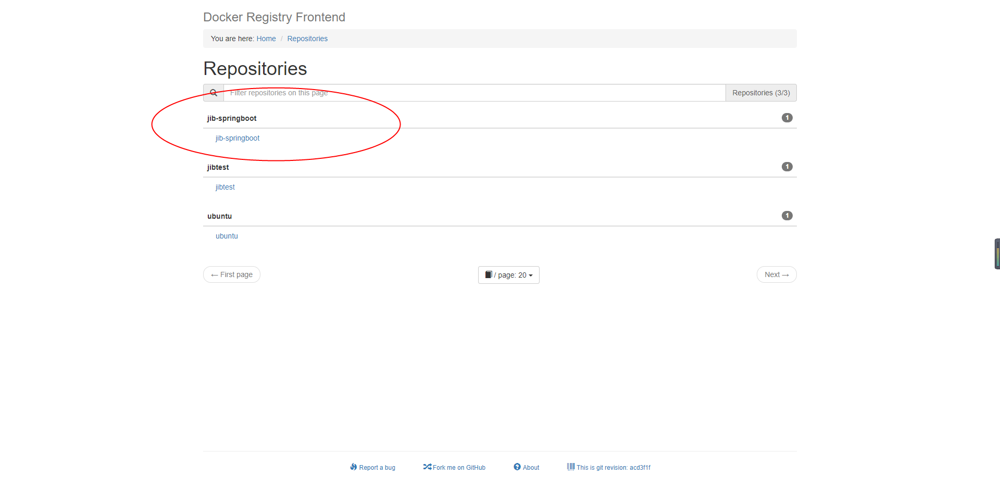
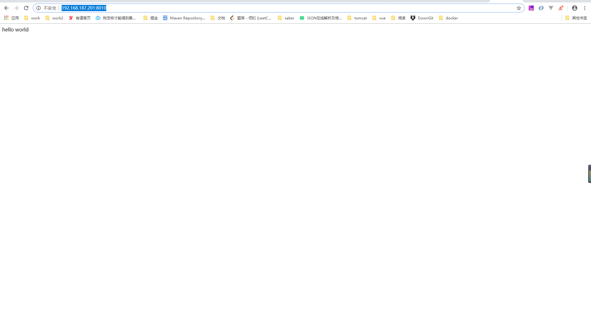
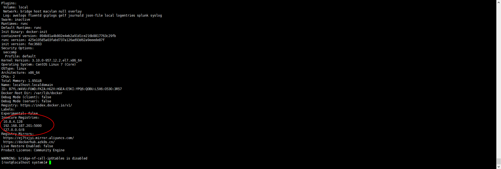

### Java应用Docker容器化

​		使用Docker启动项目的步骤一般来说有**打包** -- **DockerFile创建镜像** -- **启动容器** ，一般来说需要三步，然后其中**DockerFile**的编写还是有些麻烦的，刚好了解到谷歌有个**Jib**能够跳过**DockerFile**直接创建镜像。所以刚好尝试一下。

---

1. 创建**Docker**的私服仓库 [registry](https://hub.docker.com/_/registry)

   ```bash
   ##官方镜像
   docker run -d -p 5000:5000 --restart always --name registry registry:2
   ```

   只要一行代码即可，浏览器输入**192.168.187.201:5000/v2/_catalog**可以查看私服容器

2. 根据网页查看私服容器有些不太方便，在DockerHub上随便找了一个界面 [docker-registry-frontend](https://hub.docker.com/r/konradkleine/docker-registry-frontend)

   ```bash
   docker run \
     -d \
     -e ENV_DOCKER_REGISTRY_HOST=192.168.187.201 \
     -e ENV_DOCKER_REGISTRY_PORT=5000 \
     -p 8081:80 \
     konradkleine/docker-registry-frontend:v2
   ```
   
   启动成功后可以浏览器访问到
   
   
   
3. 创建一个简单的**SpringBoot**项目，写一个简单的接口

   ```java
   @SpringBootApplication
   @RestController
   public class DemoApplication {
   
       public static void main(String[] args) {
           SpringApplication.run(DemoApplication.class, args);
       }
   
       @GetMapping("/")
       public String test() {
           return "hello world";
       }
   
   }
   ```

4. 配置 [Jib](https://github.com/GoogleContainerTools/jib/tree/master/jib-maven-plugin#quickstart)

   ```xml
   <plugin>
       <groupId>com.google.cloud.tools</groupId>
       <artifactId>jib-maven-plugin</artifactId>
       <version>1.8.0</version>
       <configuration>
           <from>
               <image>openjdk:8-alpine</image>
           </from>
           <to>
               <image>192.168.187.201:5000/jib-springboot</image>
               <!--<image> registry.hub.docker.com/494309953/jibtest</image>
                 <auth>
                  <username>494309953</username>
                  <password>***</password>
                 </auth>-->
           </to>
        	<!-- 因为是上传私服，走的是http，这里必须配置 -->
           <allowInsecureRegistries>
               true
           </allowInsecureRegistries>
       </configuration>
   </plugin>
   ```

5. 配置完成后，maven命令那里会多出jib相关的命令

   

   当然也可以手动执行命令**mvn compile jib:build**，效果是一样的，当控制台到100%的时候打包完成并且上传到私库。可以从私库web界面看到

   

6. 启动docker容器

   ```bash
   docker run -it -p 8010:8080 192.168.187.201:5000/jib-springboot:latest
   ```

   浏览器输入: http://192.168.187.201:8010

   

   可以看到返回值，部署成功。

   ---

   #### 坑：

   ​		遇到一个坑就是上传镜像默认是只支持https，所以可能会遇见提示不安全连接之类的错误，一开始我以为是要修改私服docker的配置，emmm，结果半天没成功，后来想到会不会是要配置本地**docker**，但是因为我用的**Jib**，本地并没有装docker，最后才想到查找**Jib**文档，发现了**allowInsecureRegistries**这个配置

   **Docker**支持http的步骤

   1. 修改docker配置文件。

      ```bash
      vim /etc/docker/daemon.json
      ```

      ```json
      {
        "registry-mirrors": [
          "https://ej7txjyi.mirror.aliyuncs.com",
          "https://dockerhub.azk8s.cn"
        ],
        "insecure-registries":[
          "192.168.187.201:5000",
          "10.8.4.128"
        ]
      }
      
      ```

      主要是**insecure-registries**配置，将私服仓库的地址和端口加入即可。

      **registry-mirrors**是配置国内镜像源的

   2. 重启**Docker**

      ```bash
      systemctl daemon-reload
      systemctl restart docker
      ```

   3. 查看**Docker**信息

      ```bash
      docker info
      ```

      

      可以找到自己的配置就说明成功了