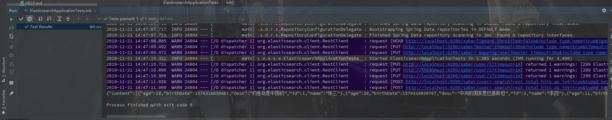
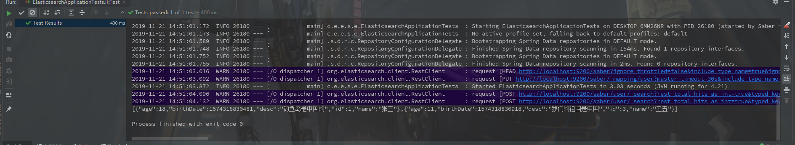
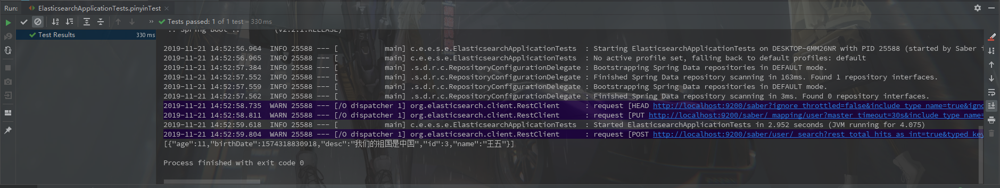

### Spring-boot-starter-data-elasticsearch

​		因为是SpringBoot默认推荐的ES操作库，继承学习比较方便，用过之后发现的确比较方便。比起用**HttpClient**之类的网络请求库操作肯定要好太多。

**pom.xml**

```xml
<dependencies>
    <dependency>
        <groupId>org.springframework.boot</groupId>
        <artifactId>spring-boot-starter-data-elasticsearch</artifactId>
    </dependency>
    
    <dependency>
        <groupId>com.alibaba</groupId>
        <artifactId>fastjson</artifactId>
        <version>1.2.62</version>
    </dependency>
</dependencies>
```

​		**spring-boot-starter-data-elasticsearch**可以说继承了**Spring-data**系列的一贯传统，类似**Spring-data-jpa**数据对应实体，不需要直接操作数据，而是通过操作实体的方式来操作数据。

​		配置文件**application.properties**，因为用的都是默认的配置文件，所以配置文件啥都可以不填，如果不是本机默认地址的话可以通过下边的属性进行设置

```properties
spring.elasticsearch.rest.username=
spring.elasticsearch.rest.password=
```

创建实体类

**User.java**

```java
@Data
@NoArgsConstructor
@AllArgsConstructor
@Builder
@Document(indexName = "saber",type = "user")
@Setting(settingPath = "/setting/User.json")
public class User {

    @Id
    private Long id;

    @MultiField(
            mainField = @Field(type = FieldType.Text, analyzer = "ik_max_word", searchAnalyzer = "ik_smart"),
            otherFields = @InnerField(suffix = "pinyin", type = FieldType.Text, analyzer = "pinyin_analyzer")
    )
    private String name;

    @Field(type = FieldType.Integer)
    private Integer age;

    @Field(type = FieldType.Date)
    private Date birthDate;

    @Field(type = FieldType.Text, analyzer = "ik_max_word", searchAnalyzer = "ik_smart")
    private String desc;

}
```

- **@Document**指定了index
- **@Setting**指定了这个**index**的设置，这里是设置了中文拼音的配置pinyin
- **@Id**就是指定id咯
- **@MultiField**指定了**ik**的中文分词和中文拼音**pinyin**
- **@Field**指定的就是普通的列
- 如果不需要中文拼音的话也是直接使用**@Field**然后指定**analyzer**和**searchAnalyzer**就好

  **/setting/User.json**	配置文件放在**resources**目录下

```json
{
  "index" : {
    "analysis" : {
      "analyzer" : {
        "pinyin_analyzer" : {
          "tokenizer" : "my_pinyin"
        }
      },
      "tokenizer" : {
        "my_pinyin" : {
          "type" : "pinyin",
          "keep_separate_first_letter" : false,
          "keep_full_pinyin" : true,
          "keep_original" : true,
          "limit_first_letter_length" : 16,
          "lowercase" : true,
          "remove_duplicated_term" : true
        }
      }
    }
  }
}
```

**UserDao.java**

```java
public interface UserDao extends ElasticsearchRepository<User, Long> {

    List<User> findByDesc(String desc);

    List<User> findByName(String name);

    @Query("{\"query_string\": {\"default_field\": \"name.pinyin\",\"query\": \"?0\"}}")
    List<User> findByPinyinName(String name);
}
```

**dao**层需要继承**ElasticsearchRepository**，默认实现有一些简单的新增，查询和删除接口。**Spring-data**还有比较黑科技的一点就是可以根据方法名查询对应的数据，如果是使用**idea**开发的话，编辑器会自动给出提示，至于方法的意思看方法名大概就能了解了。而且还提供了**@Query**注解供开发者自定义查询语句，要说不好的话大概就是使用**?0**这种方式表示了参数，而不是**#{}**形式有点不符合习惯。

---

以上就是所有的测试代码了。

**插入测试**

```java
@Test
void init() {
    userDao.save(User.builder()
                 .id(1L)
                 .name("张三")
                 .age(18)
                 .birthDate(new Date())
                 .desc("钓鱼岛是中国的")
                 .build());

    userDao.save(User.builder()
                 .id(2L)
                 .name("李四")
                 .age(20)
                 .birthDate(new Date())
                 .desc("中间的国家是巴基斯坦")
                 .build());

    userDao.save(User.builder()
                 .id(3L)
                 .name("王五")
                 .age(11)
                 .birthDate(new Date())
                 .desc("我们的祖国是中国")
                 .build());

    System.out.println(JSON.toJSONString(userDao.findAll()));
}
```

运行结果:



执行通过且打印了插入的三条日志.

**ik中文分词查询**

```java
@Test
void ikTest() {
    List<User> user = userDao.findByDesc("中国");
    System.out.println(JSON.toJSONString(user));
}
```

运行结果:



结果和**kibana**中结果一致，测试通过

**pinyin中文分词查询**

```java
@Test
void pinyinTest() {
    List<User> user = userDao.findByPinyinName("wang");
    System.out.println(JSON.toJSONString(user));
}
```

运行结果:



因为这里是只对姓名进行了pinyin分词的处理，所以按名字查出王五，与预期结果一致。

#### 总结

​		以上就是关于Java中操作ES的简单教程，但麻雀虽小五脏俱全，类似中文分词和拼音分词功能也都算是加上了，可以作为入门学习参考