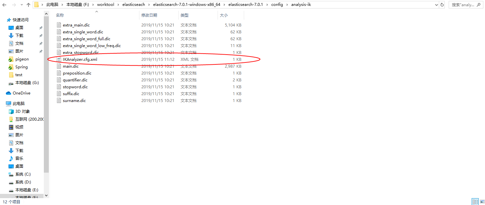

### [Elasticsearch-analysis-ik](https://github.com/medcl/elasticsearch-analysis-ik)

#### 安装方式

1. 下载对应的插件版本，进入**Elasticsearch**安装目录下的**plugins**,创建**ik**文件夹并加压插件到目录下。

   地址：<https://github.com/medcl/elasticsearch-analysis-ik/releases>

   > create plugin folder `cd your-es-root/plugins/ && mkdir ik`
   >
   > unzip plugin to folder `your-es-root/plugins/ik`

2. 或者使用**Elasticsearch**安装目录**bin**下边的工具**elasticsearch-plugin**

   > ./bin/elasticsearch-plugin install https://github.com/medcl/elasticsearch-analysis-ik/releases/download/v6.3.0/elasticsearch-analysis-ik-6.3.0.zip
   
3. 重启**Elasticsearch**


#### 测试使用

在**kibana**中测试

1. 创建一个index和mapping

   ```
   //创建一个index
   PUT /iktest
   
   //创建mapping
   PUT /iktest/_mapping
   {
     "properties": {
         "content": {
             "type": "text",
             "analyzer": "ik_max_word",
             "search_analyzer": "ik_smart"
         }
     }
   }
   //返回结果
   {
     "acknowledged" : true
   }
   ```

2. 添加几条测试数据

   ```
   POST /iktest/_create/1
   {"content":"美国留给伊拉克的是个烂摊子吗"}
   
   POST /iktest/_create/2
   {"content":"公安部：各地校车将享最高路权"}
   
   POST /iktest/_create/3
   {"content":"中韩渔警冲突调查：韩警平均每天扣1艘中国渔船"}
   
   POST /iktest/_create/4
   {"content":"中国驻洛杉矶领事馆遭亚裔男子枪击 嫌犯已自首"}
   ```

3. 查询测试

   ```
   //指令
   GET /iktest/_search
   {
     "query": {
       "match": {
         "content": "中国"
       }
     }
   }
   //结果
   {
     "took" : 0,
     "timed_out" : false,
     "_shards" : {
       "total" : 1,
       "successful" : 1,
       "skipped" : 0,
       "failed" : 0
     },
     "hits" : {
       "total" : {
         "value" : 2,
         "relation" : "eq"
       },
       "max_score" : 0.6489038,
       "hits" : [
         {
           "_index" : "iktest",
           "_type" : "_doc",
           "_id" : "3",
           "_score" : 0.6489038,
           "_source" : {
             "content" : "中韩渔警冲突调查：韩警平均每天扣1艘中国渔船"
           }
         },
         {
           "_index" : "iktest",
           "_type" : "_doc",
           "_id" : "4",
           "_score" : 0.6192584,
           "_source" : {
             "content" : "中国驻洛杉矶领事馆遭亚裔男子枪击 嫌犯已自首"
           }
         }
       ]
     }
   }
   ```

   可以看到已经可以进行中文单词查询了

4. 其他几个指令

   ```
   //查看mapping状态
   GET /iktest/_mapping
   //返回值
   {
     "iktest" : {
       "mappings" : {
         "properties" : {
           "content" : {
             "type" : "text",
             "analyzer" : "ik_max_word",
             "search_analyzer" : "ik_smart"
           }
         }
       }
     }
   }
   
   //查看分析
   GET /iktest/_analyze
   {
     "text":"中华人民共和国MN",
     "tokenizer": "ik_max_word"
   }
   
   GET /iktest/_analyze
   {
     "text":"中华人民共和国MN",
     "tokenizer": "ik_smart"
   }
   ```

5. 从上边查看分析可以知道`ik_max_word` 和`ik_smart` 什么区别

   > ik_max_word: 会将文本做最细粒度的拆分，比如会将“中华人民共和国国歌”拆分为“中华人民共和国,中华人民,中华,华人,人民共和国,人民,人,民,共和国,共和,和,国国,国歌”，会穷尽各种可能的组合，适合 Term Query；
   >
   > ik_smart: 会做最粗粒度的拆分，比如会将“中华人民共和国国歌”拆分为“中华人民共和国,国歌”，适合 Phrase 查询。

#### 扩展字典

根据官网可以知道配置文件`IKAnalyzer.cfg.xml`一般会在``{conf}/analysis-ik/config/IKAnalyzer.cfg.xml` or `{plugins}/elasticsearch-analysis-ik-*/config/IKAnalyzer.cfg.xml`。



找到配置文件目录可以发现下边已经提供有一些字典可供选择，像之前发现ES无法根据单个汉子搜索，这时候修改配置文件

```xml
<?xml version="1.0" encoding="UTF-8"?>
<!DOCTYPE properties SYSTEM "http://java.sun.com/dtd/properties.dtd">
<properties>
	<comment>IK Analyzer 扩展配置</comment>
	<!--用户可以在这里配置自己的扩展字典 -->
	<entry key="ext_dict">extra_single_word.dic</entry>
	 <!--用户可以在这里配置自己的扩展停止词字典-->
	<entry key="ext_stopwords"></entry>
	<!--用户可以在这里配置远程扩展字典 -->
	<!-- <entry key="remote_ext_dict">words_location</entry> -->
	<!--用户可以在这里配置远程扩展停止词字典-->
	<!-- <entry key="remote_ext_stopwords">words_location</entry> -->
</properties>
```

将这个单个字的词典加入进来就好了，之后有时间再验证一下远程扩展字典。