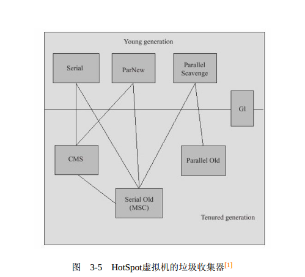
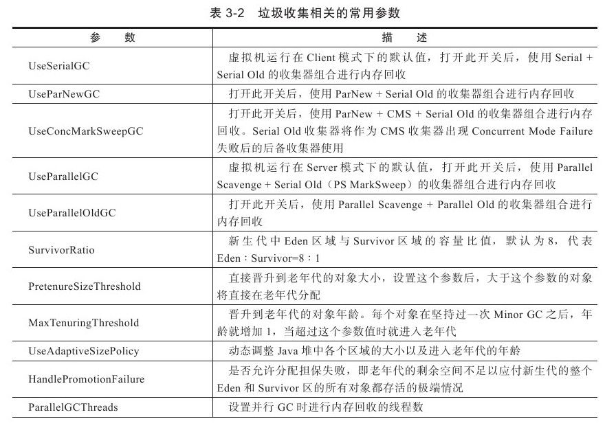
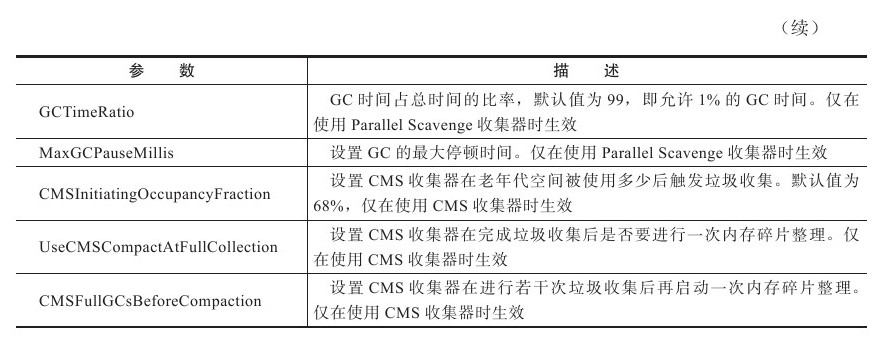

### Jvm垃圾回收

---

#### 垃圾回收算法

- 引用计数算法：

  > 给对象中添加一个引用计数器，每当有一个地方引用它时，计数器值就加1；当引用失效
  > 时，计数器值就减1；任何时刻计数器为0的对象就是不可能再被使用的。 

  缺点:

  1. 很难解决对象之间相互循环引用的问题

- 可达性分析算法 ：

  > 这个算法的基本思路就是通过一系列的称为“GC Roots”的对象作为起始点，从这些节点开始向下搜索，搜索所走过的路径称为引用链（Reference Chain），当一个对象到GC Roots没有任何引用链相连（用图论的话来说，就是从GC Roots到这个对象不可达）时，则证明此对象是不可用的。 

---

#### 垃圾收集算法

- ##### 标记-清除算法 

  > 最基础的收集算法是“标记-清除”（Mark-Sweep）算法，如同它的名字一样，算法分为“标记”和“清除”两个阶段：首先标记出所有需要回收的对象，在标记完成后统一回收所有被标记的对象 

  缺点:

  1. 效率问题，标记和清除两个过程的效率都不高。
  2. 空间问题，标记清除之后会产生大量不连续的内存碎片，空间碎片太多可能会导致以后在程序运行过程中需要分配较大对象时，无法找到足够的连续内存而不得不提前触发另一次垃圾收集动作。

- ##### 复制算法 

  > 为了解决效率问题，一种称为“复制”（Copying）的收集算法出现了，它将可用内存按容量划分为大小相等的两块，每次只使用其中的一块。当这一块的内存用完了，就将还存活着的对象复制到另外一块上
  > 面，然后再把已使用过的内存空间一次清理掉。 

  优点:

  1. 这样使得每次都是对整个半区进行内存回收，内存分配时也就不用考虑内存碎片等复杂情况，只要移动堆顶指针，按顺序分配内存即可，实现简单，运行高效 。

  缺点:

  1. 代价是将内存缩小为了原来的一半，未免太高了一点。

- ##### 标记-整理算法 

  > “标记-整理”（MarkCompact）算法，标记过程仍然与“标记-清除”算法一样，但后续步骤不是直接对可回收对象进行清理，而是让所有存活的对象都向一端移动，然后直接清理掉端边界以外的内存 。

- ##### 分代收集算法 

  > 这种算法并没有什么新的思想，只是根据对象存活周期的不同将内存划分为几块。一般是把Java堆分为新生代和老年代，这样就可以根据各个年代的特点采用最适当的收集算法。在新生代中，每次垃圾收集时都发现有大批对象死去，只有少量存活，那就选用复制算法，只需要付出少量存活对象的复制成本就可以完成收集。而老年代中因为对象存活率高、没有额外空间对它进行分配担保，就必须使用“标记—清理”或者“标记—整理”算法来进行回收。 

---

#### HotSpot的算法实现 

1. ##### 枚举根节点 

   ​		可达性分析对执行时间的敏感还体现在GC停顿上，因为这项分析工作必须在一个能确保一致性的快照中进行——这里“一致性”的意思是指在整个分析期间整个执行系统看起来就像被冻结在某个时间点上，不可以出现分析过程中对象引用关系还在不断变化的情况，该点不满足的话分析结果准确性就无法得到保证。这点是导致GC进行时必须停顿所有Java执行线程（Sun将这件事情称为“Stop The World”）的其中一个重要原因，即使是在号称（几乎）不会发生停顿的CMS收集器中，枚举根节点时也是必须要停顿的 。

   > 在HotSpot的实现中，是使用一组称为**OopMap**的数据结构来保存根节点的

2. ##### 安全点 

   > **OopMap**里边的内容变化非常多，如果每执行一条指令都要变化的话会需要大量的额外空间和性能，所以只需要在**特定的位置**更新记录就可以了，这些位置就是**安全点**。这些位置一般有**方法调用、循环跳转、异常跳转等 **

   在虚拟机发生GC时让所有线程都跑到最近的安全点上再停下有**抢先式中断**和**主动式中断**两种方法

   - **抢先式中断**不需要线程的执行代码主动去配合，在GC发生时，首先把所有线程全部中断，如果发现有线程中断的地方不在安全点上，就恢复线程，让它“跑”到安全点上。现在几乎没有虚拟机实现采用抢先式中断来暂停线程从而响应GC事件。 
   - **主动式中断**的思想是当GC需要中断线程的时候，不直接对线程操作，仅仅简单地设置一个标志，各个线程执行时主动去轮询这个标志，发现中断标志为真时就自己中断挂起。轮询标志的地方和安全点是重合的，另外再加上创建对象需要分配内存的地方。 

3. ##### 安全区域 

   ​		使用Safepoint似乎已经完美地解决了如何进入GC的问题，但实际情况却并不一定。 Safepoint机制保证了程序执行时，在不太长的时间内就会遇到可进入GC的Safepoint。但是，程序“不执行”的时候呢？所谓的程序不执行就是没有分配CPU时间，典型的例子就是线程处于Sleep状态或者Blocked状态，这时候线程无法响应JVM的中断请求， “走”到安全的地方去中断挂起， JVM也显然不太可能等待线程重新被分配CPU时间。对于这种情况，就需要安全区域（Safe Region）来解决。 

   > 安全区域是指在一段代码片段之中，引用关系不会发生变化。在这个区域中的任意地方开始GC都是安全的。我们也可以把Safe Region看做是被扩展了的Safepoint。 

   ---

   #### 垃圾收集器
   
   
   
   ​		图3-5展示了7种作用于不同分代的收集器，如果两个收集器之间存在连线，就说明它们可以搭配使用。虚拟机所处的区域，则表示它是属于新生代收集器还是老年代收集器。

- ##### Serial收集器 

  > 单线程的收集器，但它的“单线程”的意义并不仅仅说明它只会使用一个CPU或一条收集线程去完成垃圾收集工作，更重要的是在它进行垃圾收集时，必须暂停其他所有的工作线程，直到它收集结束 

- ##### ParNew收集器 

  > ParNew收集器其实就是Serial收集器的多线程版本 

- ##### Parallel Scavenge收集器， 经常称为“吞吐量优先”收集器 

  > ​		Parallel Scavenge收集器是一个新生代收集器，它也是使用复制算法的收集器，又是并行的多线程收集器。
  >
  > ​		Parallel Scavenge收集器的特点是它的关注点与其他收集器不同，CMS等收集器的关注点是尽可能地缩短垃圾收集时用户线程的停顿时间，而Parallel Scavenge收集器的目标则是达到一个可控制的吞吐量（Throughput）。所谓吞吐量就是CPU用于运行用户代码的时间与CPU总消耗时间的比值，即吞吐量=运行用户代码时间/（运行用户代码时间+垃圾收集时间），虚拟机总共运行了100分钟，其中垃圾收集花掉1分钟，那吞吐量就是99%。 

  Parallel Scavenge收集器提供了两个参数用于精确控制吞吐量，分别是控制最大垃圾收集停顿时间的                **-XX： MaxGCPauseMillis**参数以及直接设置吞吐量大小的**-XX： GCTimeRatio**参数。 

- ##### Serial Old收集器 

  > Serial收集器的老年代版本，它同样是一个单线程收集器，使用“标记-整理”算法。
  >
  > 需要说明一下， Parallel Scavenge收集器架构中本身有PS MarkSweep收集器来进行老年代收集，并非直接使用了Serial Old收集器，但是这个PS MarkSweep收集器与Serial Old的实现非常接近，所以在官方的许多资料中都是直接以Serial Old代替PS MarkSweep进行讲解。

- ##### Parallel Old收集器 

  > Parallel Old是Parallel Scavenge收集器的老年代版本，使用多线程和“标记-整理”算法。 

- ##### CMS收集器 

  > CMS（Concurrent Mark Sweep）收集器是一种以获取最短回收停顿时间为目标的收集器。目前很大一部分的Java应用集中在互联网站或者B/S系统的服务端上，这类应用尤其重视服务的响应速度，希望系统停顿时间最短，以给用户带来较好的体验。 CMS收集器就非常符合这类应用的需求。 

  从名字（包含“Mark Sweep”）上就可以看出， CMS收集器是基于“标记—清除”算法实现的，它的运作过程相对于前面几种收集器来说更复杂一些，整个过程分为4个步骤，包括：

  1. 初始标记（CMS initial mark）
  2. 并发标记（CMS concurrent mark）
  3. 重新标记（CMS remark）
  4. 并发清除（CMS concurrent sweep）

  其中，初始标记、重新标记这两个步骤仍然需要**Stop TheWorld**。 CMS默认启动的回收线程数是**（CPU数量+3） /4 **

  **-XX： CMSInitiatingOccupancyFraction**：提高触发百分比，以便降低内存回收次数从而获取更好的性能 ，在JDK 1.6中， CMS收集器的启动阈值已经提升至92%。 

  **-XX：+UseCMSCompactAtFullCollection **:用于在CMS收集器顶不住要进行FullGC时开启内存碎片的合并整理过程 ，默认就是开启的 

  **-XX： CMSFullGCsBeforeCompaction **：这个参数是用于设置执行多少次不压缩的Full GC后，跟着来一次带压缩的（默认值为0，表示每次进入**Full GC**时都进行碎片整理） 

- ##### G1收集器 

  > G1是一款面向服务端应用的垃圾收集器,与其他GC收集器相比， G1具备如下特点 
  
  - **并行与并发：** G1能充分利用多CPU、多核环境下的硬件优势，使用多个CPU（CPU或者CPU核心）来缩短Stop-The-World停顿的时间，部分其他收集器原本需要停顿Java线程执行的GC动作， G1收集器仍然可
    以通过并发的方式让Java程序继续执行。 
  - **分代收集：**与其他收集器一样，分代概念在G1中依然得以保留。虽然G1可以不需要其他收集器配合就能独立管理整个GC堆，但它能够采用不同的方式去处理新创建的对象和已经存活了一段时间、熬过多次 GC的旧对象以获取更好的收集效果。 
  - **空间整合：**与CMS的“标记—清理”算法不同， G1从整体来看是基于“标记—整理”算法实现的收集器，从局部（两个Region之间）上来看是基于“复制”算法实现的，但无论如何，这两种算法都意味着G1运作期
    间不会产生内存空间碎片，收集后能提供规整的可用内存。这种特性有利于程序长时间运行，分配大对象时不会因为无法找到连续内存空间而提前触发下一次GC。 
  - **可预测的停顿：**这是G1相对于CMS的另一大优势，降低停顿时间是G1和CMS共同的关注点，但G1除了追求低停顿外，还能建立可预测的停顿时间模型，能让使用者明确指定在一个长度为M毫秒的时间片段内，消耗在垃圾收集上的时间不得超过N毫秒，这几乎已经是实时Java（RTSJ）的垃圾收集器的特征了。 
  
- 

  

---

#### 一些Java启动的参数

##### 

