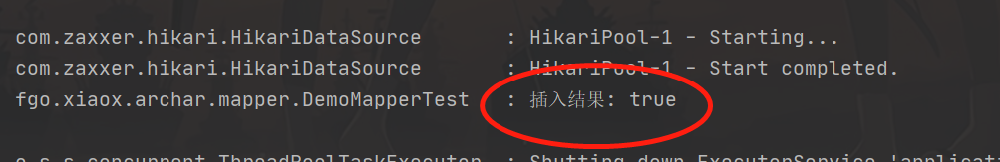

#### mybatis-plus中插入实体类使用enum

**1.** 在**application.yml**中配置:

```yaml
mybatis-plus:
  type-enums-package: fgo.xiaox.archar.entity.enums
  configuration:
    default-enum-type-handler: org.apache.ibatis.type.EnumOrdinalTypeHandler
```

**2.** 新建枚举类，注意路径需要在配置中的包下

```java
package fgo.xiaox.archar.entity.enums;

import com.baomidou.mybatisplus.annotation.EnumValue;
import com.fasterxml.jackson.annotation.JsonFormat;

@JsonFormat(shape = JsonFormat.Shape.OBJECT)
public enum  SexEnum {

    /**
     *
     */
    MAN(1, "男"),
    WOMAN(2, "女");

    @EnumValue
    private final int code;

    private final String descp;

    SexEnum(int code, String descp) {
        this.code = code;
        this.descp = descp;
    }

    public int getCode() {
        return code;
    }

    public String getDescp() {
        return descp;
    }
}
```

> ​		这里有两个注意点：**1.** **@EnumValue**是mybatis-plus的注解，对应的code是将要插入到数据库中的。**2.** **@JsonFormat(shape = JsonFormat.Shape.OBJECT)** 是**SpringMVC**接口返回格式化的，对应格式为包含code和descp字段的对象，如果只需要返回code，在code上注释**@JsonValue**即可。

**3.**将实体类中对应的类型改为枚举

```java
public class Demo implements Serializable {

    private static final long serialVersionUID = 1L;

    private Long id;

    /**
     * 名字
     */
    private String name;

    /**
     * 年龄
     */
    private Integer age;

    /**
     * 性别(1-男，2-女)
     */
    private SexEnum sex;

    /**
     * 生日
     */
    private LocalDateTime birthdayTime;

}
```

**4.** 使用测试类测试一下：

- ​	首先是查询:

  ```java
  @Test
  public void list() {
      List<Demo> list = demoService.list();
      log.info("查询结果: {}", JSON.obj2String(list));
  }
  ```

  结果:

  

  发现枚举类可以正常序列化。

- 然后是插入

  ```java
  @Test
  public void saveOrUpdate() {
      boolean b = demoService.saveOrUpdate(Demo.builder()
                                           .name("周小小")
                                           .age(220)
                                           .sex(SexEnum.WOMAN.WOMAN)
                                           .birthdayTime(LocalDateTime.now())
                                           .build());
      log.info("插入结果: {}", b);
  }
  ```

  结果:

  

  日志插入成功，看数据库有也有新增数据。

**5.**接口返回使用枚举主要通过**jackson**，和**mybatis-plus**倒是没啥关系，但如果用的话都用的到，所以一起测试一下

写个简单接口，获取所有的数据

```java
@GetMapping("/list")
public JsonResult<List<Demo>> list() {
    return JsonResult.success(demoService.list());
}
```

枚举类使用如上的**@JsonFormat(shape = JsonFormat.Shape.OBJECT)**


结果是一个对象，换成**@JsonValue**试一下

```java
package fgo.xiaox.archar.entity.enums;

import com.baomidou.mybatisplus.annotation.EnumValue;
import com.fasterxml.jackson.annotation.JsonValue;

public enum  SexEnum {

    /**
     *
     */
    MAN(1, "男"),
    WOMAN(2, "女");

    @EnumValue
    @JsonValue
    private final int code;

    private final String descp;

    SexEnum(int code, String descp) {
        this.code = code;
        this.descp = descp;
    }

    public int getCode() {
        return code;
    }

    public String getDescp() {
        return descp;
    }
}

```

结果：


结果会变成只返回code，使用哪种可以自己视情况而定。

然后还有一个问题是当枚举作为参数时，如果是**Json**格式参数可以如上使用**@JsonView**进行解析，如果是**GET**类请求需要自己代码手动转一下或者基于**SpringMVC**自定义参数解析器。因为暂时也不想写，所以先就这把。