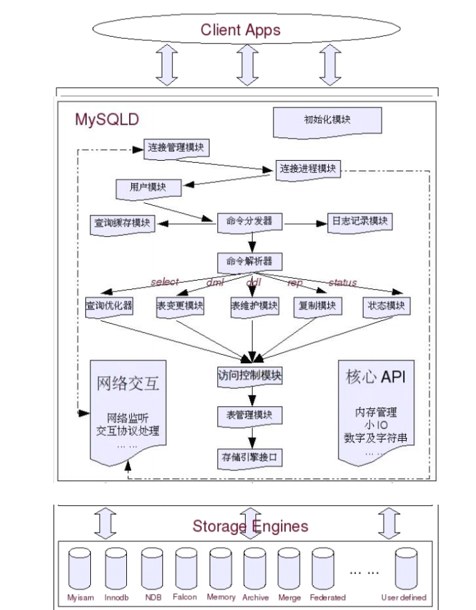

#### mysql结构图




#### innodb和myisam

|          |              Innodb               |                       Myisam                       |
| -------- | :-------------------------------: | :------------------------------------------------: |
| 存储文件 | .frm 表定义文件<br/>.ibd 数据文件 | frm 表定义文件<br/>.myd 数据文件<br/>.myi 索引文件 |
| 锁       |            表锁、行锁             |                        表锁                        |
| 事务     |               ACID                |                       不支持                       |
| CRUD     |              读、写               |                        读多                        |
| count    |               扫表                |                   专门存储的地方                   |
| 索引结构 |              B+ Tree              |                      B+ Tree                       |


#### 锁

- 共享锁

  ​		如果事务T对数据A加上共享锁后，则其他事务只能对A再加共享锁，不能加排他锁。获准共享锁的事务只能读数据，不能修改数据。

  ```mysql
  ###锁表
  lock table user read;
  ###锁行
  select ... lock in share mode;
  ```

- 排它锁

  ​		如果事务T对数据A加上排他锁后，则其他事务不能再对A加任任何类型的封锁。获准排他锁的事务既能读数据，又能修改数据。

  ```mysql
  ###锁表
  lock table user wirte;
  ###锁行
  select ... for update;
  ```

- 间隙锁

  ​		在索引记录之间的间隙上的锁，保证某个间隙内的数据在锁定情况下不会发生任何变化。间隙的范围是根据检索条件向下寻找最靠近检索条件的记录值A作为左区间，向上寻找最靠近检索条件的记录值B作为右区间，即锁定的间隙为（A，B）。

  | number | 1    | 2    | 3    | 4    | 5    | 6    | 6    | 6    | 11   |
  | ------ | ---- | ---- | ---- | ---- | ---- | ---- | ---- | ---- | ---- |
  | id     | 1    | 3    | 5    | 7    | 9    | 10   | 11   | 12   | 23   |

  select * from t where number=6;那么间隙锁锁定的间隙为：（5，11），所以你再想插入5到11之间的数就会被阻塞。

  ##### 锁优化

    1. 尽可能让所有数据检索都通过索引来完成
    2. 合理设计索引
    3. 减少基于范围的数据是检索过滤条件
    4. 控制事务大小
    5. 业务允许的情况下，使用较低级别的事务隔离


#### 索引

​	索引种类一般有**B-Tree**、**Hash**、**Fulltext**、**R-Tree**,一般常用的是**B-Trees**索引。

​	判断是否创建索引:

- 较频繁的作为查询条件的字段应该创建索引
- 唯一性太差的字段不适合单独创建索引
- 更新频繁的字段不适合创建索引
- 不会出现在where子句中的字段不该创建索引
- 联合索引的最左匹配原则

*最左匹配原则*  : 创建索引(A,B,C),此时查询语句where中可以使用到此索引的组合有A、AB、AC、ABC，其中sql的顺序会在查询优化自动匹配上。

此外联合索引还有以下几个原则：

1. 经常用的列优先（最左匹配原则）
2. 离散度高的列优先（离散度高原则）
3. 宽度小的列优先（最少空间原则）


#### ACID事务性

​		任何支持事务的数据库，都必须具备四个特性，分别是：原子性（Atomicity）、一致性（Consistency）、隔离性（Isolation）、持久性（Durability），也就是我们常说的事务ACID，这样才能保证事务（（Transaction）中数据的正确性。

**四大隔离级别:**

- 读未提交（Read Uncommitted）
- 读提交（Read Committed）
- 可重复读（Repeated Read）
- 串行化（Serializable）

可以参考一篇博客:<https://baijiahao.baidu.com/s?id=1611918898724887602&wfr=spider&for=pc>