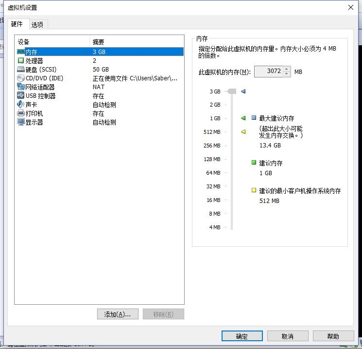

### Mysql性能测试

​		心血来潮的突然想起一直使用的mysql，貌似从来不知道性能几何，都是网上看的测试篇。emmm，所以想写个小Demo测试一下。

参考文：<https://segmentfault.com/a/1190000019177990>

---

本机配置：

>系统:	windows10
>
>cpu:	i7-7700	4核8线程
>
>内存：16G	2400MHZ
>
>硬盘：未知机械

因为是本地启动的VMware虚拟机，然后虚拟机又安装了一个docker启动的mysql。

虚拟机配置:



Mysql配置:

>//这里只调节了一下mysql的最大连接数
>
>set GLOBAL max_connections=1000;

#### 测试代码

```java
@Slf4j
public class OrderTest extends MysqltestApplicationTests {

    @Autowired
    private OrderMapper orderMapper;

    private StopWatch stopWatch;

    @Before
    public void before() {
        stopWatch = new StopWatch();
        stopWatch.start();
    }

    @After
    public void after() {
        stopWatch.stop();
        log.info(stopWatch.prettyPrint());
    }

    private static final ExecutorService executorService = Executors.newFixedThreadPool(100000);

    @Test
    @Rollback(false)
    public void insert() throws InterruptedException {

        int count = 10000;

        CountDownLatch countDownLatch = new CountDownLatch(count);

        for (int i = 0; i < count; i++) {
            executorService.execute(new Runnable() {
                @Override
                public void run() {
                    try {
                        Random random = new Random();
                        Order order = Order.builder()
                                .name("tk第"+ countDownLatch.getCount() +"个订单")
                                .price(random.nextInt() % 1000)
                                .userId(Math.abs(random.nextLong() % 100))
                                .build();
                        Integer count = orderMapper.insertSelective(order);
                        log.info("插入tk一条数据， {}", count);
//                        Order order = orderMapper.selectByPrimaryKey(36002698910236L);
                    } catch (Exception e) {
                        log.error("错误: {}", e);
                    } finally {
                        log.info("当前计数器: {}", countDownLatch.getCount());
                        countDownLatch.countDown();
                    }

                }
            });
        }

        countDownLatch.await();

//        throw new RuntimeException("测试一个异常");
    }

    @Test
    public void select() {

//        List<Order> orderList = orderMapper.selectAll();
//
//        log.info(String.valueOf(orderList.size()));

//        36002698910236
        Order order = orderMapper.selectByPrimaryKey(36002698910236L);
        log.info("xx: {}", order);
    }

}
```

配置文件:

```properties
logging.level.sql=debug
spring.datasource.driver-class-name=com.mysql.jdbc.Driver
spring.datasource.username=root
spring.datasource.password=123456
spring.datasource.url=jdbc:mysql://192.168.187.201:3306/ds0?useUnicode=true&characterEncoding=utf-8&autoReconnect=true&failOverReadOnly=false
spring.datasource.druid.max-active=10
```

创建了一个10W大小的线程池，然后往数据库中进行插入操作。

**插入1W条数据时**

| 数据量 | 数据库线程大小 | 耗时(ms) |
| ------ | -------------- | -------- |
| 1w     | 8              | 51101    |
| 1w     | 16             | 41063    |
| 1w     | 50             | 25259    |
| 1w     | 200            | 22186    |

**插入5W条数据时**

| 数据量 | 数据库线程大小 | 耗时(ms) |
| ------ | -------------- | -------- |
| 5w     | 8              | 332263   |
| 5w     | 16             | 208014   |
| 5w     | 50             | 92981    |
| 5w     | 200            | 71860    |

---

#### 接下来看看查询操作

**查询1w次数据时**

| 数据量 | 数据库线程大小 | 耗时(ms) |
| ------ | -------------- | -------- |
| 1w     | 8              | 4775     |
| 1w     | 16             | 6684     |
| 1w     | 50             | 6970     |
| 1w     | 200            | 6741     |

**因为查询速度比较快，所以使用查询10w次数据时**

| 数据量 | 数据库线程大小 | 耗时(ms) |
| ------ | -------------- | -------- |
| 10w    | 8              | 29434    |
| 10w    | 16             | 36620    |
| 10w    | 50             | 73892    |
| 10w    | 200            | 108991   |

#### 总结:

​		进行插入操作时，线程池设置大一些可以拥有更快的速度，查询操作时则正好相反。emmm，那如何设置一下就变得，emmm，好难啊。但是考虑到一般情况的项目来说，查询操作普遍比更新操作要多，所以应该以查询为主，设置在CPU核心数的2倍左右应该是比较合理的选择。

​		还有导致这个结果的原因就在IO和CPU，CPU真正工作的核心其实一直都只有品牌上标志的几个，项目中使用到的线程池其实是CPU通过线程切换进行工作，然而这个线程切换是一个十分耗时的操作，当CPU满额运载时如果还要进行上下文切换那自然就是增加了额外的工作量导致的速度变慢。


**个人理解的概念**

- IO密集型：指的类似使用mysql之类时，线程会陷入阻塞状态等待结果返回比较多的时候。这种时候CPU是处于等待状态的，如何这个等待的时间比较长，那么切换到另一个线程继续工作会提升工作效率，反之如果等待的时间很短，切换到另一个线程工作会降低效率。

CPU密集型：指的是CPU处理等待状态的时间，如果等待时间短或者根本没有等待则是CPU密集。