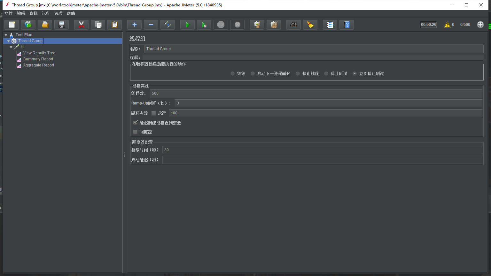
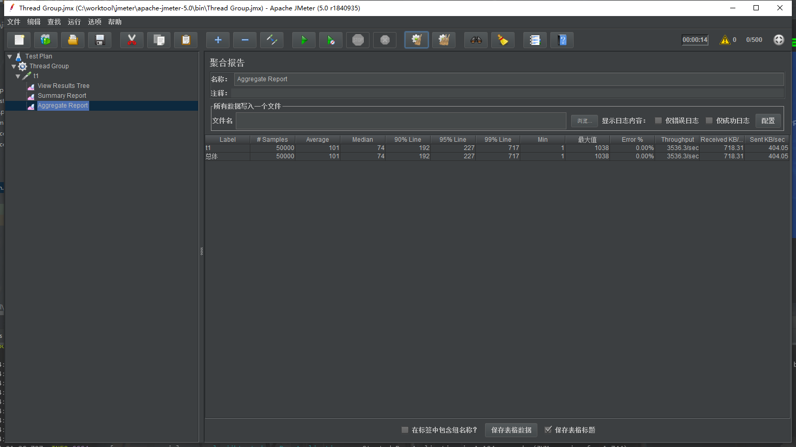
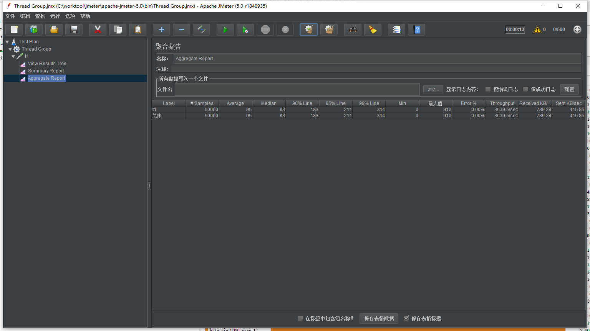
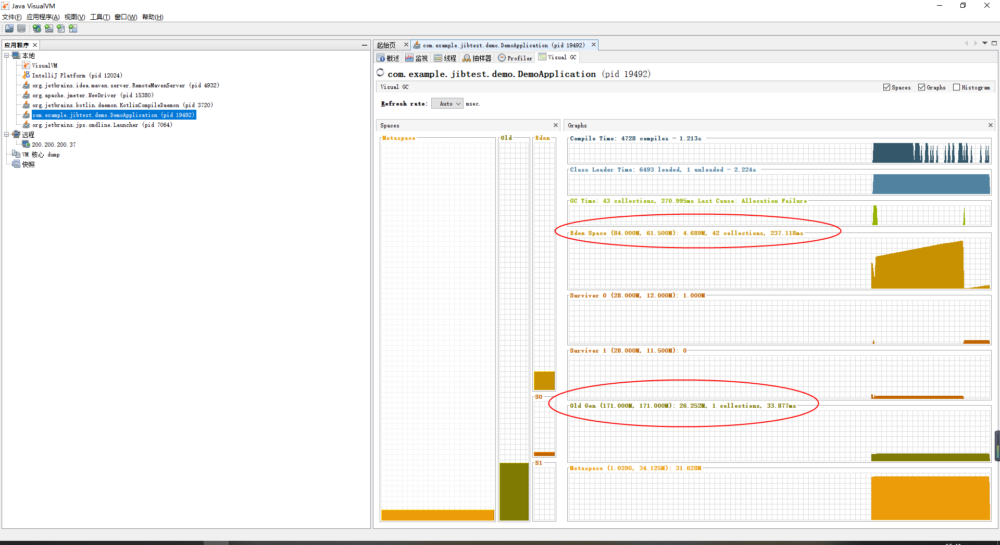

#### Tomcat性能小测

​		一般来说单机**Tomcat**能支持多少**QPS**呢，网上资料动不动就是几十万几百万的**QPS**，听起来都蛮吓人的，所以想自己测试一下。

---

本机配置：

> 系统:	windows10
>
> cpu:	i7-7700	4核8线程 3.6Hz
>
> 内存：16G	2400MHZ
>
> 硬盘：未知机械

---

首先测试代码:

**pom.xml**

```xml
<parent>
    <groupId>org.springframework.boot</groupId>
    <artifactId>spring-boot-starter-parent</artifactId>
    <version>2.2.2.RELEASE</version>
    <relativePath/> <!-- lookup parent from repository -->
</parent>
```

**xxx.java**

```java
@GetMapping("/test")
public Map test1() throws InterruptedException {
    Map<String, Object> result = new HashMap<>();
    result.put("name", "saber");
    result.put("age", 18);
    result.put("birth", new Date());
    return result;
}
```

**WebAccessLogFilter**：记录下每次请求的耗时，打印些日志

```java
@Component
@WebFilter(filterName = "webAccessLogFilter", urlPatterns = "/*")
public class WebAccessLogFilter implements Filter {

    private static final Logger log = LoggerFactory.getLogger(WebAccessLogFilter.class);

    @Override
    public void doFilter(ServletRequest servletRequest, ServletResponse servletResponse, FilterChain filterChain) throws IOException, ServletException {
        HttpServletRequest request = (HttpServletRequest) servletRequest;
        HttpServletResponse response = (HttpServletResponse) servletResponse;
        String url = request.getServletPath();

        long start = System.currentTimeMillis();
        try {
            filterChain.doFilter(request, response);
        } finally {
            log.info("url: {},  status: {}, response_time: {}ms",
                    url, response.getStatus(), (System.currentTimeMillis() - start));
        }
    }
}
```

**测试用例**：

​		使用**Jmeter**做一个简单的压力测试，因为**Jmeter**压力请求需要占用端口的问题，每次测试5w压力



---

**默认测试**:

* Java启动参数:

  > -Xms256m -Xmx256m

* application.properties: 全部默认配置



​		显示**QPS**为3536，感觉比想象中要低一些，毕竟在博客中经常出现的都是几十万或几百万的**QPS，**这里的3000似乎显得是这么不够看。想想办法看能不能优化一下。


**优化测试一**

​		先从简单的更改**SpringBoot**设置入手，也就是**Tomcat**的配置，我们知道**Tomcat**默认是有支持线程数，默认最大的线程是200，最大接收数为100。总之先调大这两个参数试试看

* Java启动参数:

  > -Xms256m -Xmx256m

* application.properties

  ```properties
  server.tomcat.accept-count=500
  server.tomcat.max-threads=500
  ```




​		从结果上看差别不明显，这里结果图都是跑了好几次后选的一张中间结果图。通过资源管理器可以发现，在默认200个线程状态下**CPU**资源就已经满载了，所以再新增线程并不能提高性能，反而可能会浪费资源，然而吊轨的是，当我降低线程数为16时，**CPU**资源依然满载，但是**QPS**并没有提升，当然也没有下降就是了。

>  ps:一般情况下16个线程肯定是跑不满**CPU**的，因为大部分业务项目都是**IO密集型**，具体表现就是线程会阻塞等待数据库返回结果，所以实际项目中如果计算机资源允许，调大线程数应该是可以提升**QPS**的


**优化测试二**

​		接下来试试看调整**JVM**参数看看，因为我们设置了**JVM**最大内存为256M，所以修改垃圾收集器和增大内存可能能够提升**QPS**。

​		使用**JDK**中自带的**VisualVM**观察内存状态



​		可以看到在这5w次的请求中，**JVM**一共经过了42次的新生代回收和1次老年代的回收，其中这次老年代的回收是在**Java**启动完后就执行过一次的，在压测过程中老年代没有经历过回收。而新生代的垃圾回收速度一般是很快的，可以看到42次回收总共耗时也就花费了200多毫秒，**JVM**优化在这里也无能为力了

#### 结论:

​		在这里本机限制**QPS**的最大因素应该就是**CPU**性能，如果要提升单机**QPS**看来只能是使用更为强劲的**CPU**了，**英特尔i7-7700**在单机状态下的理论最高的**QPS**是**3400**到**4000**左右