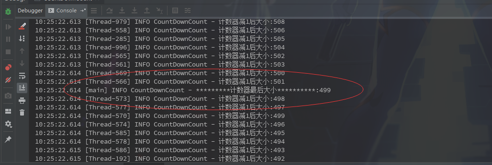
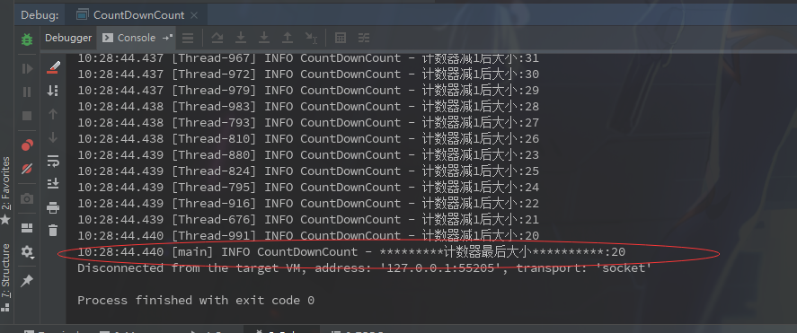

### CountDownLatch

​	又叫做计数器，作用是让多个线程都执行完成后再执行之后的操作。一个比较形象的栗子大概是统计全国人口，可以新建23个线程，每个线程统计一个省的人口，然后当各个省的人口都统计完成后再将各个省的人口相加从而得到全国人口。

使用也很简单:

| 方法                               | 作用                                            |
| ---------------------------------- | ----------------------------------------------- |
| await()                            | 计数器阻塞，当计数器为0才才会继续执行后面的代码 |
| await(long timeout, TimeUnit unit) | 设置一个超时时长，超过时间也会继续往后面执行    |
| countDown()                        | 计数器减1                                       |
| getCount()                         | 获取计数器大小                                  |


------

```java
@Slf4j
public class CountDownCount {

    private static Integer count = 1000;

    public static void main(String[] args) {

        for (int i =0; i < 1000; i++) {
            Thread thread = new Thread(new Runnable() {
                public void run() {
                    count--;
                    log.info("计数器减1后大小:{}", count);
                }
            });
            thread.start();
        }
        log.info("*********计数器最后大小**********:{}", count);
    }

}
```



上边是一个简单的栗子，新建1000个线程，每个线程执行一次减1操作，最后输出count的大小。根据日志很容易看出是1000个线程还没执行完就执行了输出语句。so，加入CountDownLatch试试看。

##### 改造后代码

```java
@Slf4j
public class CountDownCount {

    private static Integer count = 1000;

    private static CountDownLatch countDownLatch = new CountDownLatch(1000);

    public static void main(String[] args) throws InterruptedException {

        for (int i =0; i < 1000; i++) {
            Thread thread = new Thread(new Runnable() {
                public void run() {
                    count--;
                    countDownLatch.countDown();
                    log.info("计数器减1后大小:{}", count);
                }
            });
            thread.start();
        }
        countDownLatch.await();
        log.info("*********计数器最后大小**********:{}", count);
    }

}
```



可以看到的是计数器最后大小输出是在所有线程执行完之后再输出的，日志打印是正确。至于结果与期望0还是不符，是因为 `count--`并不是一个原子性操作引起的。