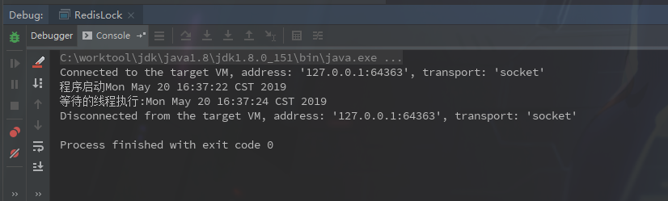

### 记录一些使用例子

> 并发类很重要，emmm，但是使用频率又很低，所以使用过的都记录一下

| 方法名                             | 作用解释                                     |
| ---------------------------------- | -------------------------------------------- |
| void wait()                        | 阻塞线程等待通知                             |
| void wait(long timeout)            | 设置等待时间，当超过等待时间时会继续往下执行 |
| void wait(long timeout, int nanos) | 设置等待时间和精度，未验证，一般不用         |
| notify()                           | 通知一个等待线程                             |
| notifyAll()                        | 通知所有等待线程                             |

示例代码:

```java
private static final ExecutorService executorService = Executors.newCachedThreadPool();

    public static void main(String[] args) throws InterruptedException {

        System.out.println("程序启动" + new Date());

        String lock = "lock";

        executorService.execute(new Runnable() {
            @Override
            public void run() {
                synchronized (lock) {
                    while (true) {
                        try {
                            lock.wait(10000);
                        } catch (InterruptedException e) {
                            e.printStackTrace();
                        }
                        System.out.println("等待的线程执行:" + new Date());
                        return;
                    }
                }

            }
        });

        try {
            Thread.sleep(2000);
        } catch (InterruptedException e) {
            e.printStackTrace();
        }

        synchronized (lock) {
            lock.notifyAll();
        }

    }
```

##### 输出结果



这段代码意思很简单，启动一个新线程等待10S的通知后输出执行信息，然后当前线程休息2S后通知等待的线程。

期望结果是启动2S后输出消息，可以看到输出消息结果正确。

#### 使用注意点

- `wait` 和 `notifyAll`虽然都是从Object继承来的方法，但是直接调用会抛出 `java.lang.IllegalMonitorStateException`异常,解释是要获取对象锁，必须写在`synchronized`方法或代码块内。

  