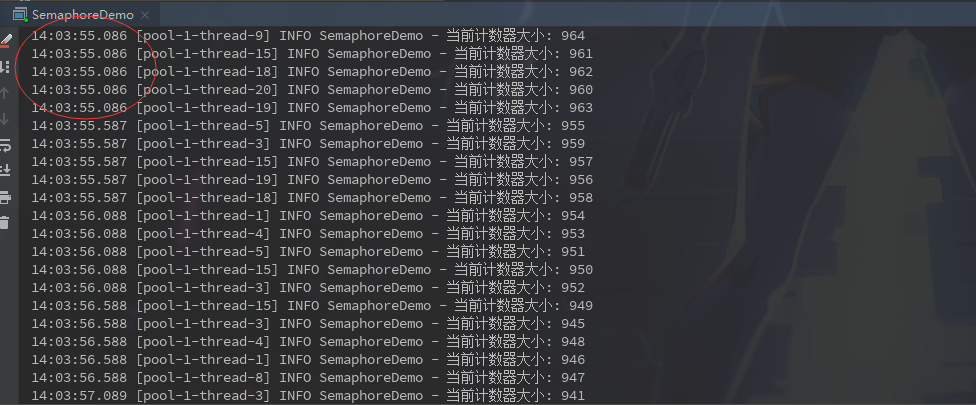

### Semaphore

​		直译信号量，作用和我们平时理解的令牌桶很像。声明一个信号量大小，多线程执行时需要获取到信号才能继续执行。

| 方法                                    | 作用                                   |
| --------------------------------------- | -------------------------------------- |
| acquire()                               | 获取一个信号，会阻塞线程等待           |
| acquire(int permits)                    | 获取n个信号                            |
| acquireUninterruptibly()                | 获取一个信号，会阻塞线程等待且不可中断 |
| tryAcquire()                            | 获取一个信号，会立即返回成功或者失败   |
| tryAcquire(long timeout, TimeUnit unit) | 等待信号获取的时间                     |
| release()                               | 释放一个信号                           |
| release(int permits)                    | 释放n个信号                            |

用一段代码简单使用下:

```java
@Slf4j
public class SemaphoreDemo {

    private static Semaphore semaphore = new Semaphore(5);

    private static final ExecutorService EXECUTOR_SERVICE = Executors.newFixedThreadPool(20);

    private static volatile AtomicInteger count = new AtomicInteger(1000);

    public static void main(String[] args) {
        for (int i =0; i < 1000; i++) {
            EXECUTOR_SERVICE.execute(new Runnable() {
                @Override
                public void run() {
                    try {
                        semaphore.acquire();

                    } catch (InterruptedException e) {
                        e.printStackTrace();
                    }
                    log.info("当前计数器大小: {}", count.decrementAndGet());
                    try {
                        Thread.sleep(500);
                    } catch (InterruptedException e) {
                        e.printStackTrace();
                    }
                    semaphore.release();
                }
            });
        }
    }
}
```

上面代码意思是将一个1000的数字用多线程，每次减1，减1000次，结果刚好是0.输出结果



从打印时间可以看出，因为`Semaphore`大小设置为5，所以打印基本是5个一组的输出，又因为每次减1操作都休息了500ms然后再释放信号，所以每组打印存在大概500ms的间隔。