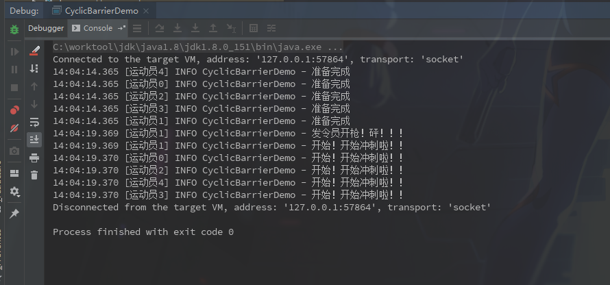

### CyclicBarrier

​		中文解释是栅栏。作用是声明一个可以拦截n个线程的栅栏，当n个线程到达栅栏时(调用栅栏的await方法时线程进入等待状态)，然后才能继续执行栅栏后面的代码。

| 方法                                               | 作用                            |
| -------------------------------------------------- | ------------------------------- |
| CyclicBarrier(int parties)                         | 拦截线程的个数                  |
| CyclicBarrier(int parties, Runnable barrierAction) | 当n个线程到达时可以做点啥再继续 |
| await()                                            | 线程进入阻塞等待状态            |
| await(long timeout, TimeUnit unit)                 | 设置超时时间继续往下执行        |
| reset()                                            | 重置栅栏到达线程数              |

简单示例:

```java
@Slf4j
public class CyclicBarrierDemo {

    public static void main(String[] args) {

        CyclicBarrier cyclicBarrier = new CyclicBarrier(5, new Runnable() {
            @Override
            public void run() {
                log.info("发令员开枪！砰！！！");
            }
        });

        for (int i = 0; i < 5; i++) {
            new Thread(new Runnable() {
                @Override
                public void run() {
                    log.info("准备完成");
                    try {
                        Thread.sleep(5000);
                    } catch (InterruptedException e) {
                        e.printStackTrace();
                    }

                    try {
                        cyclicBarrier.await();
                    } catch (InterruptedException e) {
                        e.printStackTrace();
                    } catch (BrokenBarrierException e) {
                        e.printStackTrace();
                    }
                    log.info("开始！开始冲刺啦！！");
                }
            }, "运动员" + i).start();
        }

    }

}
```

结果打印:



上面代码意思很明显啦，就是五个线程都会先执行准备，然后需要等待一个信息才能执行冲刺。

- **如果有线程已经处于等待状态，调用reset方法会导致已经在等待的线程出现BrokenBarrierException异常。并且由于出现了BrokenBarrierException，将会导致始终无法等待。**
- **如果在等待的过程中，线程被中断，也会抛出BrokenBarrierException异常，并且这个异常会传播到其他所有的线程。**
- **如果在执行屏障操作过程中发生异常，则该异常将传播到当前线程中，其他线程会抛出BrokenBarrierException，屏障被损坏。**
- **如果超出指定的等待时间，当前线程会抛出 TimeoutException 异常，其他线程会抛出BrokenBarrierException异常。**


> 参考链接: <https://www.jianshu.com/p/a1d92ceadbe7>