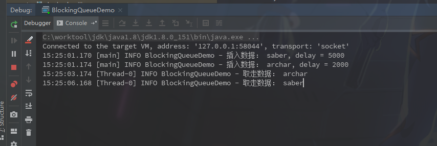

### BlockingQueue

阻塞队列，有几个特点

- 当队列满时执行put操作会阻塞，直到队列中take一个对象；
- 当队列空时执行take操作会阻塞，直到队列中put一个对象；


##### 队列的几套操作方法

| -           | Throws Exception | Special Value | Blocks | Times Out                  |
| ----------- | ---------------- | ------------- | ------ | -------------------------- |
| **Insert**  | add()            | offer()       | put()  | offer(o, timeout,timeunit) |
| **Remove**  | remove()         | poll()        | take() | poll(o, timeout,timeunit)  |
| **Examine** | element()        | peek()        |        |                            |

- Throws Exception 操作失败直接抛出异常
- Special Value 操作结束返回成功标识
- Blocks 阻塞直到操作完成
- Times Out 阻塞一段时间，否则返回值

##### 实现类

1. **ArrayBlockingQueue**

   > 有界的阻塞队列，内部实现类是数组，先进先出的顺序插入

2. **DelayQueue**

   > 延迟队列

3. **LinkedBlockingQueue**

   > 初始化指定大小则有边界，否则无穷大，先进先出的顺序插入

4. **SynchronousQueue**

   > 只保存一个元素，当插入一个元素只有取走一个才能继续插入


**DelayQueue Demo**

------

```java
@Slf4j
public class BlockingQueueDemo {

    public static void main(String[] args) throws InterruptedException {

        DelayQueue<DelayModel> blockingQueue = new DelayQueue<>();

        new Thread(new Runnable() {
            @Override
            public void run() {
                while (true) {
                    try {
                        DelayModel delayModel1 = blockingQueue.take();
                        log.info("取走数据： {}", delayModel1.getName());
                    } catch (InterruptedException e) {
                        e.printStackTrace();
                    }
                }

            }
        }).start();

        DelayModel delayModel = new DelayModel();
        delayModel.setAge(30);
        delayModel.setName("saber");
        delayModel.setNow(System.currentTimeMillis() + 5000);
        blockingQueue.put(delayModel);
        log.info("插入数据： {}, delay = {}", delayModel.getName(), delayModel.getNow() - System.currentTimeMillis());

        DelayModel delayModel1 = new DelayModel();
        delayModel1.setAge(18);
        delayModel1.setName("archar");
        delayModel1.setNow(System.currentTimeMillis() + 2000);
        blockingQueue.put(delayModel1);
        log.info("插入数据： {}, delay = {}", delayModel1.getName(), delayModel1.getNow() - System.currentTimeMillis());

    }
}
```

DelayModel.class

```java
@Data
public class DelayModel implements Delayed {

    private String name;

    private Integer age;

    private Long now;

    @Override
    public long getDelay(TimeUnit unit) {
        return now - System.currentTimeMillis();
    }

    @Override
    public int compareTo(Delayed o) {
        // 过期时间长的放置在队列尾部
        if (this.getDelay(TimeUnit.MICROSECONDS) > o.getDelay(TimeUnit.MICROSECONDS)) {
            return 1;
        }
        // 过期时间短的放置在队列头
        if (this.getDelay(TimeUnit.MICROSECONDS) < o.getDelay(TimeUnit.MICROSECONDS)) {
            return -1;
        }
        return 0;
    }

}
```

结果输出:



上边代码的意思是创建一个延迟队列，然后偶新建一个线程采用阻塞的方式去获取队列中的消息，然后再插入两条消息，一条延迟5秒，一条延迟2秒。注意点基本在阻塞队列的消息需要继承`Delayed`类，以及实现的两个方法的意义。

```java
// 这个方法在延迟内会被一直调用，知道返回值等于或小于0时，才会将消息出队列
long getDelay(TimeUnit unit);
//返回值大于0的放置在队列尾部，返回值小于0的会放置在队列头
//如果过期时间大的消息放在了队头，那么其他消息哪怕过期时间到了也需要等待队头的消息先消费
int compareTo(Delayed o);
```


​		


------

