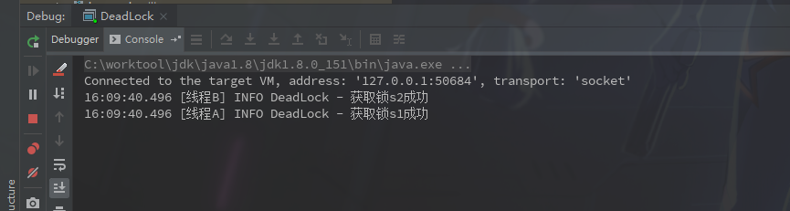

### 死锁

死锁发生的必要条件

- 互斥条件

  > A，B不同的线程会去竞争同一把锁

- 请求和保持条件

  > 当A线程持有锁时，B线程会一直等待A释放锁

- 不剥夺条件

  > 当A线程持有锁时，不会释放这把锁

- 环路等待条件

  > A线程持有锁s1，B线程持有锁s2，A线程等待获取锁s2，B线程等待获取锁s1

一个死锁的栗子

```java
@Slf4j
public class DeadLock {

    private static Object s1 = new Object();

    private static Object s2 = new Object();

    public static void main(String[] args) {

        new Thread(new Runnable() {
            @Override
            public void run() {
                synchronized (s1) {
                    log.info("获取锁s1成功");
                    try {
                        Thread.sleep(2000);
                    } catch (InterruptedException e) {
                        log.error("错误: {}", e);
                    }
                    synchronized (s2) {
                        log.info("获取锁s2成功");
                        log.info("执行完成");
                    }
                }
            }
        }, "线程A").start();

        new Thread(new Runnable() {
            @Override
            public void run() {
                synchronized (s2) {
                    log.info("获取锁s2成功");
                    try {
                        Thread.sleep(2000);
                    } catch (InterruptedException e) {
                        log.error("错误: {}", e);
                    }
                    synchronized (s1) {
                        log.info("获取锁s1成功");
                        log.info("执行完成");
                    }
                }
            }
        }, "线程B").start();

    }
}
```

结果输出:



代码意思是新建两个线程，线程A获取锁s1，2秒后再去获取锁s2，线程B获取锁s2，2s后再去获取或s1。然后线程A和B会进入互相等待模式，也就是死锁.

