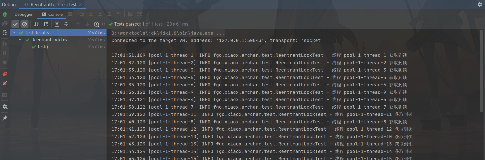

#### ReentrantLock

​		作为最最最有名且简洁的锁实现，还是值得看一看的。

总结下可以看的点有：

1. 加锁、释放锁的实现
2. 可重入的实现
3. AQS有什么用


先写一段测试代码

```java
@Test
public void test() {
    CountDownLatch countDownLatch = new CountDownLatch(20);
    ExecutorService executorService = Executors.newFixedThreadPool(20);
    ReentrantLock lock = new ReentrantLock();
    for (int i = 0; i < 20; i++) {
        executorService.execute(() -> {
            lock.lock();
            log.info("线程 {} 获取到锁", Thread.currentThread().getName());
            try {
                Thread.sleep(1000);
            } catch (InterruptedException e) {
                e.printStackTrace();
            }
            countDownLatch.countDown();
            lock.unlock();
        });
    }
    countDownLatch.await();
}
```

输出:



输出结果一秒一个，符合预期输出。

---

##### 源码部份

**ReentrantLock**有两个实现类，分别是非公平锁**NonfairSync**和公平锁**FairSync**

```java
static final class NonfairSync extends Sync {
    private static final long serialVersionUID = 7316153563782823691L;

    /**
         * Performs lock.  Try immediate barge, backing up to normal
         * acquire on failure.
         */
    final void lock() {
        //compareAndSetState成功就代表获取到了锁
        if (compareAndSetState(0, 1))
            setExclusiveOwnerThread(Thread.currentThread());
        else
            acquire(1);
    }

    protected final boolean tryAcquire(int acquires) {
        return nonfairTryAcquire(acquires);
    }
}

//Sync类实现的默认为非公平的获取锁
final boolean nonfairTryAcquire(int acquires) {
    final Thread current = Thread.currentThread();
    int c = getState();
    if (c == 0) {
        if (compareAndSetState(0, acquires)) {
            setExclusiveOwnerThread(current);
            return true;
        }
    }
    else if (current == getExclusiveOwnerThread()) {
        int nextc = c + acquires;
        if (nextc < 0) // overflow
            throw new Error("Maximum lock count exceeded");
        setState(nextc);
        return true;
    }
    return false;
}
```

```java
static final class FairSync extends Sync {
    private static final long serialVersionUID = -3000897897090466540L;

    final void lock() {
        acquire(1);
    }

    /**
         * Fair version of tryAcquire.  Don't grant access unless
         * recursive call or no waiters or is first.
         */
    protected final boolean tryAcquire(int acquires) {
        final Thread current = Thread.currentThread();
        int c = getState();
        if (c == 0) {
            if (!hasQueuedPredecessors() &&
                compareAndSetState(0, acquires)) {
                setExclusiveOwnerThread(current);
                return true;
            }
        }
        else if (current == getExclusiveOwnerThread()) {
            int nextc = c + acquires;
            if (nextc < 0)
                throw new Error("Maximum lock count exceeded");
            setState(nextc);
            return true;
        }
        return false;
    }
}
```

观察代码可以看到：

- 公平锁和非公平锁都继承了**Sync**类
- 在获取锁**lock()**方法的实现上，非公平锁会先尝试获取锁，如果失败了调用**acquire**方法获取锁，公平锁则会直接调用**acquire**方法获取锁
- 对比公平锁和非公平锁的**tryAcquire**方法，主要区别是在**getState()**为0获取锁时，判断多了一个**hasQueuedPredecessors()**的区别，这个方法主要是判断等待队列前有没有线程了。公平锁会按照队列一个个获取锁执行，非公平锁则每次都会尝试获取一次

再看看**Sync**类的实现

```java
abstract static class Sync extends AbstractQueuedSynchronizer {
    private static final long serialVersionUID = -5179523762034025860L;

    /**
         * Performs {@link Lock#lock}. The main reason for subclassing
         * is to allow fast path for nonfair version.
         */
    abstract void lock();

    /**
         * Performs non-fair tryLock.  tryAcquire is implemented in
         * subclasses, but both need nonfair try for trylock method.
         */
    final boolean nonfairTryAcquire(int acquires) {
        final Thread current = Thread.currentThread();
        int c = getState();
        if (c == 0) {
            if (compareAndSetState(0, acquires)) {
                setExclusiveOwnerThread(current);
                return true;
            }
        }
        else if (current == getExclusiveOwnerThread()) {
            int nextc = c + acquires;
            if (nextc < 0) // overflow
                throw new Error("Maximum lock count exceeded");
            setState(nextc);
            return true;
        }
        return false;
    }

    protected final boolean tryRelease(int releases) {
        int c = getState() - releases;
        if (Thread.currentThread() != getExclusiveOwnerThread())
            throw new IllegalMonitorStateException();
        boolean free = false;
        if (c == 0) {
            free = true;
            setExclusiveOwnerThread(null);
        }
        setState(c);
        return free;
    }

    protected final boolean isHeldExclusively() {
        // While we must in general read state before owner,
        // we don't need to do so to check if current thread is owner
        return getExclusiveOwnerThread() == Thread.currentThread();
    }

    final ConditionObject newCondition() {
        return new ConditionObject();
    }

    // Methods relayed from outer class

    final Thread getOwner() {
        return getState() == 0 ? null : getExclusiveOwnerThread();
    }

    final int getHoldCount() {
        return isHeldExclusively() ? getState() : 0;
    }

    final boolean isLocked() {
        return getState() != 0;
    }

    /**
         * Reconstitutes the instance from a stream (that is, deserializes it).
         */
    private void readObject(java.io.ObjectInputStream s)
        throws java.io.IOException, ClassNotFoundException {
        s.defaultReadObject();
        setState(0); // reset to unlocked state
    }
}
```

可以发现主要实现了**nonfairTryAcquire**和**tryRelease**，分别是获取锁和释放锁的方法，然后继承了**AbstractQueuedSynchronizer**，也就是所谓**AQS**,所谓的**AQS**指的也就是一个抽象类，可以继承类可以很方便的实现一个锁的功能。之后可以看看**AQS**的具体结构