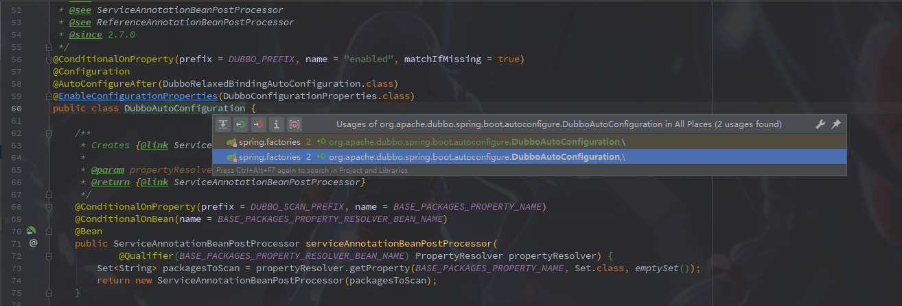
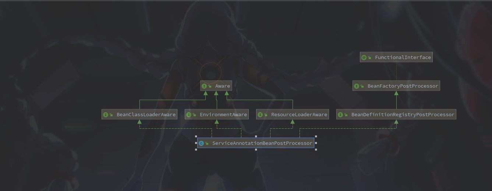
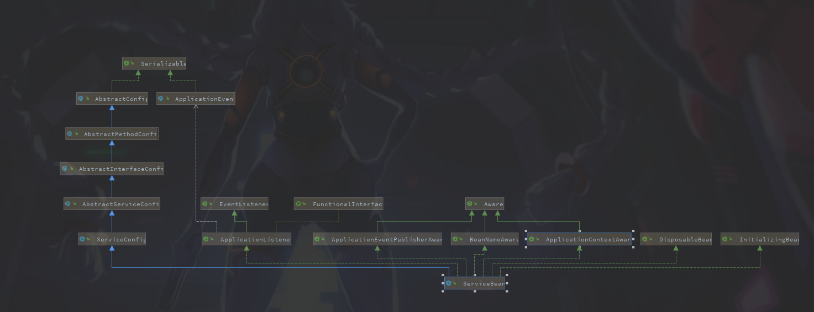

### Dubbo提供者启动过程

​		之前关于框架的源码阅读比较少，只读过一些Java集合类的源码。So，加强一下咯。

阅读版本：

```xml
<dependency>
    <groupId>org.apache.dubbo</groupId>
    <artifactId>dubbo-spring-boot-starter</artifactId>
    <version>2.7.1</version>
</dependency>
<dependency>
    <groupId>org.apache.dubbo</groupId>
    <artifactId>dubbo</artifactId>
    <version>2.7.1</version>
</dependency>
```


图例说明：

- 图中左边淡蓝背景的为服务消费方使用的接口，右边淡绿色背景的为服务提供方使用的接口，位于中轴线上的为双方都用到的接口。

- 图中从下至上分为十层，各层均为单向依赖，右边的黑色箭头代表层之间的依赖关系，每一层都可以剥离上层被复用，其中，Service 和 Config 层为 API，其它各层均为 SPI。

- 图中绿色小块的为扩展接口，蓝色小块为实现类，图中只显示用于关联各层的实现类。

- 图中蓝色虚线为初始化过程，即启动时组装链，红色实线为方法调用过程，即运行时调时链，紫色三角箭头为继承，可以把子类看作父类的同一个节点，线上的文字为调用的方法。


​		根据上图大概可以猜到`Server` 应该就是通信的服务器，然后根据蓝色虚线查找，找到`DubboProtocol`类，idea中文件查找一下发现有这个类，然后以这个类为参考调试进行阅读。下边是整理后的过程。

---

**1.**入口，SpringBoot入口应该都是从一个自动配置的文件类开始吧

`DubboAutoConfiguration` -> `ServiceAnnotationBeanPostProcessor`。因为是注解版的服务提供所以走的这个方法。



**2.**打开`ServiceAnnotationBeanPostProcessor`的关系图，主要关注其中的`BeanDefinitionRegistryPostProcessor`接口。



**BeanDefinitionRegistryPostProcessor**

```java
public interface BeanDefinitionRegistryPostProcessor extends BeanFactoryPostProcessor {

	/**
	 * Modify the application context's internal bean definition registry after its
	 * standard initialization. All regular bean definitions will have been loaded,
	 * but no beans will have been instantiated yet. This allows for adding further
	 * bean definitions before the next post-processing phase kicks in.
	 * @param registry the bean definition registry used by the application context
	 * @throws org.springframework.beans.BeansException in case of errors
	 */
	void postProcessBeanDefinitionRegistry(BeanDefinitionRegistry registry) throws BeansException;

}
```

​		这个接口的主要作用是可以拿到Spring的`BeanDefinitionRegistry`，从而实现动态的注入Bean(一般是通过在类上注解，类似@Service，@Bean，@Component或者xml文件中的<Bean>标签)。

**3.**`ServiceAnnotationBeanPostProcessor` 的 `postProcessBeanDefinitionRegistry` 方法

```java
@Override
public void postProcessBeanDefinitionRegistry(BeanDefinitionRegistry registry) throws BeansException {

    Set<String> resolvedPackagesToScan = resolvePackagesToScan(packagesToScan);

    if (!CollectionUtils.isEmpty(resolvedPackagesToScan)) {
        //扫描配置路径下的类进行注入
        registerServiceBeans(resolvedPackagesToScan, registry);
    } else {
        if (logger.isWarnEnabled()) {
            logger.warn("packagesToScan is empty , ServiceBean registry will be ignored!");
        }
    }

}
```

**4.**进入`postProcessBeanDefinitionRegistry` 方法

```java
private void registerServiceBeans(Set<String> packagesToScan, BeanDefinitionRegistry registry) {

    DubboClassPathBeanDefinitionScanner scanner =
        new DubboClassPathBeanDefinitionScanner(registry, environment, resourceLoader);

    BeanNameGenerator beanNameGenerator = resolveBeanNameGenerator(registry);

    scanner.setBeanNameGenerator(beanNameGenerator);

    scanner.addIncludeFilter(new AnnotationTypeFilter(Service.class));

    for (String packageToScan : packagesToScan) {

        // Registers @Service Bean first
        scanner.scan(packageToScan);

        // Finds all BeanDefinitionHolders of @Service whether @ComponentScan scans or not.
        //查找路径下所有Dubbo中@Service注解的类转换成Bean描述类
        Set<BeanDefinitionHolder> beanDefinitionHolders =
            findServiceBeanDefinitionHolders(scanner, packageToScan, registry, beanNameGenerator);

        if (!CollectionUtils.isEmpty(beanDefinitionHolders)) {

            for (BeanDefinitionHolder beanDefinitionHolder : beanDefinitionHolders) {
                //注入Bean
                registerServiceBean(beanDefinitionHolder, registry, scanner);
            }

            if (logger.isInfoEnabled()) {
                logger.info(beanDefinitionHolders.size() + " annotated Dubbo's @Service Components { " +
                            beanDefinitionHolders +
                            " } were scanned under package[" + packageToScan + "]");
            }

        } else {

            if (logger.isWarnEnabled()) {
                logger.warn("No Spring Bean annotating Dubbo's @Service was found under package["
                            + packageToScan + "]");
            }

        }

    }

}
```


**5.**进入 `registerServiceBean`方法

```java
private void registerServiceBean(BeanDefinitionHolder beanDefinitionHolder,        BeanDefinitionRegistry registry,DubboClassPathBeanDefinitionScanner scanner) {

    Class<?> beanClass = resolveClass(beanDefinitionHolder);

    Service service = findMergedAnnotation(beanClass, Service.class);

    Class<?> interfaceClass = resolveServiceInterfaceClass(beanClass, service);

    String annotatedServiceBeanName = beanDefinitionHolder.getBeanName();

    //解析带有@Service的类为BeanDefinition
    AbstractBeanDefinition serviceBeanDefinition =
        buildServiceBeanDefinition(service, interfaceClass, annotatedServiceBeanName);

    // ServiceBean Bean name
    String beanName = generateServiceBeanName(service, interfaceClass);

    if (scanner.checkCandidate(beanName, serviceBeanDefinition)) { // check duplicated candidate bean
        //下一步注入
        registry.registerBeanDefinition(beanName, serviceBeanDefinition);

        if (logger.isInfoEnabled()) {
            logger.info("The BeanDefinition[" + serviceBeanDefinition +
                        "] of ServiceBean has been registered with name : " + beanName);
        }

    } else {

        if (logger.isWarnEnabled()) {
            logger.warn("The Duplicated BeanDefinition[" + serviceBeanDefinition +
                        "] of ServiceBean[ bean name : " + beanName +
                        "] was be found , Did @DubboComponentScan scan to same package in many times?");
        }

    }

}
```


这里重点观察其中的 `buildServiceBeanDefinition`方法，从名字可以看出这里是构建一个服务Bean的描述(Spring在注入Bean的时候都会先解析配置为一个`BeanDefinition`的类来保存Bean的描述信息)

**6.**进入 `buildServiceBeanDefinition`方法

```java
private AbstractBeanDefinition buildServiceBeanDefinition(Service service, Class<?> interfaceClass,String annotatedServiceBeanName) {

    // 将Dubbo的Service构建成一个 ServiceBean
    BeanDefinitionBuilder builder = rootBeanDefinition(ServiceBean.class);

    AbstractBeanDefinition beanDefinition = builder.getBeanDefinition();

    MutablePropertyValues propertyValues = beanDefinition.getPropertyValues();

    String[] ignoreAttributeNames = of("provider", "monitor", "application", "module", "registry", "protocol",
                                       "interface", "interfaceName", "parameters");

    propertyValues.addPropertyValues(new AnnotationPropertyValuesAdapter(service, environment, ignoreAttributeNames));

    // References "ref" property to annotated-@Service Bean
    addPropertyReference(builder, "ref", annotatedServiceBeanName);
    // Set interface
    builder.addPropertyValue("interface", interfaceClass.getName());
    // Convert parameters into map
    builder.addPropertyValue("parameters", convertParameters(service.parameters()));

    /**
         * Add {@link org.apache.dubbo.config.ProviderConfig} Bean reference
         */
    String providerConfigBeanName = service.provider();
    if (StringUtils.hasText(providerConfigBeanName)) {
        addPropertyReference(builder, "provider", providerConfigBeanName);
    }
    
    ......
}
```

这里注意到创建了一个`ServiceBean`的Bean。so，这里意思是将@Service注解的类解析成一个`ServiceBean`并注入到Spring的容器中。

​		打开`ServiceBean`的继承类图，发现其中实现了`ApplicationListener`接口，实现这个接口的类可以实现ApplicationContext事件处理。




​		**万里长征第一步**,在`SpringBoot`的版本下，通过扫描配置路径下带有Dubbo中**@Service**，并将其转换为`ServiceBean`注入到Spring容器当中。

