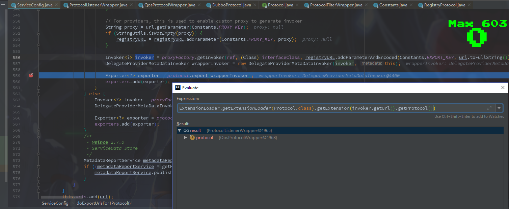

### Dubbo提供者启动过程

​		前边读到Dubbo通过扫描将@Service类转换成 了`ServiceBean`类，而`ServiceBean`又实现了 `ApplicationListener`接口，所以在Spring启动的过程会调用各个`ServiceBean`类中的 **onApplicationEvent** 方法。


---

**1.** 进入`ServiceBean`的 **onApplicationEvent**方法

```java
@Override
public void onApplicationEvent(ContextRefreshedEvent event) {
    if (!isExported() && !isUnexported()) {
        if (logger.isInfoEnabled()) {
            logger.info("The service ready on spring started. service: " + getInterface());
        }
        //从这里开始对外提供服务
        export();
    }
}

@Override
public void export() {
    //提供服务的入口
    super.export();
    // Publish ServiceBeanExportedEvent
    publishExportEvent();
}
```

**2.**通过 `ServiceBean`的 **export**方法，进入到父类的**export**,也就是 `ServiceConfig`的 **export**方法中

**ServiceConfig**

```java
public synchronized void export() {
    checkAndUpdateSubConfigs();

    if (!shouldExport()) {
        return;
    }

    if (shouldDelay()) {
        DELAY_EXPORT_EXECUTOR.schedule(this::doExport, getDelay(), TimeUnit.MILLISECONDS);
    } else {
        //进入这个分支
        doExport();
    }
}

protected synchronized void doExport() {
    if (unexported) {
        throw new IllegalStateException("The service " + interfaceClass.getName() + " has already unexported!");
    }
    if (exported) {
        return;
    }
    exported = true;

    if (StringUtils.isEmpty(path)) {
        path = interfaceName;
    }
    //进入到这个分支
    doExportUrls();
}

private void doExportUrls() {
    List<URL> registryURLs = loadRegistries(true);
    for (ProtocolConfig protocolConfig : protocols) {
        String pathKey = URL.buildKey(getContextPath(protocolConfig).map(p -> p + "/" + path).orElse(path), group, version);
        ProviderModel providerModel = new ProviderModel(pathKey, ref, interfaceClass);
        ApplicationModel.initProviderModel(pathKey, providerModel);
        //拿到一个协议配置继续进入
        doExportUrlsFor1Protocol(protocolConfig, registryURLs);
    }
}

private void doExportUrlsFor1Protocol(ProtocolConfig protocolConfig, List<URL> registryURLs) {
    String name = protocolConfig.getName();
    if (StringUtils.isEmpty(name)) {
        name = DUBBO;
    }

    Map<String, String> map = new HashMap<String, String>();
    map.put(SIDE_KEY, PROVIDER_SIDE);
    
    //...过滤了一些不是这次重点的代码...
        
    if (!SCOPE_NONE.equalsIgnoreCase(scope)) {

        // export to local if the config is not remote (export to remote only when config is remote)
        if (!SCOPE_REMOTE.equalsIgnoreCase(scope)) {
            exportLocal(url);
        }
        // export to remote if the config is not local (export to local only when config is local)
        if (!SCOPE_LOCAL.equalsIgnoreCase(scope)) {
            if (!isOnlyInJvm() && logger.isInfoEnabled()) {
                logger.info("Export dubbo service " + interfaceClass.getName() + " to url " + url);
            }
            if (CollectionUtils.isNotEmpty(registryURLs)) {
                for (URL registryURL : registryURLs) {
                    //if protocol is only injvm ,not register
                    if (LOCAL_PROTOCOL.equalsIgnoreCase(url.getProtocol())) {
                        continue;
                    }
                    url = url.addParameterIfAbsent(DYNAMIC_KEY, registryURL.getParameter(DYNAMIC_KEY));
                    URL monitorUrl = loadMonitor(registryURL);
                    if (monitorUrl != null) {
                        url = url.addParameterAndEncoded(MONITOR_KEY, monitorUrl.toFullString());
                    }
                    if (logger.isInfoEnabled()) {
                        logger.info("Register dubbo service " + interfaceClass.getName() + " url " + url + " to registry " + registryURL);
                    }

                    // For providers, this is used to enable custom proxy to generate invoker
                    String proxy = url.getParameter(PROXY_KEY);
                    if (StringUtils.isNotEmpty(proxy)) {
                        registryURL = registryURL.addParameter(PROXY_KEY, proxy);
                    }

                    Invoker<?> invoker = PROXY_FACTORY.getInvoker(ref, (Class) interfaceClass, registryURL.addParameterAndEncoded(EXPORT_KEY, url.toFullString()));
                    DelegateProviderMetaDataInvoker wrapperInvoker = new DelegateProviderMetaDataInvoker(invoker, this);
					//这里是核心，得到了一个协议并且暴露服务
                    //如果断点在这话会比较奇怪，走不进去，发现类名是一个 Protocol$Adaptive，但是搜索却找不到这个类。百度后发现这是Dubbo中一个叫SPI的技术，会根据url加载不同Protocol,然后这个 Protocol$Adaptive是通过字节码技术直接加载到应用中去的，so，我们一般来说根本看不见代码。后边会贴一个网上找到 Protocol$Adaptive 源码
                    Exporter<?> exporter = protocol.export(wrapperInvoker);
                    exporters.add(exporter);
                }
            } else {
                Invoker<?> invoker = PROXY_FACTORY.getInvoker(ref, (Class) interfaceClass, url);
                DelegateProviderMetaDataInvoker wrapperInvoker = new DelegateProviderMetaDataInvoker(invoker, this);

                Exporter<?> exporter = protocol.export(wrapperInvoker);
                exporters.add(exporter);
            }
            /**
                 * @since 2.7.0
                 * ServiceData Store
                 */
            MetadataReportService metadataReportService = null;
            if ((metadataReportService = getMetadataReportService()) != null) {
                metadataReportService.publishProvider(url);
            }
        }
    }
}
```

**3.**下一步将走进`QosProtocolWrapper`的**export**方法中。

> 这里因为断点一步步走并不能直接找到 `QosProtocolWrapper` 类。可以根据上一节的Dubbo结构设计图定位到代码后边会执行的位置，然后根据调试的堆栈信息回推代码走向。另一个方法是根据下边给出的`Protocol$Adaptive`类代码，得知这里的 Protocol是根据 ExtensionLoader.getExtensionLoader(Protocol.class).getExtension(str) 这行代码查找实现类的，所以可以利用Idea的断电调试功能获取到这里的实现类。如下图展示可以看到获取到的类是 `QosProtocolWrapper` `



**QosProtocolWrapper**

```java
@Override
public <T> Exporter<T> export(Invoker<T> invoker) throws RpcException {
    // 注册服务
    if (Constants.REGISTRY_PROTOCOL.equals(invoker.getUrl().getProtocol())) {
        startQosServer(invoker.getUrl());
        return protocol.export(invoker);
    }
    return protocol.export(invoker);
}
```

**4.**其中会经过 `ProtocolFilterWrapper`的 **export**方法再进入 `RegistryProtocol`的**export**方法

**RegistryProtocol**

```java
public <T> Exporter<T> export(final Invoker<T> originInvoker) throws RpcException {
    URL registryUrl = getRegistryUrl(originInvoker);
    // url to export locally
    URL providerUrl = getProviderUrl(originInvoker);

    // Subscribe the override data
    // FIXME When the provider subscribes, it will affect the scene : a certain JVM exposes the service and call
    //  the same service. Because the subscribed is cached key with the name of the service, it causes the
    //  subscription information to cover.
    final URL overrideSubscribeUrl = getSubscribedOverrideUrl(providerUrl);
    final OverrideListener overrideSubscribeListener = new OverrideListener(overrideSubscribeUrl, originInvoker);
    overrideListeners.put(overrideSubscribeUrl, overrideSubscribeListener);

    providerUrl = overrideUrlWithConfig(providerUrl, overrideSubscribeListener);
    //export invoker
    //本地服务暴露(启动Netty或其他将服务提供出去)
    final ExporterChangeableWrapper<T> exporter = doLocalExport(originInvoker, providerUrl);

    // url to registry
    final Registry registry = getRegistry(originInvoker);
    final URL registeredProviderUrl = getRegisteredProviderUrl(providerUrl, registryUrl);
    ProviderInvokerWrapper<T> providerInvokerWrapper = ProviderConsumerRegTable.registerProvider(originInvoker,
                                                                                                 registryUrl, registeredProviderUrl);
    //to judge if we need to delay publish
    boolean register = registeredProviderUrl.getParameter("register", true);
    if (register) {
        register(registryUrl, registeredProviderUrl);
        providerInvokerWrapper.setReg(true);
    }

    // Deprecated! Subscribe to override rules in 2.6.x or before.
    registry.subscribe(overrideSubscribeUrl, overrideSubscribeListener);

    exporter.setRegisterUrl(registeredProviderUrl);
    exporter.setSubscribeUrl(overrideSubscribeUrl);
    //Ensure that a new exporter instance is returned every time export
    return new DestroyableExporter<>(exporter);
}

private <T> ExporterChangeableWrapper<T> doLocalExport(final Invoker<T> originInvoker, URL providerUrl) {
    String key = getCacheKey(originInvoker);
	//protocol.export(invokerDelegete)类似`ServiceConfig`那里的export，protocol都是通过SPI机制代理的，不同的是这里执行类的protocol从'registry'变成了'dubbo',使用同样的方法可以得到protocol的实现类依然是QosProtocolWrapper
    return (ExporterChangeableWrapper<T>) bounds.computeIfAbsent(key, s -> {
        Invoker<?> invokerDelegete = new InvokerDelegate<>(originInvoker, providerUrl);
        return new ExporterChangeableWrapper<>((Exporter<T>) protocol.export(invokerDelegete), originInvoker);
    });
}
```

**5.**再次进入`QosProtocolWrapper`类的**export**方法

```java
@Override
public <T> Exporter<T> export(Invoker<T> invoker) throws RpcException {
    if (Constants.REGISTRY_PROTOCOL.equals(invoker.getUrl().getProtocol())) {
        startQosServer(invoker.getUrl());
        return protocol.export(invoker);
    }
    //这次因为protocol为'dubbo'走入这里
    return protocol.export(invoker);
}
```

**6.**断点进入`ProtocolFilterWrapper`类的**export**方法

```java
@Override
public <T> Exporter<T> export(Invoker<T> invoker) throws RpcException {
    if (Constants.REGISTRY_PROTOCOL.equals(invoker.getUrl().getProtocol())) {
        return protocol.export(invoker);
    }
    //同上走入这
    return protocol.export(buildInvokerChain(invoker, Constants.SERVICE_FILTER_KEY, Constants.PROVIDER));
}
```

**7.**断点进入`DubboProtocol`的**export**方法

**DubboProtocol**

```java
@Override
public <T> Exporter<T> export(Invoker<T> invoker) throws RpcException {
    URL url = invoker.getUrl();

    // export service.
    String key = serviceKey(url);
    DubboExporter<T> exporter = new DubboExporter<T>(invoker, key, exporterMap);
    exporterMap.put(key, exporter);

    //export an stub service for dispatching event
    Boolean isStubSupportEvent = url.getParameter(Constants.STUB_EVENT_KEY, Constants.DEFAULT_STUB_EVENT);
    Boolean isCallbackservice = url.getParameter(Constants.IS_CALLBACK_SERVICE, false);
    if (isStubSupportEvent && !isCallbackservice) {
        String stubServiceMethods = url.getParameter(Constants.STUB_EVENT_METHODS_KEY);
        if (stubServiceMethods == null || stubServiceMethods.length() == 0) {
            if (logger.isWarnEnabled()) {
                logger.warn(new IllegalStateException("consumer [" + url.getParameter(Constants.INTERFACE_KEY) +
                                                      "], has set stubproxy support event ,but no stub methods founded."));
            }

        } else {
            stubServiceMethodsMap.put(url.getServiceKey(), stubServiceMethods);
        }
    }
	
    //启动服务
    openServer(url);
    optimizeSerialization(url);

    return exporter;
}


private void openServer(URL url) {
    // find server.
    String key = url.getAddress();
    //client can export a service which's only for server to invoke
    boolean isServer = url.getParameter(Constants.IS_SERVER_KEY, true);
    if (isServer) {
        ExchangeServer server = serverMap.get(key);
        if (server == null) {
            synchronized (this) {
                server = serverMap.get(key);
                if (server == null) {
                    //当Server为null时创建Server
                    serverMap.put(key, createServer(url));
                }
            }
        } else {
            // server supports reset, use together with override
            server.reset(url);
        }
    }
}

private ExchangeServer createServer(URL url) {
    url = URLBuilder.from(url)
        // send readonly event when server closes, it's enabled by default
        .addParameterIfAbsent(Constants.CHANNEL_READONLYEVENT_SENT_KEY, Boolean.TRUE.toString())
        // enable heartbeat by default
        .addParameterIfAbsent(Constants.HEARTBEAT_KEY, String.valueOf(Constants.DEFAULT_HEARTBEAT))
        .addParameter(Constants.CODEC_KEY, DubboCodec.NAME)
        .build();
    String str = url.getParameter(Constants.SERVER_KEY, Constants.DEFAULT_REMOTING_SERVER);

    if (str != null && str.length() > 0 && !ExtensionLoader.getExtensionLoader(Transporter.class).hasExtension(str)) {
        throw new RpcException("Unsupported server type: " + str + ", url: " + url);
    }

    ExchangeServer server;
    try {
        //启动网络服务的路口
        server = Exchangers.bind(url, requestHandler);
    } catch (RemotingException e) {
        throw new RpcException("Fail to start server(url: " + url + ") " + e.getMessage(), e);
    }

    str = url.getParameter(Constants.CLIENT_KEY);
    if (str != null && str.length() > 0) {
        Set<String> supportedTypes = ExtensionLoader.getExtensionLoader(Transporter.class).getSupportedExtensions();
        if (!supportedTypes.contains(str)) {
            throw new RpcException("Unsupported client type: " + str);
        }
    }

    return server;
}
```

**8.**之后一路断点跟踪 **bind** 方法，来到`Transporters`中的**bind**方法中

```java
public static Server bind(URL url, ChannelHandler... handlers) throws RemotingException {
    if (url == null) {
        throw new IllegalArgumentException("url == null");
    }
    if (handlers == null || handlers.length == 0) {
        throw new IllegalArgumentException("handlers == null");
    }
    ChannelHandler handler;
    if (handlers.length == 1) {
        handler = handlers[0];
    } else {
        handler = new ChannelHandlerDispatcher(handlers);
    }
    //通过getTransporter()可以看出这里又使用了一次Dubbo的SPI机制，根据url参数来加载不同的加载类，这里默认的加载是 NettyTransporter
    return getTransporter().bind(url, handler);
}

public static Transporter getTransporter() {
    return ExtensionLoader.getExtensionLoader(Transporter.class).getAdaptiveExtension();
}
```

**9.**进入 `NettyTransporter`

```java
public class NettyTransporter implements Transporter {

    public static final String NAME = "netty3";

    @Override
    public Server bind(URL url, ChannelHandler listener) throws RemotingException {
        //这里就是创建了一个Netty服务器
        return new NettyServer(url, listener);
    }

    @Override
    public Client connect(URL url, ChannelHandler listener) throws RemotingException {
        return new NettyClient(url, listener);
    }

}
```

**10.**进入**NettyServer**,通过构造方法进入父类构造方法，然后调用子类的doOpen方法进行初始化操作

```java
public NettyServer(URL url, ChannelHandler handler) throws RemotingException {
    super(url, ChannelHandlers.wrap(handler, ExecutorUtil.setThreadName(url, SERVER_THREAD_POOL_NAME)));
}

@Override
protected void doOpen() throws Throwable {
    bootstrap = new ServerBootstrap();

    bossGroup = new NioEventLoopGroup(1, new DefaultThreadFactory("NettyServerBoss", true));
    workerGroup = new NioEventLoopGroup(getUrl().getPositiveParameter(Constants.IO_THREADS_KEY, Constants.DEFAULT_IO_THREADS),
                                        new DefaultThreadFactory("NettyServerWorker", true));
	
    //这里是初始化消息处理器，后边dubbo服务调用都会通过这个Handler
    final NettyServerHandler nettyServerHandler = new NettyServerHandler(getUrl(), this);
    channels = nettyServerHandler.getChannels();

    bootstrap.group(bossGroup, workerGroup)
        .channel(NioServerSocketChannel.class)
        .childOption(ChannelOption.TCP_NODELAY, Boolean.TRUE)
        .childOption(ChannelOption.SO_REUSEADDR, Boolean.TRUE)
        .childOption(ChannelOption.ALLOCATOR, PooledByteBufAllocator.DEFAULT)
        .childHandler(new ChannelInitializer<NioSocketChannel>() {
            @Override
            protected void initChannel(NioSocketChannel ch) throws Exception {
                // FIXME: should we use getTimeout()?
                int idleTimeout = UrlUtils.getIdleTimeout(getUrl());
                NettyCodecAdapter adapter = new NettyCodecAdapter(getCodec(), getUrl(), NettyServer.this);
                ch.pipeline()//.addLast("logging",new LoggingHandler(LogLevel.INFO))//for debug
                    .addLast("decoder", adapter.getDecoder())
                    .addLast("encoder", adapter.getEncoder())
                    .addLast("server-idle-handler", new IdleStateHandler(0, 0, idleTimeout, MILLISECONDS))
                    .addLast("handler", nettyServerHandler);
            }
        });
    // bind
    //初始化操作
    ChannelFuture channelFuture = bootstrap.bind(getBindAddress());
    channelFuture.syncUninterruptibly();
    channel = channelFuture.channel();

}
```


#### 总结

- 服务提供者从Spring启动到扫描Service，然后封装Service为ServiceBean注入到Spring容器，再启动Netty服务器提供服务；
- 代码中很多无法调试跟踪的代码都是应用了Dubbo的SPI技术，需要另外了解；
- 提供者还有重要的一步是往注册中心注册服务，这里没有深究。


#### 附件代码

参考来自: https://blog.csdn.net/synpore/article/details/79144707 

**ProxyFactory$Adaptive** 反编译后code

```java
package com.alibaba.dubbo.rpc;

import com.alibaba.dubbo.common.Node;
import com.alibaba.dubbo.common.URL;
import com.alibaba.dubbo.common.extension.ExtensionLoader;

public class Adaptive
  implements ProxyFactory
{
  public Object getProxy(Invoker paramInvoker)
    throws RpcException
  {
    if (paramInvoker == null)
      throw new IllegalArgumentException("com.alibaba.dubbo.rpc.Invoker argument == null");
    if (paramInvoker.getUrl() == null)
      throw new IllegalArgumentException("com.alibaba.dubbo.rpc.Invoker argument getUrl() == null");
    URL localURL = paramInvoker.getUrl();
    String str = localURL.getParameter("proxy", "javassist");
    if (str == null)
      throw new IllegalStateException("Fail to get extension(com.alibaba.dubbo.rpc.ProxyFactory) name from url(" + localURL.toString() + ") use keys([proxy])");
    ProxyFactory localProxyFactory = (ProxyFactory)ExtensionLoader.getExtensionLoader(ProxyFactory.class).getExtension(str);
    return localProxyFactory.getProxy(paramInvoker);
  }

  public Invoker getInvoker(Object paramObject, Class paramClass, URL paramURL)
    throws RpcException
  {
    if (paramURL == null)
      throw new IllegalArgumentException("url == null");
    URL localURL = paramURL;
    String str = localURL.getParameter("proxy", "javassist");
    if (str == null)
      throw new IllegalStateException("Fail to get extension(com.alibaba.dubbo.rpc.ProxyFactory) name from url(" + localURL.toString() + ") use keys([proxy])");
    ProxyFactory localProxyFactory = (ProxyFactory)ExtensionLoader.getExtensionLoader(ProxyFactory.class).getExtension(str);
    return localProxyFactory.getInvoker(paramObject, paramClass, paramURL);
  }
}
```

**Protocol$Adaptive** 反编译后的code

```java
package com.alibaba.dubbo.rpc;

import com.alibaba.dubbo.common.Node;
import com.alibaba.dubbo.common.URL;
import com.alibaba.dubbo.common.extension.ExtensionLoader;

public class Adaptive
  implements Protocol
{
  public void destroy()
  {
    throw new UnsupportedOperationException("method public abstract void com.alibaba.dubbo.rpc.Protocol.destroy() of interface com.alibaba.dubbo.rpc.Protocol is not adaptive method!");
  }

  public int getDefaultPort()
  {
    throw new UnsupportedOperationException("method public abstract int com.alibaba.dubbo.rpc.Protocol.getDefaultPort() of interface com.alibaba.dubbo.rpc.Protocol is not adaptive method!");
  }

  public Invoker refer(Class paramClass, URL paramURL)
    throws RpcException
  {
    if (paramURL == null)
      throw new IllegalArgumentException("url == null");
    URL localURL = paramURL;
    String str = (localURL.getProtocol() == null) ? "dubbo" : localURL.getProtocol();
    if (str == null)
      throw new IllegalStateException("Fail to get extension(com.alibaba.dubbo.rpc.Protocol) name from url(" + localURL.toString() + ") use keys([protocol])");
    Protocol localProtocol = (Protocol)ExtensionLoader.getExtensionLoader(Protocol.class).getExtension(str);
    return localProtocol.refer(paramClass, paramURL);
  }

  public Exporter export(Invoker paramInvoker)
    throws RpcException
  {
    if (paramInvoker == null)
      throw new IllegalArgumentException("com.alibaba.dubbo.rpc.Invoker argument == null");
    if (paramInvoker.getUrl() == null)
      throw new IllegalArgumentException("com.alibaba.dubbo.rpc.Invoker argument getUrl() == null");
    URL localURL = paramInvoker.getUrl();
    String str = (localURL.getProtocol() == null) ? "dubbo" : localURL.getProtocol();
    if (str == null)
      throw new IllegalStateException("Fail to get extension(com.alibaba.dubbo.rpc.Protocol) name from url(" + localURL.toString() + ") use keys([protocol])");
    Protocol localProtocol = (Protocol)ExtensionLoader.getExtensionLoader(Protocol.class).getExtension(str);
    return localProtocol.export(paramInvoker);
  }
}
```

