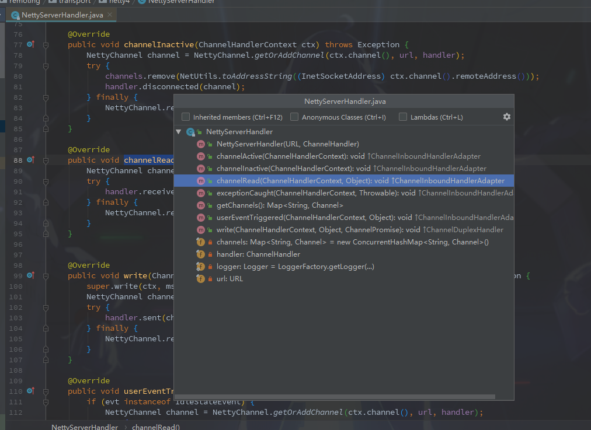

### Dubbo消息消费过程

​		上边看到了SpringBoot启动时会扫描Service并使用Netty开启对外的网络服务，接下来就从Netty的`NettyServerHandler`类开始看看提供消费消息的过程。

**阅读目标:**

- 从接收消息到找到具体执行类的流程；
- 如何具体的根据消息找到执行类。

---

**1.**进入 `NettyServerHandler`，对Netty不是很熟悉，但是可以猜到里边会有一个接收消息的回调方法。查看类的方法，可以找到一个叫**channelRead**的方法，用来读取消息。



```java
@Override
public void channelRead(ChannelHandlerContext ctx, Object msg) throws Exception {
    NettyChannel channel = NettyChannel.getOrAddChannel(ctx.channel(), url, handler);
    try {
        handler.received(channel, msg);
    } finally {
        NettyChannel.removeChannelIfDisconnected(ctx.channel());
    }
}
```

**2.**根据**received**方法一步步调试下去，来到`AllChannelHandler`的**received**方法。

```java
@Override
public void received(Channel channel, Object message) throws RemotingException {
    ExecutorService cexecutor = getExecutorService();
    try {
        cexecutor.execute(new ChannelEventRunnable(channel, handler, ChannelState.RECEIVED, message));
    } catch (Throwable t) {
        //TODO A temporary solution to the problem that the exception information can not be sent to the opposite end after the thread pool is full. Need a refactoring
        //fix The thread pool is full, refuses to call, does not return, and causes the consumer to wait for time out
        if(message instanceof Request && t instanceof RejectedExecutionException){
            Request request = (Request)message;
            if(request.isTwoWay()){
                String msg = "Server side(" + url.getIp() + "," + url.getPort() + ") threadpool is exhausted ,detail msg:" + t.getMessage();
                Response response = new Response(request.getId(), request.getVersion());
                response.setStatus(Response.SERVER_THREADPOOL_EXHAUSTED_ERROR);
                response.setErrorMessage(msg);
                channel.send(response);
                return;
            }
        }
        throw new ExecutionException(message, channel, getClass() + " error when process received event .", t);
    }
}
```

>可以看到这里使用了一个线程池去执行任务。值得注意的是这个线程池，跟踪代码可以找到这个
>
>```java
>public WrappedChannelHandler(ChannelHandler handler, URL url) {
>        this.handler = handler;
>        this.url = url;
>        executor = (ExecutorService) ExtensionLoader.getExtensionLoader(ThreadPool.class).getAdaptiveExtension().getExecutor(url);
>
>        String componentKey = Constants.EXECUTOR_SERVICE_COMPONENT_KEY;
>        if (Constants.CONSUMER_SIDE.equalsIgnoreCase(url.getParameter(Constants.SIDE_KEY))) {
>            componentKey = Constants.CONSUMER_SIDE;
>        }
>        DataStore dataStore = ExtensionLoader.getExtensionLoader(DataStore.class).getDefaultExtension();
>        dataStore.put(componentKey, Integer.toString(url.getPort()), executor);
>}
>```
> **executor**是根据SPI动态获取的，这个线程池是在初始化Netty服务器的时候初始化的，默认是200个线程且任务队列为`SynchronousQueue`，可以知道这个线程池不保存任务，所以超过200线程访问时会阻塞等待。默认的实现类是`FixedThreadPool`

**3.**进入ChannelEventRunnable类，该类实现**Runnable**接口，查看**run()**方法

```java
@Override
public void run() {
    if (state == ChannelState.RECEIVED) {
        try {
            // 从方法名能看出来各个分支的意思，这里是处理接收消息事件
            handler.received(channel, message);
        } catch (Exception e) {
            logger.warn("ChannelEventRunnable handle " + state + " operation error, channel is " + channel
                        + ", message is " + message, e);
        }
    } else {
        switch (state) {
            case CONNECTED:
                try {
                    // 这里处理连接事件
                    handler.connected(channel);
                } catch (Exception e) {
                    logger.warn("ChannelEventRunnable handle " + state + " operation error, channel is " + channel, e);
                }
                break;
            case DISCONNECTED:
                try {
                    // 这里处理断开连接事件
                    handler.disconnected(channel);
                } catch (Exception e) {
                    logger.warn("ChannelEventRunnable handle " + state + " operation error, channel is " + channel, e);
                }
                break;
            case SENT:
                try {
                    // 这里处理发送消息事件
                    handler.sent(channel, message);
                } catch (Exception e) {
                    logger.warn("ChannelEventRunnable handle " + state + " operation error, channel is " + channel
                                + ", message is " + message, e);
                }
                break;
            case CAUGHT:
                try {
                    // 这里处理异常事件
                    handler.caught(channel, exception);
                } catch (Exception e) {
                    logger.warn("ChannelEventRunnable handle " + state + " operation error, channel is " + channel
                                + ", message is: " + message + ", exception is " + exception, e);
                }
                break;
            default:
                logger.warn("unknown state: " + state + ", message is " + message);
        }
    }

}
```

**4.**消息先来到 `DecodeHandler`，看名字可以知道这是一个解码类，虽然这里并没有解码。

​	随后消息来到`HeaderExchangeHandler`

**HeaderExchangeHandler**

```java
@Override
public void received(Channel channel, Object message) throws RemotingException {
    channel.setAttribute(KEY_READ_TIMESTAMP, System.currentTimeMillis());
    final ExchangeChannel exchangeChannel = HeaderExchangeChannel.getOrAddChannel(channel);
    try {
        if (message instanceof Request) {
            // handle request.
            Request request = (Request) message;
            if (request.isEvent()) {
            	//处理消息
                handlerEvent(channel, request);
            } else {
                if (request.isTwoWay()) {
                    handleRequest(exchangeChannel, request);
                } else {
                    handler.received(exchangeChannel, request.getData());
                }
            }
        } else if (message instanceof Response) {
            handleResponse(channel, (Response) message);
        } else if (message instanceof String) {
            if (isClientSide(channel)) {
                Exception e = new Exception("Dubbo client can not supported string message: " + message + " in channel: " + channel + ", url: " + channel.getUrl());
                logger.error(e.getMessage(), e);
            } else {
                String echo = handler.telnet(channel, (String) message);
                if (echo != null && echo.length() > 0) {
                    channel.send(echo);
                }
            }
        } else {
            handler.received(exchangeChannel, message);
        }
    } finally {
        HeaderExchangeChannel.removeChannelIfDisconnected(channel);
    }
}


void handleRequest(final ExchangeChannel channel, Request req) throws RemotingException {
    Response res = new Response(req.getId(), req.getVersion());
    if (req.isBroken()) {
        Object data = req.getData();
        /***省略***/
    }
    // find handler by message class.
    Object msg = req.getData();
    try {
        // handle data.
        //处理消息，这里handle是DubboProtocol下边的reply
        CompletableFuture<Object> future = handler.reply(channel, msg);
        if (future.isDone()) {
            res.setStatus(Response.OK);
            res.setResult(future.get());
            channel.send(res);
            return;
        }
        //处理完后调用channel.send(res)回复消息
        future.whenComplete((result, t) -> {
            try {
                if (t == null) {
                    res.setStatus(Response.OK);
                    res.setResult(result);
                } else {
                    res.setStatus(Response.SERVICE_ERROR);
                    res.setErrorMessage(StringUtils.toString(t));
                }
                channel.send(res);
            } catch (RemotingException e) {
                logger.warn("Send result to consumer failed, channel is " + channel + ", msg is " + e);
            } finally {
                // HeaderExchangeChannel.removeChannelIfDisconnected(channel);
            }
        });
    } catch (Throwable e) {
        res.setStatus(Response.SERVICE_ERROR);
        res.setErrorMessage(StringUtils.toString(e));
        channel.send(res);
    }
}
```

**5.** 这里代码又回到了`DubboProtocol`，前边在暴露服务时也有经过`DubboProtocol`开启Netty服务。观察堆栈发现个前边没注意的细节，这里**requestHandler**是`DubboProtocol`在开启Netty服务时当做参数传递给后边的handle的。

**DubboProtocol.requestHandler**

```java
private ExchangeHandler requestHandler = new ExchangeHandlerAdapter() {

    @Override
    public CompletableFuture<Object> reply(ExchangeChannel channel, Object message) throws RemotingException {

        if (!(message instanceof Invocation)) {
            throw new RemotingException(channel, "Unsupported request: "
                                        + (message == null ? null : (message.getClass().getName() + ": " + message))
                                        + ", channel: consumer: " + channel.getRemoteAddress() + " --> provider: " + channel.getLocalAddress());
        }

        Invocation inv = (Invocation) message;
        // 获取处理消息的类的封装类
        Invoker<?> invoker = getInvoker(channel, inv);
        // need to consider backward-compatibility if it's a callback
        if (Boolean.TRUE.toString().equals (inv.getAttachments() .get(IS_CALLBACK_SERVICE_INVOKE))) {
            String methodsStr = invoker.getUrl().getParameters().get("methods");
            boolean hasMethod = false;
            if (methodsStr == null || !methodsStr.contains(",")) {
                hasMethod = inv.getMethodName().equals(methodsStr);
            } else {
                String[] methods = methodsStr.split(",");
                for (String method : methods) {
                    if (inv.getMethodName().equals(method)) {
                        hasMethod = true;
                        break;
                    }
                }
            }
            if (!hasMethod) {
                logger.warn(new IllegalStateException("The methodName " + inv.getMethodName() + " not found in callback service interface ,invoke will be ignored."+ " please update the api interface. url is:"+ invoker.getUrl()) + " ,invocation is :" + inv);
                return null;
            }
        }
        RpcContext rpcContext = RpcContext.getContext();
        rpcContext.setRemoteAddress(channel.getRemoteAddress());
        //调用服务类执行代码获取结果
        Result result = invoker.invoke(inv);

        if (result instanceof AsyncRpcResult) {
            return ((AsyncRpcResult) result).getResultFuture().thenApply(r -> (Object)r);

        } else {
            return CompletableFuture.completedFuture(result);
        }
    }
    
    ......
}
```

​		上边代码重点就是找到具体的执行类，并且执行过后返回一个Result。

**6.**进入**getInvoker**获取执行类方法

```java
Invoker<?> getInvoker(Channel channel, Invocation inv) throws RemotingException {
    boolean isCallBackServiceInvoke = false;
    boolean isStubServiceInvoke = false;
    int port = channel.getLocalAddress().getPort();
    String path = inv.getAttachments().get(Constants.PATH_KEY);

    // if it's callback service on client side
    isStubServiceInvoke = Boolean.TRUE.toString().equals(inv.getAttachments().get(Constants.STUB_EVENT_KEY));
    if (isStubServiceInvoke) {
        port = channel.getRemoteAddress().getPort();
    }

    //callback
    isCallBackServiceInvoke = isClientSide(channel) && !isStubServiceInvoke;
    if (isCallBackServiceInvoke) {
        path += "." + inv.getAttachments().get(Constants.CALLBACK_SERVICE_KEY);
        inv.getAttachments().put(IS_CALLBACK_SERVICE_INVOKE, Boolean.TRUE.toString());
    }

    //这里key是有服务类的包名+版本号+组构成。(egg:fgo.saber.service.DemoService:1.0.0:20880)
    String serviceKey = serviceKey(port, path,inv.getAttachments() .get(Constants.VERSION_KEY), inv.getAttachments().get(Constants.GROUP_KEY));
    
    //关键代码，前边根据一定规则获取到Service对应的key，然后从 exporterMap 中找到对应的服务
    //联想到前边本地暴露服务成功时会将这个服务保存到这个 map 中
    DubboExporter<?> exporter = (DubboExporter<?>) exporterMap.get(serviceKey);

    if (exporter == null) {
        throw new RemotingException(channel, "Not found exported service: " + serviceKey + " in " + exporterMap.keySet() + ", may be version or group mismatch " +
                                    ", channel: consumer: " + channel.getRemoteAddress() + " --> provider: " + channel.getLocalAddress() + ", message:" + inv);
    }

    return exporter.getInvoker();
}
```

**7.**在`DubboProtocol`中执行完获取到结果后，回到`HeaderExchangeHandler`中，调用 **channel.send(res);**回复结果完成一次调用。

---

#### 总结:

​		服务提供者的一次大概流程就总结到这了，疑点是很多实用SPI用法的地方调试因为无法追踪，导致不好理解，需要沟通上下文加打印调试查看。

​		而且也看的比较粗糙,emmm,就算这样也有点小累。所以有很多特性都没看，现在能立刻想到的有服务提供者的超时和异常处理就没注意，以后有时间精力再看吧。