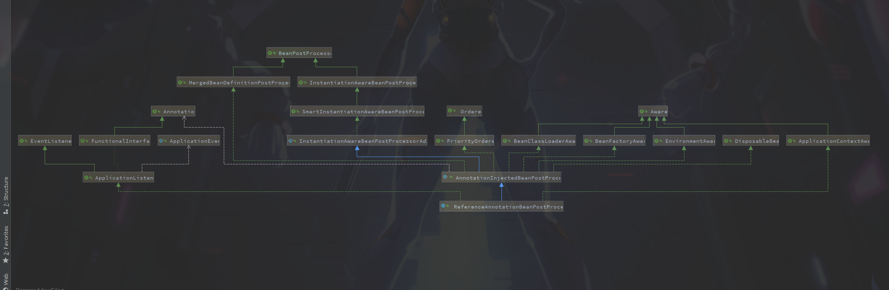

### Dubbo消息者启动过程

​		SpringBoot项目是根据一个自动配置文件启动，找到之前说过的dubbo的自动配置文件`DubboAutoConfiguration`。

---

**1.**找到 `DubboAutoConfiguration`，发现有个 **ReferenceAnnotationBeanPostProcessor**的Bean，emmm，很明显，前边有个**ServiceAnnotationBeanPostProcessor**是扫描**@Service**的，那这个应该就是扫描**@Reference**的注解了。

```java
@ConditionalOnMissingBean
@Bean(name = ReferenceAnnotationBeanPostProcessor.BEAN_NAME)
public ReferenceAnnotationBeanPostProcessor referenceAnnotationBeanPostProcessor() {
    return new ReferenceAnnotationBeanPostProcessor();
}
```

**2.**这里需要了解一点Spring的接口体系<!--这里Spring源码不是很熟悉,后续有待加强-->。查看`ReferenceAnnotationBeanPostProcessor`的类图关系：



这里实现和继承的类很多，但我们现在关注的是`MergedBeanDefinitionPostProcessor`和`InstantiationAwareBeanPostProcessor`接口，`Spring`会把所有实现这个接口的Bean收集起来，并且在创建Bean的时候先调用`MergedBeanDefinitionPostProcessor`的**postProcessMergedBeanDefinition**方法初始化需要代理的类，后调用`InstantiationAwareBeanPostProcessor`的**postProcessPropertyValues**方法注入。

**MergedBeanDefinitionPostProcessor**

```java
public interface MergedBeanDefinitionPostProcessor extends BeanPostProcessor {

	/**
	 * Post-process the given merged bean definition for the specified bean.
	 * @param beanDefinition the merged bean definition for the bean
	 * @param beanType the actual type of the managed bean instance
	 * @param beanName the name of the bean
	 * @see AbstractAutowireCapableBeanFactory#applyMergedBeanDefinitionPostProcessors
	 */
	void postProcessMergedBeanDefinition(RootBeanDefinition beanDefinition, Class<?> beanType, String beanName);

	/**
	 * A notification that the bean definition for the specified name has been reset,
	 * and that this post-processor should clear any metadata for the affected bean.
	 * <p>The default implementation is empty.
	 * @param beanName the name of the bean
	 * @since 5.1
	 * @see DefaultListableBeanFactory#resetBeanDefinition
	 */
	default void resetBeanDefinition(String beanName) {
	}

}
```

**3.**分析可以知道Spring在创建Bean的时候会调用`postProcessMergedBeanDefinition`方法为属性实现注入效果，查看方法可以来到`AnnotationInjectedBeanPostProcessor`的**postProcessMergedBeanDefinition**方法。

```java
@Override
public void postProcessMergedBeanDefinition(RootBeanDefinition beanDefinition, Class<?> beanType, String beanName) {
    if (beanType != null) {
        //初始化需要注入的属性的类
        InjectionMetadata metadata = findInjectionMetadata(beanName, beanType, null);
        metadata.checkConfigMembers(beanDefinition);
    }
}

private InjectionMetadata findInjectionMetadata(String beanName, Class<?> clazz, PropertyValues pvs) {
    // Fall back to class name as cache key, for backwards compatibility with custom callers.
    String cacheKey = (StringUtils.hasLength(beanName) ? beanName : clazz.getName());
    // Quick check on the concurrent map first, with minimal locking.
    AnnotationInjectedBeanPostProcessor.AnnotatedInjectionMetadata metadata = this.injectionMetadataCache.get(cacheKey);
    if (InjectionMetadata.needsRefresh(metadata, clazz)) {
        synchronized (this.injectionMetadataCache) {
            metadata = this.injectionMetadataCache.get(cacheKey);
            if (InjectionMetadata.needsRefresh(metadata, clazz)) {
                if (metadata != null) {
                    metadata.clear(pvs);
                }
                try {
                    //因为这里所有Spring的容器初始化时都会走这里，所以最好断点判断一个自己beanName
                    //构建一个注解的元数据
                    metadata = buildAnnotatedMetadata(clazz);
                    this.injectionMetadataCache.put(cacheKey, metadata);
                } catch (NoClassDefFoundError err) {
                    throw new IllegalStateException("Failed to introspect object class [" + clazz.getName() +
                                                    "] for annotation metadata: could not find class that it depends on", err);
                }
            }
        }
    }
    return metadata;
}

private AnnotationInjectedBeanPostProcessor.AnnotatedInjectionMetadata buildAnnotatedMetadata(final Class<?> beanClass) {
    //收集类中所有被(@Reference属性，重开一个.md好了)注解的属性.顺带看一下这里怎么过滤@Reference属性，重开一个3.1.1***.md好了
    Collection<AnnotationInjectedBeanPostProcessor.AnnotatedFieldElement> fieldElements = findFieldAnnotationMetadata(beanClass);
    //收集类中所有被注解的方法
    Collection<AnnotationInjectedBeanPostProcessor.AnnotatedMethodElement> methodElements = findAnnotatedMethodMetadata(beanClass);
    return new AnnotationInjectedBeanPostProcessor.AnnotatedInjectionMetadata(beanClass, fieldElements, methodElements);
    
}
```

**4.**貌似走到这一步并没有做很多操作，先回到Spring初始化Bean的方法中。

**AbstractAutowireCapableBeanFactory**

```java
protected Object doCreateBean(final String beanName, final RootBeanDefinition mbd, final @Nullable Object[] args)
			throws BeanCreationException {

    // Instantiate the bean.
    BeanWrapper instanceWrapper = null;
    if (mbd.isSingleton()) {
        instanceWrapper = this.factoryBeanInstanceCache.remove(beanName);
    }
    ......省略
    synchronized (mbd.postProcessingLock) {
        if (!mbd.postProcessed) {
            try {
                // 上边 MergedBeanDefinitionPostProcessor 调用的入口就在这
                applyMergedBeanDefinitionPostProcessors(mbd, beanType, beanName);
            }
            catch (Throwable ex) {
                throw new BeanCreationException(mbd.getResourceDescription(), beanName,
                                                "Post-processing of merged bean definition failed", ex);
            }
            mbd.postProcessed = true;
        }
    }

    ......省略
    try {
        //字面意思是填充Bean,instanceWrapper创建了Bean，但此时Bean中属性都还为null
        populateBean(beanName, mbd, instanceWrapper);
        exposedObject = initializeBean(beanName, exposedObject, mbd);
    }
    ......省略

    return exposedObject;
}
```

```java
protected void populateBean(String beanName, RootBeanDefinition mbd, @Nullable BeanWrapper bw) {
    
 	......省略一段
        
    PropertyDescriptor[] filteredPds = null;
    if (hasInstAwareBpps) {
        if (pvs == null) {
            pvs = mbd.getPropertyValues();
        }
        for (BeanPostProcessor bp : getBeanPostProcessors()) {
            //将所有实现了InstantiationAwareBeanPostProcessor的Bean拿出来执行了一遍
            if (bp instanceof InstantiationAwareBeanPostProcessor) {
                InstantiationAwareBeanPostProcessor ibp = (InstantiationAwareBeanPostProcessor) bp;
                PropertyValues pvsToUse = ibp.postProcessProperties(pvs, bw.getWrappedInstance(), beanName);
                if (pvsToUse == null) {
                    if (filteredPds == null) {
                        filteredPds = filterPropertyDescriptorsForDependencyCheck(bw, mbd.allowCaching);
                    }
                    //设置Bean属性的值
                    pvsToUse = ibp.postProcessPropertyValues(pvs, filteredPds, bw.getWrappedInstance(), beanName);
                    if (pvsToUse == null) {
                        return;
                    }
                }
                pvs = pvsToUse;
            }
        }
    }
    if (needsDepCheck) {
        if (filteredPds == null) {
            filteredPds = filterPropertyDescriptorsForDependencyCheck(bw, mbd.allowCaching);
        }
        checkDependencies(beanName, mbd, filteredPds, pvs);
    }

    if (pvs != null) {
        applyPropertyValues(beanName, mbd, bw, pvs);
    }
}
```

**5.**来到`AnnotationInjectedBeanPostProcessor`的**postProcessPropertyValues**方法

```java
@Override
public PropertyValues postProcessPropertyValues(
    PropertyValues pvs, PropertyDescriptor[] pds, Object bean, String beanName) throws BeanCreationException {
	//拿到前边扫描的注解信息
    InjectionMetadata metadata = findInjectionMetadata(beanName, bean.getClass(), pvs);
    try {
        //属性注入
        metadata.inject(bean, beanName, pvs);
    } catch (BeanCreationException ex) {
        throw ex;
    } catch (Throwable ex) {
        throw new BeanCreationException(beanName, "Injection of @" + getAnnotationType().getName() + " dependencies is failed", ex);
    }
    return pvs;
}
```

**6.**进入`InjectionMetadata`的**inject**方法

```java
public void inject(Object target, @Nullable String beanName, @Nullable PropertyValues pvs) throws Throwable {
    Collection<InjectedElement> checkedElements = this.checkedElements;
    Collection<InjectedElement> elementsToIterate =
        (checkedElements != null ? checkedElements : this.injectedElements);
    if (!elementsToIterate.isEmpty()) {
        for (InjectedElement element : elementsToIterate) {
            if (logger.isTraceEnabled()) {
                logger.trace("Processing injected element of bean '" + beanName + "': " + element);
            }
            //循环属性注入
            element.inject(target, beanName, pvs);
        }
    }
}
```

**7.**进入`AnnotationInjectedBeanPostProcessor.AnnotatedFieldElement`的子类方法

```java
@Override
protected void inject(Object bean, String beanName, PropertyValues pvs) throws Throwable {
	// 获取类
    Class<?> injectedType = field.getType();
	
    //获取代理实现类
    Object injectedObject = getInjectedObject(annotation, bean, beanName, injectedType, this);

    //使用反射设置属性需要开启 Field 的 Accessible属性
    ReflectionUtils.makeAccessible(field);

    //将代理类设置到属性上(注入)
    field.set(bean, injectedObject);

}
```

**8.**上边其实就已经注入成功，但是再看看获取代理实现类的代码。

**AnnotationInjectedBeanPostProcessor.getInjectedObject**

```java
protected Object getInjectedObject(A annotation, Object bean, String beanName, Class<?> injectedType, InjectionMetadata.InjectedElement injectedElement) throws Exception {

    //获取缓存的key。(egg:consumers:dubbo:fgo.saber.service.DemoService:1.0.0#source=private fgo.saber.service.DemoService fgo.saber.consumer.consumer.ConsumerApplication.demoService#attributes={version=1.0.0})
    String cacheKey = buildInjectedObjectCacheKey(annotation, bean, beanName, injectedType, injectedElement);

    Object injectedObject = injectedObjectsCache.get(cacheKey);

    if (injectedObject == null) {
        //获取不到则创建一个
        injectedObject = doGetInjectedBean(annotation, bean, beanName, injectedType, injectedElement);
        // Customized inject-object if necessary
        injectedObjectsCache.putIfAbsent(cacheKey, injectedObject);
    }

    return injectedObject;

}

@Override
protected Object doGetInjectedBean(Reference reference, Object bean, String beanName, Class<?> injectedType,InjectionMetadata.InjectedElement injectedElement) throws Exception {

    String referencedBeanName = buildReferencedBeanName(reference, injectedType);
	//emmm.不是很明白这些做什么的还
    ReferenceBean referenceBean = buildReferenceBeanIfAbsent(referencedBeanName, reference, injectedType, getClassLoader());

    cacheInjectedReferenceBean(referenceBean, injectedElement);

    //创建代理类
    Object proxy = buildProxy(referencedBeanName, referenceBean, injectedType);

    return proxy;
}

private Object buildProxy(String referencedBeanName, ReferenceBean referenceBean, Class<?> injectedType) {
    //动态代理
    InvocationHandler handler = buildInvocationHandler(referencedBeanName, referenceBean);
    Object proxy = Proxy.newProxyInstance(getClassLoader(), new Class[]{injectedType}, handler);
    return proxy;
}
```

---

#### 总结:

​		消费者的启动流程大致就是在Spring加载Bean时通过继承，使用Spring的一些特性在启动时，使用反射和动态代理来完成特殊的注入。