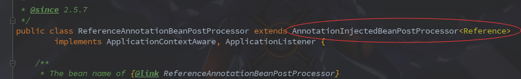

### 3.1.1-Dubbo消费者启动过程中如何过滤Reference属性

​		前边启动过程中乍一看只了解到Dubbo会在Spring启动时，在创建Bean的时候对**@Reference**注解的属性进行注入，然后发现他在扫描的时候貌似扫描了Bean下的所有属性，有点困惑所以回过头来查看一下。

---

**1.**回过头来断点发现过滤**@Reference**是在`AnnotationInjectedBeanPostProcessor`的构建注解信息这里过滤的。

```java
private AnnotationInjectedBeanPostProcessor.AnnotatedInjectionMetadata buildAnnotatedMetadata(final Class<?> beanClass) {
    //收集类中所有被(@Reference属性，重开一个.md好了)注解的属性.顺带看一下这里怎么过滤@Reference属性，重开一个3.1.1***.md好了
    Collection<AnnotationInjectedBeanPostProcessor.AnnotatedFieldElement> fieldElements = findFieldAnnotationMetadata(beanClass);
    //收集类中所有被注解的方法
    Collection<AnnotationInjectedBeanPostProcessor.AnnotatedMethodElement> methodElements = findAnnotatedMethodMetadata(beanClass);
    return new AnnotationInjectedBeanPostProcessor.AnnotatedInjectionMetadata(beanClass, fieldElements, methodElements);
    
}
```

**2.**进入**findFieldAnnotationMetadata**方法

```java
private List<AnnotationInjectedBeanPostProcessor.AnnotatedFieldElement> findFieldAnnotationMetadata(final Class<?> beanClass) {

    final List<AnnotationInjectedBeanPostProcessor.AnnotatedFieldElement> elements = new LinkedList<AnnotationInjectedBeanPostProcessor.AnnotatedFieldElement>();

    ReflectionUtils.doWithFields(beanClass, new ReflectionUtils.FieldCallback() {
        @Override
        public void doWith(Field field) throws IllegalArgumentException, IllegalAccessException {
			
            //获取注解，直觉告诉就是这里了
            A annotation = getAnnotation(field, getAnnotationType());

            if (annotation != null) {

                if (Modifier.isStatic(field.getModifiers())) {
                    if (logger.isWarnEnabled()) {
                        logger.warn("@" + getAnnotationType().getName() + " is not supported on static fields: " + field);
                    }
                    return;
                }

                elements.add(new AnnotationInjectedBeanPostProcessor.AnnotatedFieldElement(field, annotation));
            }

        }
    });

    return elements;

}

//获取注解类。查看发现该值是在构造函数中初始化的
public final Class<A> getAnnotationType() {
    return annotationType;
}

public AnnotationInjectedBeanPostProcessor() {
    //获取注解类型
    this.annotationType = resolveGenericType(getClass());
}
```

​		点击进入`ClassUtils`的**resolveGenericType**方法.emmm,感觉挺神奇的，如果不是Idea，都不知道怎么找到这个类上来的

```java
public abstract class ClassUtils {

    public static <T> Class<T> resolveGenericType(Class<?> declaredClass) {
        //这个是获取父类的具体类型.这里 declaredClass 为 ReferenceAnnotationBeanPostProcessor
        ParameterizedType parameterizedType = (ParameterizedType) declaredClass.getGenericSuperclass();
        Type[] actualTypeArguments = parameterizedType.getActualTypeArguments();
        return (Class<T>) actualTypeArguments[0];
    }
}
```

查看`ReferenceAnnotationBeanPostProcessor`的类型发现:



父类为 `AnnotationInjectedBeanPostProcessor<Reference>`，断点走完发现返回的注解类型就是`Reference`

**3.**查看**getAnnotation**方法

```java
@Nullable
public static <A extends Annotation> A getAnnotation(AnnotatedElement annotatedElement, Class<A> annotationType) {
    try {
        A annotation = annotatedElement.getAnnotation(annotationType);
        if (annotation == null) {
            for (Annotation metaAnn : annotatedElement.getAnnotations()) {
                annotation = metaAnn.annotationType().getAnnotation(annotationType);
                if (annotation != null) {
                    break;
                }
            }
        }
        return (annotation != null ? synthesizeAnnotation(annotation, annotatedElement) : null);
    }
    catch (Throwable ex) {
        handleIntrospectionFailure(annotatedElement, ex);
        return null;
    }
}
```

​		可以发现主要功能就是比较注解类型是不是`Reference`，如果不是则返回null。结合前边的代码，如果为null则会直接return，不然则会加入到属性数组当中 。