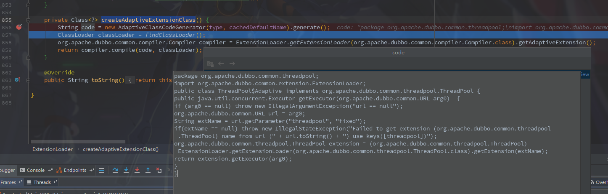

### SPI中查看$Adaptive类的代码

​		Dubbo源码中很多地方都会出现类似的用法

>egg: `WrappedChannelHandler` lines:`50`。这里是获取一个线程池
>```java
>executor = (ExecutorService) ExtensionLoader.getExtensionLoader(ThreadPool.class).getAdaptiveExtension().getExecutor(url);
>```

​		像代码中这种地方很难跟踪调试，比如上边代码我们可以知道是url获取了一个线程池，但是不明白他是根据url中哪个参数获取的，如何获取的。

​		跟踪发现我们可以进入`ExtensionLoader`中找到**createAdaptiveExtensionClass**，然后断点在方法中查看，可以发现



字符串code就是代码的字符串格式，我们拷贝下来即可查看，就是格式不太好看。