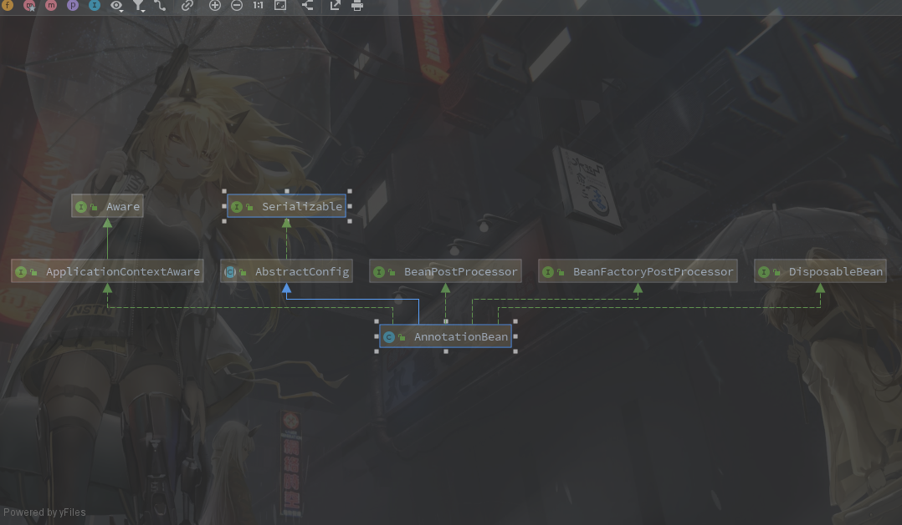
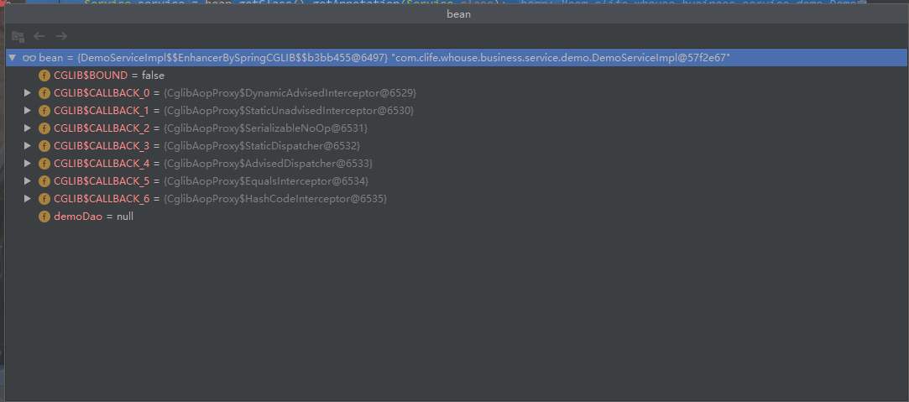

#### 公司代码使用Dubbo的Service注解无法注册服务的问题

​		总所周知**Dubbo**提供了自己的**Service**和**Reference**注解方便开发者可以更方便的注册和使用服务，但是在公司去出现了使用**Service**注解无法注册服务的问题，只能使用**XML**的方式提供服务感到不解，所以有时间看一下代码。

公司的**Dubbo**使用的还是**2.5.3**版本，没错，就是**Dubbo**还没有加入**apache**之前的版本。

**1.**通过**Dubbo**提供的**Service**找到使用它的地方，可以找到**AnnotationBean**类，查看**AnnotationBean**的类图



可以发现熟悉的**BeanPostProcessor**，查看代码发现在**postProcessAfterInitialization**有使用到**Service**

**2.** **AnnotationBean#postProcessAfterInitialization**

```java
public Object postProcessAfterInitialization(Object bean, String beanName) throws BeansException {
    //判断这个Bean是否匹配检测路径，这个路径是在配置文件的 dubbo:annotation 设置的
    if (! isMatchPackage(bean)) {
        return bean;
    }
    //判断bean是否有Service注解，调试发现问题就出现在这里
    Service service = bean.getClass().getAnnotation(Service.class);
    //如果有注解就注册服务了，下边代码都是注册服务代码
    if (service != null) {
        ServiceBean<Object> serviceConfig = new ServiceBean<Object>(service);
        if (void.class.equals(service.interfaceClass())
            && "".equals(service.interfaceName())) {
            if (bean.getClass().getInterfaces().length > 0) {
                serviceConfig.setInterface(bean.getClass().getInterfaces()[0]);
            } else {
                throw new IllegalStateException("Failed to export remote service class " + bean.getClass().getName() + ", cause: The @Service undefined interfaceClass or interfaceName, and the service class unimplemented any interfaces.");
            }
        }
        if (applicationContext != null) {
            serviceConfig.setApplicationContext(applicationContext);
            if (service.registry() != null && service.registry().length > 0) {
                List<RegistryConfig> registryConfigs = new ArrayList<RegistryConfig>();
                for (String registryId : service.registry()) {
                    if (registryId != null && registryId.length() > 0) {
                        registryConfigs.add((RegistryConfig)applicationContext.getBean(registryId, RegistryConfig.class));
                    }
                }
                serviceConfig.setRegistries(registryConfigs);
            }
            if (service.provider() != null && service.provider().length() > 0) {
                serviceConfig.setProvider((ProviderConfig)applicationContext.getBean(service.provider(),ProviderConfig.class));
            }
            if (service.monitor() != null && service.monitor().length() > 0) {
                serviceConfig.setMonitor((MonitorConfig)applicationContext.getBean(service.monitor(), MonitorConfig.class));
            }
            if (service.application() != null && service.application().length() > 0) {
                serviceConfig.setApplication((ApplicationConfig)applicationContext.getBean(service.application(), ApplicationConfig.class));
            }
            if (service.module() != null && service.module().length() > 0) {
                serviceConfig.setModule((ModuleConfig)applicationContext.getBean(service.module(), ModuleConfig.class));
            }
            if (service.provider() != null && service.provider().length() > 0) {
                serviceConfig.setProvider((ProviderConfig)applicationContext.getBean(service.provider(), ProviderConfig.class));
            } else {

            }
            if (service.protocol() != null && service.protocol().length > 0) {
                List<ProtocolConfig> protocolConfigs = new ArrayList<ProtocolConfig>();
                for (String protocolId : service.registry()) {
                    if (protocolId != null && protocolId.length() > 0) {
                        protocolConfigs.add((ProtocolConfig)applicationContext.getBean(protocolId, ProtocolConfig.class));
                    }
                }
                serviceConfig.setProtocols(protocolConfigs);
            }
            try {
                serviceConfig.afterPropertiesSet();
            } catch (RuntimeException e) {
                throw (RuntimeException) e;
            } catch (Exception e) {
                throw new IllegalStateException(e.getMessage(), e);
            }
        }
        serviceConfig.setRef(bean);
        serviceConfigs.add(serviceConfig);
        serviceConfig.export();
    }
    return bean;
}
```

​		在第二步**bean.getClass().getAnnotation(Service.class)**中发现有些类明明有**Service**却获取不到注解，调试发现是**bean**在到这一步时被代理了，此时拿到的是一个代理类，而不是原装的服务类了。



​		查看了一下代理类发现很多**Transaction**字样的类，尝试把代码中开启事务的代码注释后发现服务注册可以成功注册。那么问题很明显就是服务类在使用事务后会创建成代理类，导致注解丢失。


服务注册失败的问题弄清楚后，能够马上想到的解决办法有两个。

1. 我们可以知道**Spring**的**Bean**在刚注册时都是原来的类，然后**BeanPostProcessor**类的使用范围又很宽广，所以猜测应该是在某个顺序比较靠前的**BeanPostProcessor**实现类中将类给包装成代理类了，所以可以尝试改变**BeanPostProcessor**的顺序来实现服务注册；
2. 因为代理后丢失注解感觉上就有人遇见过才对，百度后发现在注解上增加**@Inherited**可以解决，在加上**Dubbo**关键字查询后发现新版本的**Dubbo**是没有这个问题，查看新版本的**Service**注解可以发现多了**@Inherited**注解；