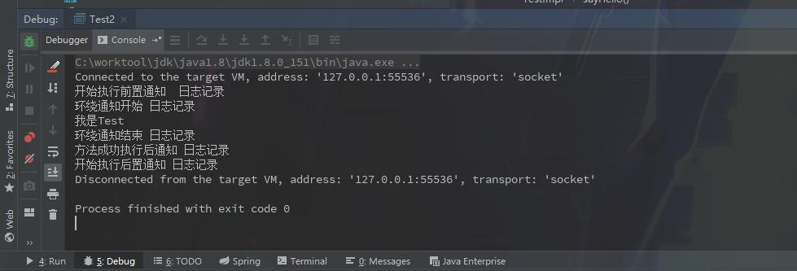
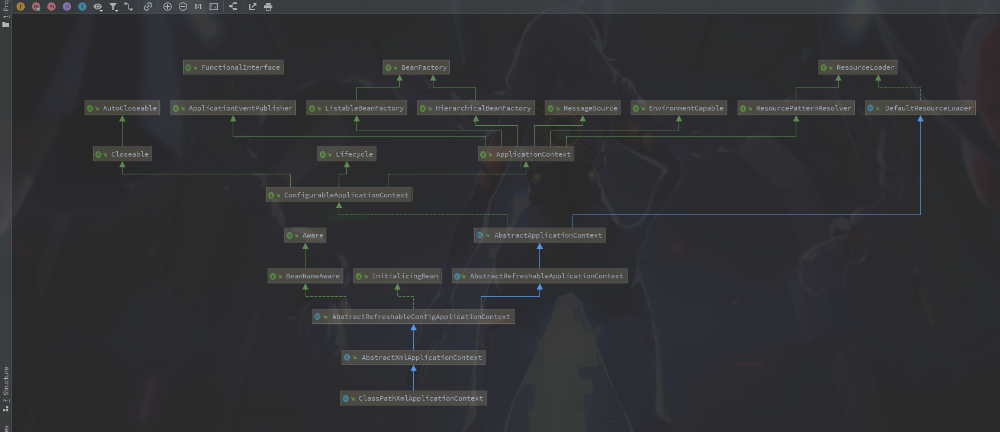

### Spring之AOP

​		**AOP**就是切面，概念理解上和Java中的过滤器，SpringMVC中的拦截器差不多，只不过粒度更细一些，可以在方法调用中增加自己的操作。

​		这里先说下代理模式，可以分为**静态代理**和**动态代理**，所谓**代理模式**，一般指的就是**A类**调用**B类**，**B类**再调用**C类**，这种时候**B类**就可以说是代理了**C类**。emmm，实际概念会更复杂一些，但是代理模式一般都符合这个模式。(这样看起来我们平时写的CURD，Service层貌似就是个代理了，不知道这样是不是可以说熟悉代理模式)。然后**静态代理**指写代码时就确定了**B类**只能代理**C类**，而**动态代理**需要初始化时才知道代理类，所以**B类**在动态代理中可能是代理**C**类，也可能是**BDEF**等其他类，所以叫做动态代理。

---

来一个测试代码示例:

**pom.xml**

```xml
<dependency>
    <groupId>org.springframework</groupId>
    <artifactId>spring-beans</artifactId>
    <version>5.1.8.RELEASE</version>
</dependency>
<dependency>
    <groupId>org.springframework</groupId>
    <artifactId>spring-aop</artifactId>
    <version>5.1.8.RELEASE</version>
</dependency>
<dependency>
    <groupId>org.aspectj</groupId>
    <artifactId>aspectjrt</artifactId>
    <version>1.9.4</version>
</dependency>
<dependency>
    <groupId>org.aspectj</groupId>
    <artifactId>aspectjweaver</artifactId>
    <version>1.9.4</version>
</dependency>
<dependency>
    <groupId>org.springframework</groupId>
    <artifactId>spring-context</artifactId>
    <version>5.1.8.RELEASE</version>
</dependency>
```

引入的稍微有点多，因为多了两个**aspectjrt**和**aspectjweaver**

**Main.java**

```java
package fgo.saber;

import fgo.saber.service.Test;
import org.springframework.context.ApplicationContext;
import org.springframework.context.support.ClassPathXmlApplicationContext;

/**
 * @author zq
 * @date 2019/9/25
 */
public class Test2 {

    public static void main(String[] args) {
        ApplicationContext applicationContext = new ClassPathXmlApplicationContext("spring.xml");

        Test test = applicationContext.getBean("testImpl", Test.class);

        test.sayHello()

    }
}
```

**Spring.xml**

```xml
<?xml version="1.0" encoding="UTF-8"?>
<beans xmlns="http://www.springframework.org/schema/beans"
	   xmlns:xsi="http://www.w3.org/2001/XMLSchema-instance" xmlns:aop="http://www.springframework.org/schema/aop"
	   xsi:schemaLocation="http://www.springframework.org/schema/beans http://www.springframework.org/schema/beans/spring-beans.xsd http://www.springframework.org/schema/aop http://www.springframework.org/schema/aop/spring-aop.xsd">

	<bean id="testImpl" class="fgo.saber.service.impl.TestImpl"/>

	<bean id="testAop" class="fgo.saber.aop.TestAop"/>

	<aop:aspectj-autoproxy proxy-target-class="true"/>

	<aop:config>
		<aop:pointcut id="testAopPointCut" expression="execution(* fgo.saber.service.impl.TestImpl.*(..))"/>
		<aop:aspect ref="testAop" order="1" id="testAspect">
			<aop:before method="beforeLog" pointcut-ref="testAopPointCut"/>
			<aop:after method="afterLog" pointcut-ref="testAopPointCut"/>
			<aop:after-returning method="afterReturningLog" pointcut-ref="testAopPointCut" />
			<aop:after-throwing method="afterThrowingLog" pointcut-ref="testAopPointCut"/>
			<aop:around method="aroundLog" pointcut-ref="testAopPointCut" />
		</aop:aspect>
	</aop:config>
</beans>
```

执行结果:



写这个测试例子的遇见一个，一开始想使用前边**IOC**测试启动中用到的**DefaultListableBeanFactory**类加载，但是这样启动的**Spring AOP**中的代码并不会执行，然后网上查找换成**ApplicationContext**才正常执行，本次争取查找一下这个问题。

---

**1.**因为启动时直接从**ClassPathXmlApplicationContext**启动，所以先看看这个类的继承关系.



从图里可以看出一个熟悉的接口**BeanFactory**，前边**IOC中的DefaultListableBeanFactory**也有实现这个接口，通过这个接口可以获取Bean实例，是**Spring**中一个很重要的接口。

进入**ClassPathXmlApplicationContext**方法

```java
public ClassPathXmlApplicationContext(
    String[] configLocations, boolean refresh, @Nullable ApplicationContext parent)
    throws BeansException {
	//没啥用的样子
    super(parent);
    //设置文件的路径
    setConfigLocations(configLocations);
    if (refresh) {
        //初始化工作都是在这里
        refresh();
    }
}
```

**2.**跟踪进入到**AbstractApplicationContext#refresh()**方法。这里可以说是最重要的一个方法了，很多重要的步骤都是在这里完成的。

```java
@Override
public void refresh() throws BeansException, IllegalStateException {
    synchronized (this.startupShutdownMonitor) {
        //初始化了一些东西，跑了一遍默认并没有执行什么东西
        // Prepare this context for refreshing.
        prepareRefresh();

        // Tell the subclass to refresh the internal bean factory.
        ConfigurableListableBeanFactory beanFactory = obtainFreshBeanFactory();

        // Prepare the bean factory for use in this context.
        prepareBeanFactory(beanFactory);

        try {
            // Allows post-processing of the bean factory in context subclasses.
            postProcessBeanFactory(beanFactory);

            // Invoke factory processors registered as beans in the context.
            invokeBeanFactoryPostProcessors(beanFactory);

            // Register bean processors that intercept bean creation.
            registerBeanPostProcessors(beanFactory);

            // Initialize message source for this context.
            initMessageSource();

            // Initialize event multicaster for this context.
            initApplicationEventMulticaster();

            // Initialize other special beans in specific context subclasses.
            onRefresh();

            // Check for listener beans and register them.
            registerListeners();

            // Instantiate all remaining (non-lazy-init) singletons.
            finishBeanFactoryInitialization(beanFactory);

            // Last step: publish corresponding event.
            finishRefresh();
        }

        catch (BeansException ex) {
            if (logger.isWarnEnabled()) {
                logger.warn("Exception encountered during context initialization - " +
                            "cancelling refresh attempt: " + ex);
            }

            // Destroy already created singletons to avoid dangling resources.
            destroyBeans();

            // Reset 'active' flag.
            cancelRefresh(ex);

            // Propagate exception to caller.
            throw ex;
        }

        finally {
            // Reset common introspection caches in Spring's core, since we
            // might not ever need metadata for singleton beans anymore...
            resetCommonCaches();
        }
    }
}
```

**3.**从上边第二步 **obtainFreshBeanFactory()** 跟踪进入到 **AbstractRefreshableApplicationContext# refreshBeanFactory()**方法

**AbstractRefreshableApplicationContext**

```java
@Override
protected final void refreshBeanFactory() throws BeansException {
    //如果已经初始化过BeanFactory会先销毁
    if (hasBeanFactory()) {
        destroyBeans();
        closeBeanFactory();
    }
    try {
        //这里看到初始化了我们熟悉的 DefaultListableBeanFactory
        DefaultListableBeanFactory beanFactory = createBeanFactory();
        beanFactory.setSerializationId(getId());
        customizeBeanFactory(beanFactory);
        //看方法名可以猜测这里做的就是 DefaultListableBeanFactory 初始化Bean的那一步
        loadBeanDefinitions(beanFactory);
        synchronized (this.beanFactoryMonitor) {
            this.beanFactory = beanFactory;
        }
    }
    catch (IOException ex) {
        throw new ApplicationContextException("I/O error parsing bean definition source for " + getDisplayName(), ex);
    }
}
```

**4.** 跟踪进入 **AbstractXmlApplicationContext#loadBeanDefinitions** 方法

```java
@Override
protected void loadBeanDefinitions(DefaultListableBeanFactory beanFactory) throws BeansException, IOException {
    // Create a new XmlBeanDefinitionReader for the given BeanFactory.
    XmlBeanDefinitionReader beanDefinitionReader = new XmlBeanDefinitionReader(beanFactory);

    // Configure the bean definition reader with this context's
    // resource loading environment.
    beanDefinitionReader.setEnvironment(this.getEnvironment());
    beanDefinitionReader.setResourceLoader(this);
    beanDefinitionReader.setEntityResolver(new ResourceEntityResolver(this));

    // Allow a subclass to provide custom initialization of the reader,
    // then proceed with actually loading the bean definitions.
    initBeanDefinitionReader(beanDefinitionReader);
    loadBeanDefinitions(beanDefinitionReader);
}
```

可以看到这里和猜想的一样，这里主要通过解析xml文件初始化Spring的容器。

**5.** 回到 **AbstractApplicationContext#refresh()**方法:

```java
@Override
public void refresh() throws BeansException, IllegalStateException {
    synchronized (this.startupShutdownMonitor) {
        //初始化了一些东西，跑了一遍默认并没有执行什么东西
        // Prepare this context for refreshing.
        prepareRefresh();

        // Tell the subclass to refresh the internal bean factory.
        //初始化了Spring的工厂。解析xml中的配置.这里BeanDefinition都已经解析完成了
        ConfigurableListableBeanFactory beanFactory = obtainFreshBeanFactory();

        // Prepare the bean factory for use in this context.
        //设置了一堆东西。后边有想起来可以看看
        prepareBeanFactory(beanFactory);

        try {
            // Allows post-processing of the bean factory in context subclasses.
            postProcessBeanFactory(beanFactory);

            // Invoke factory processors registered as beans in the context.
            invokeBeanFactoryPostProcessors(beanFactory);

            // Register bean processors that intercept bean creation.
            registerBeanPostProcessors(beanFactory);

            // Initialize message source for this context.
            initMessageSource();

            // Initialize event multicaster for this context.
            initApplicationEventMulticaster();

            // Initialize other special beans in specific context subclasses.
            onRefresh();

            // Check for listener beans and register them.
            registerListeners();

            // Instantiate all remaining (non-lazy-init) singletons.
            finishBeanFactoryInitialization(beanFactory);

            // Last step: publish corresponding event.
            finishRefresh();
        }

        catch (BeansException ex) {
            if (logger.isWarnEnabled()) {
                logger.warn("Exception encountered during context initialization - " +
                            "cancelling refresh attempt: " + ex);
            }

            // Destroy already created singletons to avoid dangling resources.
            destroyBeans();

            // Reset 'active' flag.
            cancelRefresh(ex);

            // Propagate exception to caller.
            throw ex;
        }

        finally {
            // Reset common introspection caches in Spring's core, since we
            // might not ever need metadata for singleton beans anymore...
            resetCommonCaches();
        }
    }
}
```

