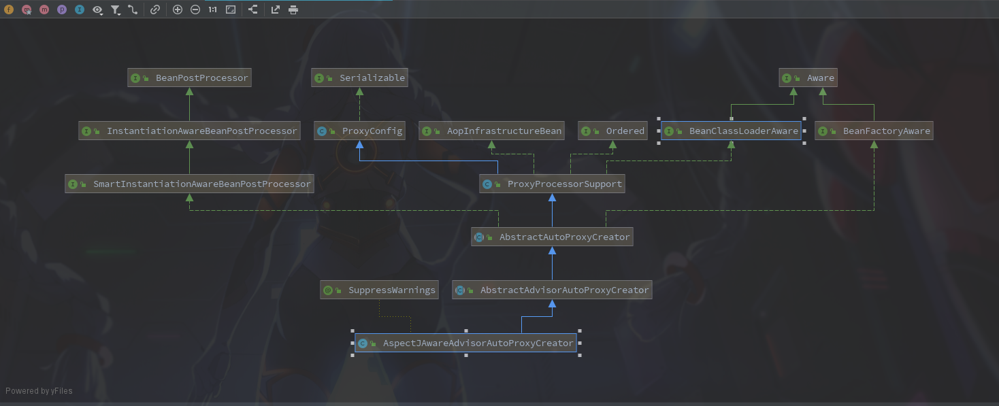
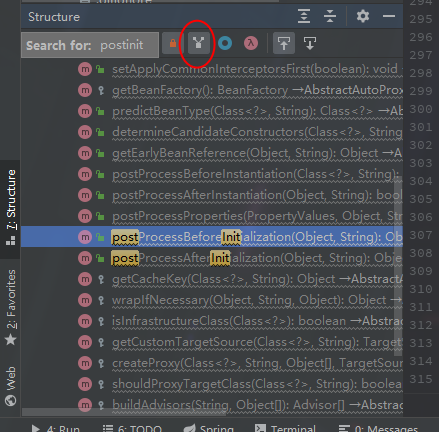

### Spring之AOP

​		前边看到**Spring**中**AOP**的启动过程，总结来说就是解析Xml，先将配置文件解析成**BeanDefinition**,然后顺带多注册了一个叫**AspectJAwareAdvisorAutoProxyCreator**的Bean。

**AspectJAwareAdvisorAutoProxyCreator**类图



通过类图可以发现该类继承实现有**BeanPostProcessor**接口的类，该类会在启动时调用，可以猜测AOP需要的配置就是在这个类中实现的。

使用Idea的一个视图功能找到实现**BeanPostProcessor**的代码位置，快捷键是`Alt+7`。



**1.**来到**AbstractAutoProxyCreator.postProcessBeforeInitialization**方法，可以发现两个实现的方法都在这里。

```java
@Override
public Object postProcessBeforeInitialization(Object bean, String beanName) {
    return bean;
}

/**
	 * Create a proxy with the configured interceptors if the bean is
	 * identified as one to proxy by the subclass.
	 * @see #getAdvicesAndAdvisorsForBean
	 */
@Override
public Object postProcessAfterInitialization(@Nullable Object bean, String beanName) {
    if (bean != null) {
        //点进去可以看见一般情况下返回的就是beanname或者bean.getClass()
        Object cacheKey = getCacheKey(bean.getClass(), beanName);
        //earlyProxyReferences一开始是空的
        if (this.earlyProxyReferences.remove(cacheKey) != bean) {
            return wrapIfNecessary(bean, beanName, cacheKey);
        }
    }
    return bean;
}
```

可以看到这里在实例化之前的**postProcessBeforeInitialization**方法并没有做任何事情，都是在Bean实例化之后再执行的。

**2.**来到**AbstractAutoProxyCreator.wrapIfNecessary**方法

```java
protected Object wrapIfNecessary(Object bean, String beanName, Object cacheKey) {
    if (StringUtils.hasLength(beanName) && this.targetSourcedBeans.contains(beanName)) {
        return bean;
    }
    //走到这里发现直接return了
    if (Boolean.FALSE.equals(this.advisedBeans.get(cacheKey))) {
        return bean;
    }
    if (isInfrastructureClass(bean.getClass()) || shouldSkip(bean.getClass(), beanName)) {
        this.advisedBeans.put(cacheKey, Boolean.FALSE);
        return bean;
    }

    // Create proxy if we have advice.
    Object[] specificInterceptors = getAdvicesAndAdvisorsForBean(bean.getClass(), beanName, null);
    if (specificInterceptors != DO_NOT_PROXY) {
        this.advisedBeans.put(cacheKey, Boolean.TRUE);
        Object proxy = createProxy(
            bean.getClass(), beanName, specificInterceptors, new SingletonTargetSource(bean));
        this.proxyTypes.put(cacheKey, proxy.getClass());
        return proxy;
    }

    this.advisedBeans.put(cacheKey, Boolean.FALSE);
    return bean;
}
```

**this.advisedBeans.get(cacheKey)**走到这里的return返回了。跟踪查找下这个**advisedBeans**的属性，发现该属性会在**postProcessBeforeInstantiation**方法中调用，该方法会在**applyBeanPostProcessorsAfterInitialization**方法之前调用。然后在该方法中会将一些Aop相关的类过滤掉。

参考**AbstractAutoProxyCreator#isInfrastructureClass**方法

```java
protected boolean isInfrastructureClass(Class<?> beanClass) {
    boolean retVal = Advice.class.isAssignableFrom(beanClass) ||
        Pointcut.class.isAssignableFrom(beanClass) ||
            Advisor.class.isAssignableFrom(beanClass) ||
                AopInfrastructureBean.class.isAssignableFrom(beanClass);
    if (retVal && logger.isTraceEnabled()) {
        logger.trace("Did not attempt to auto-proxy infrastructure class [" + beanClass.getName() + "]");
    }
    return retVal;
}
```

**3.** 先看看**AbstractAdvisorAutoProxyCreator.getAdvicesAndAdvisorsForBean**方法

**AbstractAdvisorAutoProxyCreator.getAdvicesAndAdvisorsForBean**

```java
protected Object[] getAdvicesAndAdvisorsForBean(
			Class<?> beanClass, String beanName, @Nullable TargetSource targetSource) {

    List<Advisor> advisors = findEligibleAdvisors(beanClass, beanName);
    if (advisors.isEmpty()) {
        return DO_NOT_PROXY;
    }
    return advisors.toArray();
}
```

**AbstractAdvisorAutoProxyCreator.findEligibleAdvisors**

```java
protected List<Advisor> findEligibleAdvisors(Class<?> beanClass, String beanName) {
    //之前解析Aop配置文件中注册的BeanDefition
    List<Advisor> candidateAdvisors = findCandidateAdvisors();
    //这里发挥了expression="execution(* fgo.saber.service.impl.TestImpl.*(..))"的过滤作用
    List<Advisor> eligibleAdvisors = findAdvisorsThatCanApply(candidateAdvisors, beanClass, beanName);
    extendAdvisors(eligibleAdvisors);
    if (!eligibleAdvisors.isEmpty()) {
        eligibleAdvisors = sortAdvisors(eligibleAdvisors);
    }
    return eligibleAdvisors;
}
```

配置文件中的**<aop:pointcut id="testAopPointCut" expression="execution(* fgo.saber.service.impl.TestImpl.*(..))"/>**会在这里过滤返回匹配的切面

**4.**返回**AbstractAutoProxyCreator#createProxy**方法

```java
protected Object createProxy(Class<?> beanClass, @Nullable String beanName,
			@Nullable Object[] specificInterceptors, TargetSource targetSource) {

    if (this.beanFactory instanceof ConfigurableListableBeanFactory) {
        AutoProxyUtils.exposeTargetClass((ConfigurableListableBeanFactory) this.beanFactory, beanName, beanClass);
    }

    ProxyFactory proxyFactory = new ProxyFactory();
    proxyFactory.copyFrom(this);

    if (!proxyFactory.isProxyTargetClass()) {
        if (shouldProxyTargetClass(beanClass, beanName)) {
            proxyFactory.setProxyTargetClass(true);
        }
        else {
            evaluateProxyInterfaces(beanClass, proxyFactory);
        }
    }

    Advisor[] advisors = buildAdvisors(beanName, specificInterceptors);
    proxyFactory.addAdvisors(advisors);
    proxyFactory.setTargetSource(targetSource);
    customizeProxyFactory(proxyFactory);

    proxyFactory.setFrozen(this.freezeProxy);
    if (advisorsPreFiltered()) {
        proxyFactory.setPreFiltered(true);
    }
	//proxyFactory采用工厂模式创建的代理
    return proxyFactory.getProxy(getProxyClassLoader());
}
```

**5.**一路跟踪来到**DefaultAopProxyFactory#createAopProxy**方法

```java
@Override
public AopProxy createAopProxy(AdvisedSupport config) throws AopConfigException {
    //第一个条件不认识
    //第二个是可以配置的<aop:aspectj-autoproxy proxy-target-class="true"/>
    //第三个是如果没有实现接口
    if (config.isOptimize() || config.isProxyTargetClass() || hasNoUserSuppliedProxyInterfaces(config)) {
        Class<?> targetClass = config.getTargetClass();
        if (targetClass == null) {
            throw new AopConfigException("TargetSource cannot determine target class: " +
                                         "Either an interface or a target is required for proxy creation.");
        }
        if (targetClass.isInterface() || Proxy.isProxyClass(targetClass)) {
            return new JdkDynamicAopProxy(config);
        }
        //返回一个cglib的代理
        return new ObjenesisCglibAopProxy(config);
    }
    else {
        //返回一个jdk代理
        return new JdkDynamicAopProxy(config);
    }
}
```

这段主要是判断配置**proxy-target-class**和是否实现接口，使用不同的代理方法创建代理。

#### 启动流程总结:

1. 解析**spring.xml**中的配置为**Definition**类并保存起来，其中解析**AOP**配置时注册了一个**AspectJAwareAdvisorAutoProxyCreator**
2. 当创建Bean的时候，例子中**testImpl**实例化的时候会调用**AspectJAwareAdvisorAutoProxyCreator#postProcessAfterInitialization**方法。
3. 在**postProcessAfterInitialization**方法中，会将解析**spring.xml**中拿到的所有**AOP**切点拿出来，判断有没有匹配这个Bean的切点配置，如果有的话则创建代理类返回。
4. 在创建代理的时候会根据**proxy-target-class**配置和是否有实现接口来判断使用jdk代理或者cglib代理。(proxy-target-class为true或者没有实现接口使用cglib，否则使用jdk代理)

### 总结：

​		这里主要描述了**Spring**中**AOP**启动时如何解析配置文件到为Bean创建代理的过程。其中**创建代理**其实就是代理模式的应用，然后这里比较重要的还有**BeanPostProcessor**在**Spring**中发挥的作用，之后可以总结一下。