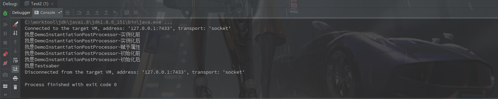

#### Spring中InstantiationAwareBeanPostProcessor

​		**InstantiationAwareBeanPostProcessor**是继承**BeanPostProcessor**，相比**BeanPostProcessor**多了四个可实现方法。

```java
public interface InstantiationAwareBeanPostProcessor extends BeanPostProcessor {
    @Nullable
	default Object postProcessBeforeInstantiation(Class<?> beanClass, String beanName) throws BeansException {
		return null;
	}
    
    default boolean postProcessAfterInstantiation(Object bean, String beanName) throws BeansException {
		return true;
	}
    
    @Nullable
	default PropertyValues postProcessProperties(PropertyValues pvs, Object bean, String beanName) throws BeansException {

		return null;
	}
    
    @Deprecated
	@Nullable
	default PropertyValues postProcessPropertyValues(
			PropertyValues pvs, PropertyDescriptor[] pds, Object bean, String beanName) throws BeansException {

		return pvs;
	}
}
```

下边看看各个方法的作用:

**default Object postProcessBeforeInstantiation(Class<?> beanClass, String beanName)**方法会在**AbstractAutowireCapableBeanFactory#createBean**中调用

```java
@Override
protected Object createBean(String beanName, RootBeanDefinition mbd, @Nullable Object[] args) throws BeanCreationException {

   /**
   *	省略
   **/

    try {
        // Give BeanPostProcessors a chance to return a proxy instead of the target bean instance.
        //这里InstantiationAwareBeanPostProcessor.postProcessBeforeInstantiation调用的地方
        Object bean = resolveBeforeInstantiation(beanName, mbdToUse);
        if (bean != null) {
            //如果InstantiationAwareBeanPostProcessor返回值不为null会直接返回
            return bean;
        }
    }
    catch (Throwable ex) {
        throw new BeanCreationException(mbdToUse.getResourceDescription(), beanName,
                                        "BeanPostProcessor before instantiation of bean failed", ex);
    }

    try {
        //这里是BeanPostProcessor调用的地方
        Object beanInstance = doCreateBean(beanName, mbdToUse, args);
        if (logger.isTraceEnabled()) {
            logger.trace("Finished creating instance of bean '" + beanName + "'");
        }
        return beanInstance;
    }
    
    ....
}
```

​		从代码中可以看出**postProcessBeforeInstantiation**方法如果有返回值的话，会改变**Bean**的类型直接返回。


**boolean postProcessAfterInstantiation(Object bean, String beanName)**方法会在**AbstractAutowireCapableBeanFactory#doCreateBean**中调用

```java
protected Object doCreateBean(final String beanName, final RootBeanDefinition mbd, final @Nullable Object[] args) throws BeanCreationException {

    ...

    // Initialize the bean instance.
    Object exposedObject = bean;
    try {
        //这里InstantiationAwareBeanPostProcessor.postProcessAfterInstantiation调用的地方
        populateBean(beanName, mbd, instanceWrapper);
        //这里是BeanPostProcessor调用的地方
        exposedObject = initializeBean(beanName, exposedObject, mbd);
    }
    ...
}
```

该方法的调用时间同样在**BeanPostProcessor**前，返回值是个布尔值，作用是控制是否进入**InstantiationAwareBeanPostProcessor#postProcessProperties**方法


**default PropertyValues postProcessProperties(PropertyValues pvs, Object bean, String beanName)**方法会根据**postProcessAfterInstantiation**返回为true是进入，返回的**PropertyValues **可以理解成是一个**Map**，会根据**name**为**Bean**的属性复制。


---

下边放一个测试例子:

**Main.java**

```java
public class Test2 {

    public static void main(String[] args) {
        ClassPathXmlApplicationContext applicationContext = new ClassPathXmlApplicationContext("spring-processor.xml");
        Test test = applicationContext.getBean("testImpl", Test.class);
        test.sayHello();
    }
}
```

**spring-processor.xml**

```xml
<?xml version="1.0" encoding="UTF-8"?>
<beans xmlns="http://www.springframework.org/schema/beans"
	   xmlns:xsi="http://www.w3.org/2001/XMLSchema-instance" xmlns:aop="http://www.springframework.org/schema/aop"
	   xsi:schemaLocation="http://www.springframework.org/schema/beans http://www.springframework.org/schema/beans/spring-beans.xsd http://www.springframework.org/schema/aop http://www.springframework.org/schema/aop/spring-aop.xsd">

	<bean class="fgo.saber.post.processor.DemoInstantiationPostProcessor"/>

	<bean id="testImpl" class="fgo.saber.service.impl.TestImpl"/>
</beans>
```

**DemoInstantiationPostProcessor.java**

```java
public class DemoInstantiationPostProcessor implements InstantiationAwareBeanPostProcessor {


    @Override
    public Object postProcessBeforeInstantiation(Class<?> beanClass, String beanName) throws BeansException {
        System.out.println("我是DemoInstantiationPostProcessor-实例化前");
        return null;
    }

    @Override
    public boolean postProcessAfterInstantiation(Object bean, String beanName) throws BeansException {
        System.out.println("我是DemoInstantiationPostProcessor-实例化后");
        return true;
    }

    @Override
    public PropertyValues postProcessProperties(PropertyValues pvs, Object bean, String beanName) throws BeansException {
        System.out.println("我是DemoInstantiationPostProcessor-赋予属性");
        MutablePropertyValues propertyValues = new MutablePropertyValues();
        propertyValues.add("name", "saber");
        return propertyValues;
    }


    @Override
    public Object postProcessBeforeInitialization(Object bean, String beanName) throws BeansException {
        System.out.println("我是DemoInstantiationPostProcessor-初始化前");
        return null;
    }

    @Override
    public Object postProcessAfterInitialization(Object bean, String beanName) throws BeansException {
        System.out.println("我是DemoInstantiationPostProcessor-初始化后");
        return null;
    }
}
```

**TestImpl.java**

```java
public class TestImpl implements Test {

    private String name;

    @Override
    public String sayHello() {
        System.out.println("我是Test" + name);
        return "我是Test" + name;
    }

    public String getName() {
        return name;
    }

    public void setName(String name) {
        this.name = name;
    }
}
```

运行结果:




##### 结论：

- **InstantiationAwareBeanPostProcessor**的调用在**BeanPostProcessor**之前;
- 如果**InstantiationAwareBeanPostProcessor.postProcessBeforeInstantiation**返回值不为null的话，会直接调用**BeanPostProcessor.postProcessAfterInitialization**然后结束；
- 在**InstantiationAwareBeanPostProcessor.postProcessProperties**返回的值会直接复制到**Bean**的属性中；