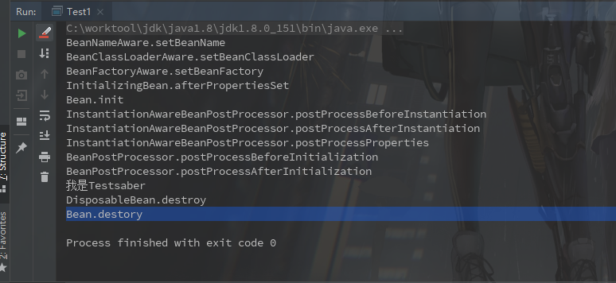

#### Spring生命周期

​		在程序中生命周期一般指的是程序运行中的一些特殊时期，比如一个类创建前，创建后。在Spring中生命周期方法主要可以分为:

1. **Bean自身的方法:**

   > 配置文件中<bean>的init-method和destroy-method指定的方法

2. **Bean级生命周期接口方法:**

   > BeanNameAware，BeanFactoryAware，BeanClassLoaderAware，
   >
   > InitializingBean，DisposableBean

3. **容器级生命周期接口方法:**

   >BeanPostProcessor，InstantiationAwareBeanPostProcessor

上边是SpringCore中的，实际项目中使用的SpringMVC一般还包括了SpringContext的功能，类似的方法会更多。

---

用个demo演示一下调用顺序:

**LifeCyclePostProcessor.java**

```java
public class LifeCyclePostProcessor implements BeanNameAware, BeanFactoryAware, BeanClassLoaderAware, InitializingBean, DisposableBean, BeanPostProcessor, InstantiationAwareBeanPostProcessor {

    public void init() {
        System.out.println("Bean.init");
    }

    public void destory12() {
        System.out.println("Bean.destory");
    }

    @Override
    public void setBeanName(String name) {
        System.out.println("BeanNameAware.setBeanName");
    }

    @Override
    public void setBeanFactory(BeanFactory beanFactory) throws BeansException {
        System.out.println("BeanFactoryAware.setBeanFactory");
    }

    @Override
    public void setBeanClassLoader(ClassLoader classLoader) {
        System.out.println("BeanClassLoaderAware.setBeanClassLoader");
    }

    @Override
    public void afterPropertiesSet() throws Exception {
        System.out.println("InitializingBean.afterPropertiesSet");
    }

    @Override
    public void destroy() throws Exception {
        System.out.println("DisposableBean.destroy");
    }

    @Override
    public Object postProcessBeforeInitialization(Object bean, String beanName) throws BeansException {
        System.out.println("BeanPostProcessor.postProcessBeforeInitialization");
        return null;
    }

    @Override
    public Object postProcessAfterInitialization(Object bean, String beanName) throws BeansException {
        System.out.println("BeanPostProcessor.postProcessAfterInitialization");
        return null;
    }

    @Override
    public Object postProcessBeforeInstantiation(Class<?> beanClass, String beanName) throws BeansException {
        System.out.println("InstantiationAwareBeanPostProcessor.postProcessBeforeInstantiation");
        return null;
    }

    @Override
    public boolean postProcessAfterInstantiation(Object bean, String beanName) throws BeansException {
        System.out.println("InstantiationAwareBeanPostProcessor.postProcessAfterInstantiation");
        return true;
    }

    @Override
    public PropertyValues postProcessProperties(PropertyValues pvs, Object bean, String beanName) throws BeansException {
        System.out.println("InstantiationAwareBeanPostProcessor.postProcessProperties");
        MutablePropertyValues propertyValues = new MutablePropertyValues();
        propertyValues.add("name", "saber");
        return propertyValues;
    }
}
```

**Test1.java**

```java
public class Test1 {

    public static void main(String[] args) {

        DefaultListableBeanFactory factory = new DefaultListableBeanFactory();

        XmlBeanDefinitionReader reader = new XmlBeanDefinitionReader(factory);

        reader.loadBeanDefinitions(new ClassPathResource("spring-processor.xml"));


        factory.addBeanPostProcessor(factory.getBean(LifeCyclePostProcessor.class));

        Test test = factory.getBean("testImpl", Test.class);
        test.sayHello();
        factory.destroySingletons();

    }
}
```

**spring-processor.xml**

```xml
<?xml version="1.0" encoding="UTF-8"?>
<beans xmlns="http://www.springframework.org/schema/beans"
	   xmlns:xsi="http://www.w3.org/2001/XMLSchema-instance" xmlns:aop="http://www.springframework.org/schema/aop"
	   xsi:schemaLocation="http://www.springframework.org/schema/beans http://www.springframework.org/schema/beans/spring-beans.xsd http://www.springframework.org/schema/aop http://www.springframework.org/schema/aop/spring-aop.xsd">

	<bean class="fgo.saber.lifecycle.LifeCyclePostProcessor" init-method="init" destroy-method="destory12"/>


	<bean id="testImpl" class="fgo.saber.service.impl.TestImpl"/>
</beans>
```

**调用结果**



