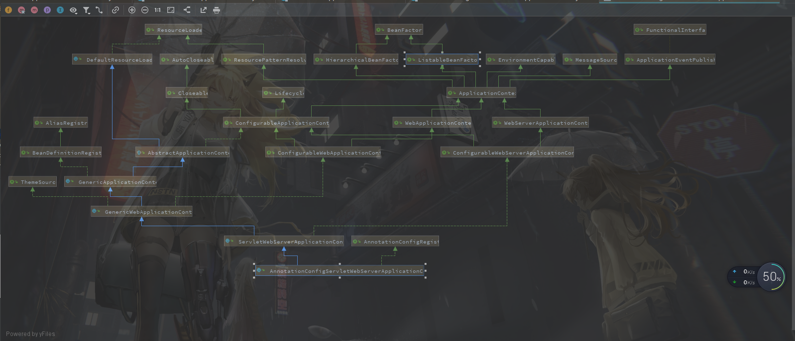
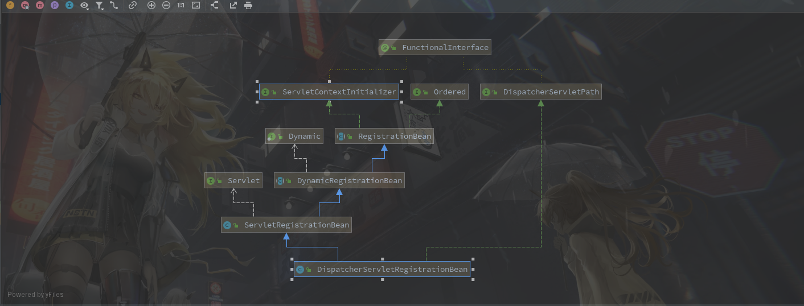

#### 从SpringBoot启动流程

​		因为**SpringMVC**是实现`Servlet`实现的，需要依赖**Tomcat**或者其他容器才能启动，所以直接从**SpringBoot**看起

**pom.xml**

```xml
<dependency>
    <groupId>org.springframework.boot</groupId>
    <artifactId>spring-boot-starter-web</artifactId>
</dependency>
```

**1.**首先从启动函数开始**SpringApplication**

```java
@SpringBootApplication
public class DemoApplication {
    public static void main(String[] args) {
        SpringApplication.run(DemoApplication.class, args);
    }
}
```

**2.**跟踪**run**方法

```java
public static ConfigurableApplicationContext run(Class<?>[] primarySources, String[] 			args) {
    //在new SpringApplication(primarySources)会初始化一些数据
    return new SpringApplication(primarySources).run(args);
}
```

**new SpringApplication(primarySources)**

```java
public SpringApplication(ResourceLoader resourceLoader, Class<?>... primarySources) {
    this.resourceLoader = resourceLoader;
    Assert.notNull(primarySources, "PrimarySources must not be null");
    this.primarySources = new LinkedHashSet<>(Arrays.asList(primarySources));
    this.webApplicationType = WebApplicationType.deduceFromClasspath();
    //这里从META-INF/spring.factories读取到类路径保存了下来
    setInitializers(                 (Collection)getSpringFactoriesInstances(ApplicationContextInitializer.class)
    );
    setListeners((Collection) getSpringFactoriesInstances(ApplicationListener.class));
    this.mainApplicationClass = deduceMainApplicationClass();
}
```

**3.**进入**SpringApplication#run**方法

```java
public ConfigurableApplicationContext run(String... args) {
    StopWatch stopWatch = new StopWatch();
    stopWatch.start();
    ConfigurableApplicationContext context = null;
    Collection<SpringBootExceptionReporter> exceptionReporters = new ArrayList<>();
    configureHeadlessProperty();
    //和上边一样从META-INF/spring.factories读取到SpringApplicationRunListener类
    SpringApplicationRunListeners listeners = getRunListeners(args);
    //立马调用了starting方法
    listeners.starting();
    try {
        ApplicationArguments applicationArguments = new DefaultApplicationArguments(args);
        ConfigurableEnvironment environment = prepareEnvironment(listeners, applicationArguments);
        configureIgnoreBeanInfo(environment);
        //看名字像是启动展示Banner图
        Banner printedBanner = printBanner(environment);
        //默认创建 AnnotationConfigServletWebServerApplicationContext
        context = createApplicationContext();
        //从META-INF/spring.factories读取到SpringBootExceptionReporter类
        exceptionReporters =   getSpringFactoriesInstances(SpringBootExceptionReporter.class,
        new Class[] { ConfigurableApplicationContext.class }, context);
        prepareContext(context, environment, listeners, applicationArguments, printedBanner);
        //刷新 context，将启动设置都配置好后刷新一遍，等于是启动功能了
        refreshContext(context);
        afterRefresh(context, applicationArguments);
        stopWatch.stop();
        if (this.logStartupInfo) {
            new StartupInfoLogger(this.mainApplicationClass).logStarted(getApplicationLog(), stopWatch);
        }
        listeners.started(context);
        callRunners(context, applicationArguments);
    }
    catch (Throwable ex) {
        handleRunFailure(context, ex, exceptionReporters, listeners);
        throw new IllegalStateException(ex);
    }

    try {
        listeners.running(context);
    }
    catch (Throwable ex) {
        handleRunFailure(context, ex, exceptionReporters, null);
        throw new IllegalStateException(ex);
    }
    return context;
}
```

**4.**跟踪**refreshContext**进入到**refresh**

```java
protected void refresh(ApplicationContext applicationContext) {
    Assert.isInstanceOf(AbstractApplicationContext.class, applicationContext);
    这里可以看到之前 SpringContext 代码中比较熟悉的refresh方法
    ((AbstractApplicationContext) applicationContext).refresh();
}
```

**AbstractApplicationContext#refresh()**

```java
public void refresh() throws BeansException, IllegalStateException {
    synchronized (this.startupShutdownMonitor) {
        // Prepare this context for refreshing.
        prepareRefresh();

        // Tell the subclass to refresh the internal bean factory.
        ConfigurableListableBeanFactory beanFactory = obtainFreshBeanFactory();

        // Prepare the bean factory for use in this context.
        prepareBeanFactory(beanFactory);

        try {
            // Allows post-processing of the bean factory in context subclasses.
            postProcessBeanFactory(beanFactory);

            // Invoke factory processors registered as beans in the context.
            invokeBeanFactoryPostProcessors(beanFactory);

            // Register bean processors that intercept bean creation.
            registerBeanPostProcessors(beanFactory);

            // Initialize message source for this context.
            initMessageSource();

            // Initialize event multicaster for this context.
            initApplicationEventMulticaster();

            // Initialize other special beans in specific context subclasses.
            onRefresh();

            // Check for listener beans and register them.
            registerListeners();

            // Instantiate all remaining (non-lazy-init) singletons.
            finishBeanFactoryInitialization(beanFactory);

            // Last step: publish corresponding event.
            finishRefresh();
        }

        catch (BeansException ex) {
            if (logger.isWarnEnabled()) {
                logger.warn("Exception encountered during context initialization - " +
                            "cancelling refresh attempt: " + ex);
            }

            // Destroy already created singletons to avoid dangling resources.
            destroyBeans();

            // Reset 'active' flag.
            cancelRefresh(ex);

            // Propagate exception to caller.
            throw ex;
        }

        finally {
            // Reset common introspection caches in Spring's core, since we
            // might not ever need metadata for singleton beans anymore...
            resetCommonCaches();
        }
    }
}
```

这里代码就比较熟悉了，大意就是扫描项目中的**Bean**和初始化之类的工作，那么**SpringBoot**接下来的启动工作暂且认为还有自带的**tomcat**启动完成就好了。

**5.**在上边**AbstractApplicationContext#refresh()**中有调用一个名为 **onRefresh()**的方法，点进去发现

```java
protected void onRefresh() throws BeansException {
    // For subclasses: do nothing by default.
}
```

这个方法默认是空的，这样写的目的是为子类重写时提供一个类似钩子的方法，而前边创建**SpringContext**的时候有提到默认创建的是**AnnotationConfigServletWebServerApplicationContext**

**AnnotationConfigServletWebServerApplicationContext类图**



查看可以发现父类**ServletWebServerApplicationContext#onRefresh()**有重写该方法

```java
@Override
protected void onRefresh() {
    //先调用父类的onRefresh()方法
    super.onRefresh();
    try {
        //然后创建自己的服务容器
        createWebServer();
    }
    catch (Throwable ex) {
        throw new ApplicationContextException("Unable to start web server", ex);
    }
}
```

​		这里关于怎么找到**ServletWebServerApplicationContext#onRefresh()**方法，其实是通过日志观察反向推理发现的，否则要按着代码一行行看完的找难度是真的大。

**6.**根据回忆下**SpringMVC**使用主要是需要配置**DispatcherServlet**，进入**createWebServer**

```java
private void createWebServer() {
    WebServer webServer = this.webServer;
    ServletContext servletContext = getServletContext();
    if (webServer == null && servletContext == null) {
        ServletWebServerFactory factory = getWebServerFactory();
        //配置tomcat都是在这一步完成的
        this.webServer = factory.getWebServer(getSelfInitializer());
    }
    else if (servletContext != null) {
        try {
            getSelfInitializer().onStartup(servletContext);
        }
        catch (ServletException ex) {
            throw new ApplicationContextException("Cannot initialize servlet context", ex);
        }
    }
    initPropertySources();
}
```

**7.**进入**TomcatServletWebServerFactory#getWebServer**方法

```java
@Override
public WebServer getWebServer(ServletContextInitializer... initializers) {
    if (this.disableMBeanRegistry) {
        Registry.disableRegistry();
    }
    Tomcat tomcat = new Tomcat();
    File baseDir = (this.baseDirectory != null) ? this.baseDirectory : createTempDir("tomcat");
    tomcat.setBaseDir(baseDir.getAbsolutePath());
    Connector connector = new Connector(this.protocol);
    connector.setThrowOnFailure(true);
    tomcat.getService().addConnector(connector);
    customizeConnector(connector);
    tomcat.setConnector(connector);
    tomcat.getHost().setAutoDeploy(false);
    configureEngine(tomcat.getEngine());
    for (Connector additionalConnector : this.additionalTomcatConnectors) {
        tomcat.getService().addConnector(additionalConnector);
    }
    //准备工作
    prepareContext(tomcat.getHost(), initializers);
    return getTomcatWebServer(tomcat);
}
```

**TomcatServletWebServerFactory#addDefaultServlet**

```java
private void addDefaultServlet(Context context) {
    Wrapper defaultServlet = context.createWrapper();
    defaultServlet.setName("default");
    defaultServlet.setServletClass("org.apache.catalina.servlets.DefaultServlet");
    defaultServlet.addInitParameter("debug", "0");
    defaultServlet.addInitParameter("listings", "false");
    defaultServlet.setLoadOnStartup(1);
    // Otherwise the default location of a Spring DispatcherServlet cannot be set
    defaultServlet.setOverridable(true);
    context.addChild(defaultServlet);
    context.addServletMappingDecoded("/", "default");
}
```

可以看到这里默认设置了一个**Servlet**，但是这里这个应该是处理默认静态文件资源的**Servlet**

**8.**找完**Tomcat**启动流程都没发现有**DispatcherServlet**的地方，随后想到这是**SpringBoot**，然后通过项目搜索**DispatcherServlet**使用到的地方，找到了**DispatcherServletAutoConfiguration**配置文件

```java
@Configuration(proxyBeanMethods = false)
@Conditional(DispatcherServletRegistrationCondition.class)
@ConditionalOnClass(ServletRegistration.class)
@EnableConfigurationProperties(WebMvcProperties.class)
@Import(DispatcherServletConfiguration.class)
protected static class DispatcherServletRegistrationConfiguration {

    @Bean(name = DEFAULT_DISPATCHER_SERVLET_REGISTRATION_BEAN_NAME)
    @ConditionalOnBean(value = DispatcherServlet.class, name = DEFAULT_DISPATCHER_SERVLET_BEAN_NAME)
    public DispatcherServletRegistrationBean dispatcherServletRegistration(DispatcherServlet dispatcherServlet,
                                                                           WebMvcProperties webMvcProperties, ObjectProvider<MultipartConfigElement> multipartConfig) {
        DispatcherServletRegistrationBean registration = new DispatcherServletRegistrationBean(dispatcherServlet,
        webMvcProperties.getServlet().getPath());
        registration.setName(DEFAULT_DISPATCHER_SERVLET_BEAN_NAME);
        registration.setLoadOnStartup(webMvcProperties.getServlet().getLoadOnStartup());
        multipartConfig.ifAvailable(registration::setMultipartConfig);
        return registration;
    }

}
```

可以看到**DispatcherServletRegistrationBean**类有使用到**DispatcherServlet**，看类名可以猜测这个类的用法应该就是我要找的注册**DispatcherServlet**的地方

**DispatcherServletRegistrationBean类图**



​		咋说呢，看到**ServletContextInitializer**这个接口类，可以猜测这应该是个回调类，验证后是如此，然后查看实现该方法的地方在**RegistrationBean#onStartup**,这里方法都比较简单，一直往下走会来到**ServletRegistrationBean#addRegistration**

```java
@Override
protected ServletRegistration.Dynamic addRegistration(String description, ServletContext servletContext) {
    String name = getServletName();
    return servletContext.addServlet(name, this.servlet);
}
```

这里的**this.servlet**就是前边配置里边的**DispatcherServlet**，到这里**DispatcherServlet**应该就加载完成了

#### 总结：

​		粗浅的看了一下**SpringBoot**的启动代码可以发现**SpringBoot**其实就和它自己宣称的一样，最大的特色便是自动化配置，可以很大程度方便开发者的使用难度和规范项目结构。与使用起来不一样的是，源码实现细节和技巧很多，需要多熟悉与锻炼。