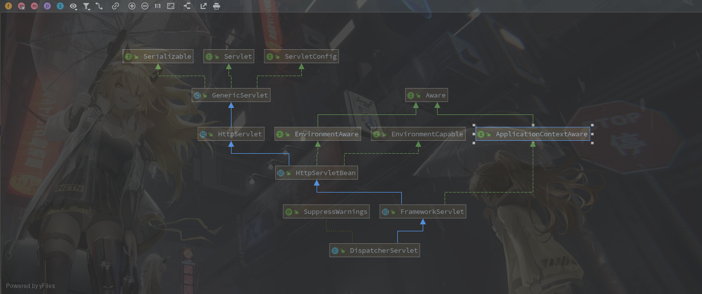

#### SpringMVC一次请求过程

​		**Java**处理请求很关键的一个类是**Servlet**，**SpringMVC**就是通过实现一个**Servlet**然后转发请求实现的，这个**Servlet**就是**DispatcherServlet**

**DispatcherServlet类图**



---

**1.**首先找到**Servlet**的**doGet**方法在

**FrameworkServlet#doGet**

```java
@Override
protected final void doGet(HttpServletRequest request, HttpServletResponse response)
    throws ServletException, IOException {

    processRequest(request, response);
}
```

**#processRequest**

```java
protected final void processRequest(HttpServletRequest request, HttpServletResponse response) throws ServletException, IOException {

    long startTime = System.currentTimeMillis();
    Throwable failureCause = null;

    //看起来是做本地化相关的
    LocaleContext previousLocaleContext = LocaleContextHolder.getLocaleContext();
    LocaleContext localeContext = buildLocaleContext(request);

    RequestAttributes previousAttributes = RequestContextHolder.getRequestAttributes();
    ServletRequestAttributes requestAttributes = buildRequestAttributes(request, response, previousAttributes);

    //特地看了下，这里是管理异步返回的
    //触发方式，controller中接口返回值使用 java.util.concurrent.Callable
    WebAsyncManager asyncManager = WebAsyncUtils.getAsyncManager(request);
    asyncManager.registerCallableInterceptor(FrameworkServlet.class.getName(), new RequestBindingInterceptor());

    //使用ThreadLocal保存 request、response、localeContext
    //通过 RequestContextHolder 和 LocaleContextHolder获取，这是不是意味着我们能够在代码的任何地方获取参数和写入返回数据
    initContextHolders(request,  localeContext, requestAttributes);

    try {
        doService(request, response);
    }
    catch (ServletException | IOException ex) {
        failureCause = ex;
        throw ex;
    }
    catch (Throwable ex) {
        failureCause = ex;
        throw new NestedServletException("Request processing failed", ex);
    }

    finally {
        resetContextHolders(request, previousLocaleContext, previousAttributes);
        if (requestAttributes != null) {
            requestAttributes.requestCompleted();
        }
        logResult(request, response, failureCause, asyncManager);
        publishRequestHandledEvent(request, response, startTime, failureCause);
    }
}
```

**2.**进入**DispatcherServlet#doService**方法

```java
@Override
protected void doService(HttpServletRequest request, HttpServletResponse response) throws Exception {
    //看方法名是日志
    logRequest(request);

    // Keep a snapshot of the request attributes in case of an include,
    // to be able to restore the original attributes after the include.
    //处理request中包含某个属性时会走进来，所以一般情况应该是不会走进来的
    Map<String, Object> attributesSnapshot = null;
    if (WebUtils.isIncludeRequest(request)) {
        attributesSnapshot = new HashMap<>();
        Enumeration<?> attrNames = request.getAttributeNames();
        while (attrNames.hasMoreElements()) {
            String attrName = (String) attrNames.nextElement();
            if (this.cleanupAfterInclude || attrName.startsWith(DEFAULT_STRATEGIES_PREFIX)) {
                attributesSnapshot.put(attrName, request.getAttribute(attrName));
            }
        }
    }

    // Make framework objects available to handlers and view objects.
    //往request中保存了一些视图对象，我们拿到request就可以获取到项目的 WebApplicationContext
    request.setAttribute(WEB_APPLICATION_CONTEXT_ATTRIBUTE, getWebApplicationContext());
    request.setAttribute(LOCALE_RESOLVER_ATTRIBUTE, this.localeResolver);
    request.setAttribute(THEME_RESOLVER_ATTRIBUTE, this.themeResolver);
    request.setAttribute(THEME_SOURCE_ATTRIBUTE, getThemeSource());

    //看名字像是处理flash的。执行过后好像对请求没有啥影响
    if (this.flashMapManager != null) {
        FlashMap inputFlashMap = this.flashMapManager.retrieveAndUpdate(request, response);
        if (inputFlashMap != null) {
            request.setAttribute(INPUT_FLASH_MAP_ATTRIBUTE, Collections.unmodifiableMap(inputFlashMap));
        }
        request.setAttribute(OUTPUT_FLASH_MAP_ATTRIBUTE, new FlashMap());
        request.setAttribute(FLASH_MAP_MANAGER_ATTRIBUTE, this.flashMapManager);
    }

    try {
        doDispatch(request, response);
    }
    finally {
        if (!WebAsyncUtils.getAsyncManager(request).isConcurrentHandlingStarted()) {
            // Restore the original attribute snapshot, in case of an include.
            if (attributesSnapshot != null) {
                restoreAttributesAfterInclude(request, attributesSnapshot);
            }
        }
    }
}
```

**3.**跳转到**#doDispatch**

```java
protected void doDispatch(HttpServletRequest request, HttpServletResponse response) throws Exception {
    HttpServletRequest processedRequest = request;
    HandlerExecutionChain mappedHandler = null;
    boolean multipartRequestParsed = false;

    WebAsyncManager asyncManager = WebAsyncUtils.getAsyncManager(request);

    try {
        ModelAndView mv = null;
        Exception dispatchException = null;

        try {
            //判断是否是文件上传请求
            processedRequest = checkMultipart(request);
            multipartRequestParsed = (processedRequest != request);

            // Determine handler for the current request.
            //获取处理请求的handle
            mappedHandler = getHandler(processedRequest);
            if (mappedHandler == null) {
                noHandlerFound(processedRequest, response);
                return;
            }

            // Determine handler adapter for the current request.
            HandlerAdapter ha = getHandlerAdapter(mappedHandler.getHandler());

            // Process last-modified header, if supported by the handler.
            String method = request.getMethod();
            boolean isGet = "GET".equals(method);
            if (isGet || "HEAD".equals(method)) {
                long lastModified = ha.getLastModified(request, mappedHandler.getHandler());
                if (new ServletWebRequest(request, response).checkNotModified(lastModified) && isGet) {
                    return;
                }
            }

            if (!mappedHandler.applyPreHandle(processedRequest, response)) {
                return;
            }

            // Actually invoke the handler.
            mv = ha.handle(processedRequest, response, mappedHandler.getHandler());

            if (asyncManager.isConcurrentHandlingStarted()) {
                return;
            }

            applyDefaultViewName(processedRequest, mv);
            mappedHandler.applyPostHandle(processedRequest, response, mv);
        }
        catch (Exception ex) {
            dispatchException = ex;
        }
        catch (Throwable err) {
            // As of 4.3, we're processing Errors thrown from handler methods as well,
            // making them available for @ExceptionHandler methods and other scenarios.
            dispatchException = new NestedServletException("Handler dispatch failed", err);
        }
        processDispatchResult(processedRequest, response, mappedHandler, mv, dispatchException);
    }
    catch (Exception ex) {
        triggerAfterCompletion(processedRequest, response, mappedHandler, ex);
    }
    catch (Throwable err) {
        triggerAfterCompletion(processedRequest, response, mappedHandler,
                               new NestedServletException("Handler processing failed", err));
    }
    finally {
        if (asyncManager.isConcurrentHandlingStarted()) {
            // Instead of postHandle and afterCompletion
            if (mappedHandler != null) {
                mappedHandler.applyAfterConcurrentHandlingStarted(processedRequest, response);
            }
        }
        else {
            // Clean up any resources used by a multipart request.
            if (multipartRequestParsed) {
                cleanupMultipart(processedRequest);
            }
        }
    }
}
```

**4.**进入**#getHandler**方法

```java
protected HandlerExecutionChain getHandler(HttpServletRequest request) throws Exception {
    //this.handlerMappings一般情况下是当前context中所有实现了 HandlerMapping 的类
   	//默认有5个。requestMappingHandlerMapping、beanNameHandlerMapping、routerFunctionMapping
    //resourceHandlerMapping、welcomePageHandlerMapping
    //测试发现一般情况下requestMappingHandlerMapping中可以找到对应处理器
    if (this.handlerMappings != null) {
        for (HandlerMapping mapping : this.handlerMappings) {
            HandlerExecutionChain handler = mapping.getHandler(request);
            if (handler != null) {
                return handler;
            }
        }
    }
    return null;
}
```

**5.**从**requestMappingHandlerMapping#getHandler**的开始，首先是父类**AbstractHandlerMapping**

**AbstractHandlerMapping#getHandler**

```java
public final HandlerExecutionChain getHandler(HttpServletRequest request) throws Exception {
    //获取请求的方法
    Object handler = getHandlerInternal(request);
    if (handler == null) {
        handler = getDefaultHandler();
    }
    if (handler == null) {
        return null;
    }
    // Bean name or resolved handler?
    if (handler instanceof String) {
        String handlerName = (String) handler;
        handler = obtainApplicationContext().getBean(handlerName);
    }

    HandlerExecutionChain executionChain = getHandlerExecutionChain(handler, request);

    if (logger.isTraceEnabled()) {
        logger.trace("Mapped to " + handler);
    }
    else if (logger.isDebugEnabled() && !request.getDispatcherType().equals(DispatcherType.ASYNC)) {
        logger.debug("Mapped to " + executionChain.getHandler());
    }

    if (hasCorsConfigurationSource(handler)) {
        CorsConfiguration config = (this.corsConfigurationSource != null ? this.corsConfigurationSource.getCorsConfiguration(request) : null);
        CorsConfiguration handlerConfig = getCorsConfiguration(handler, request);
        config = (config != null ? config.combine(handlerConfig) : handlerConfig);
        executionChain = getCorsHandlerExecutionChain(request, executionChain, config);
    }

    return executionChain;
}
```

**6.** 进入**#getHandlerInternal**方法

```java
protected HandlerMethod getHandlerInternal(HttpServletRequest request) throws Exception {
   //获取到请求路径部分.eg.localhost:8080/test,lookupPath = /test
   String lookupPath = getUrlPathHelper().getLookupPathForRequest(request);
   request.setAttribute(LOOKUP_PATH, lookupPath);
   //this.mappingRegistry中保存了项目的匹配信息，acquireReadLock方法看名字可以知道是加锁作用
   this.mappingRegistry.acquireReadLock();
   try {
      HandlerMethod handlerMethod = lookupHandlerMethod(lookupPath, request);
      return (handlerMethod != null ? handlerMethod.createWithResolvedBean() : null);
   }
   finally {
      this.mappingRegistry.releaseReadLock();
   }
}
```

**7.**进入**#lookupHandlerMethod**方法

```java
protected HandlerMethod lookupHandlerMethod(String lookupPath, HttpServletRequest request) throws Exception {
   List<Match> matches = new ArrayList<>();
    //获取所有路径匹配的方法信息，路径信息都会被转化为 RequestMappingInfo
   List<T> directPathMatches = this.mappingRegistry.getMappingsByUrl(lookupPath);
   if (directPathMatches != null) {
       //RequestMappingInfo转为Match并保存到matches中
      addMatchingMappings(directPathMatches, matches, request);
   }
   if (matches.isEmpty()) {
      // No choice but to go through all mappings...
      addMatchingMappings(this.mappingRegistry.getMappings().keySet(), matches, request);
   }

   if (!matches.isEmpty()) {
       //因为只根据url有时候会有多个匹配的方法
       //所以这里会通过request中的get，post或者requestParam之类的排序选出最匹配的方法
      Comparator<Match> comparator = new MatchComparator(getMappingComparator(request));
      matches.sort(comparator);
      Match bestMatch = matches.get(0);
      //判断过滤只能有一个方法匹配请求，否则抛出异常
      if (matches.size() > 1) {
         if (logger.isTraceEnabled()) {
            logger.trace(matches.size() + " matching mappings: " + matches);
         }
         if (CorsUtils.isPreFlightRequest(request)) {
            return PREFLIGHT_AMBIGUOUS_MATCH;
         }
         Match secondBestMatch = matches.get(1);
         if (comparator.compare(bestMatch, secondBestMatch) == 0) {
            Method m1 = bestMatch.handlerMethod.getMethod();
            Method m2 = secondBestMatch.handlerMethod.getMethod();
            String uri = request.getRequestURI();
            throw new IllegalStateException(
                  "Ambiguous handler methods mapped for '" + uri + "': {" + m1 + ", " + m2 + "}");
         }
      }
      request.setAttribute(BEST_MATCHING_HANDLER_ATTRIBUTE, bestMatch.handlerMethod);
      handleMatch(bestMatch.mapping, lookupPath, request);
      return bestMatch.handlerMethod;
   }
   else {
      return handleNoMatch(this.mappingRegistry.getMappings().keySet(), lookupPath, request);
   }
}
```

**8.**回到**AbstractHandlerMapping#getHandler**

```java
public final HandlerExecutionChain getHandler(HttpServletRequest request) throws Exception {
    //获取请求的方法
    Object handler = getHandlerInternal(request);
    //测试发现getDefaultHandler()返回的也是一个null，说明这个值应该是可以自定义设置的
    if (handler == null) {
        handler = getDefaultHandler();
    }
    if (handler == null) {
        return null;
    }
    // Bean name or resolved handler?
    //不知道什么情况会走这里
    if (handler instanceof String) {
        String handlerName = (String) handler;
        handler = obtainApplicationContext().getBean(handlerName);
    }
	
    //看名字是获取执行链，包括执行请求的具体方法和拦截器
    HandlerExecutionChain executionChain = getHandlerExecutionChain(handler, request);

    if (logger.isTraceEnabled()) {
        logger.trace("Mapped to " + handler);
    }
    else if (logger.isDebugEnabled() && !request.getDispatcherType().equals(DispatcherType.ASYNC)) {
        logger.debug("Mapped to " + executionChain.getHandler());
    }

    if (hasCorsConfigurationSource(handler)) {
        CorsConfiguration config = (this.corsConfigurationSource != null ? this.corsConfigurationSource.getCorsConfiguration(request) : null);
        CorsConfiguration handlerConfig = getCorsConfiguration(handler, request);
        config = (config != null ? config.combine(handlerConfig) : handlerConfig);
        executionChain = getCorsHandlerExecutionChain(request, executionChain, config);
    }

    return executionChain;
}
```

**9.**进入到**#getHandlerExecutionChain**方法

```java
protected HandlerExecutionChain getHandlerExecutionChain(Object handler, HttpServletRequest request) {
    HandlerExecutionChain chain = (handler instanceof HandlerExecutionChain ?
                                   (HandlerExecutionChain) handler : new HandlerExecutionChain(handler));

    String lookupPath = this.urlPathHelper.getLookupPathForRequest(request, LOOKUP_PATH);
    //adaptedInterceptors,这里有HandlerMapping初始化设置的HandlerInterceptor和Spring中继承MappedInterceptor的类，还有启动时SpringBoot配置文件 void addInterceptors(InterceptorRegistry registry)中添加的拦截器
    for (HandlerInterceptor interceptor : this.adaptedInterceptors) {
        if (interceptor instanceof MappedInterceptor) {
            MappedInterceptor mappedInterceptor = (MappedInterceptor) interceptor;
            if (mappedInterceptor.matches(lookupPath, this.pathMatcher)) {
                chain.addInterceptor(mappedInterceptor.getInterceptor());
            }
        }
        else {
            chain.addInterceptor(interceptor);
        }
    }
    //可以看到这里是在具体的执行方法上又封装了一层拦截器链
    return chain;
}
```

**10.**回到**DispatcherServlet#doDispatch**中,上边已经看到SpringMVC是如何返回一个执行器的，并且可以知道这个处理请求的类除了对应的controller执行方法，还包含拦截器信息的

```java
protected void doDispatch(HttpServletRequest request, HttpServletResponse response) throws Exception {
    HttpServletRequest processedRequest = request;
    HandlerExecutionChain mappedHandler = null;
    boolean multipartRequestParsed = false;

    WebAsyncManager asyncManager = WebAsyncUtils.getAsyncManager(request);

    try {
        ModelAndView mv = null;
        Exception dispatchException = null;

        try {
            //判断是否是文件上传请求
            processedRequest = checkMultipart(request);
            multipartRequestParsed = (processedRequest != request);

            // Determine handler for the current request.
            //获取处理请求的handle
            mappedHandler = getHandler(processedRequest);
            if (mappedHandler == null) {
                noHandlerFound(processedRequest, response);
                return;
            }

            // Determine handler adapter for the current request.
            //获取处理请求的适配类。这里是普通的get请求，RequestMappingHandlerAdapter
            HandlerAdapter ha = getHandlerAdapter(mappedHandler.getHandler());

            // Process last-modified header, if supported by the handler.
            // 看解释判断了一下请求头啥，感觉不重要，先略过
            String method = request.getMethod();
            boolean isGet = "GET".equals(method);
            if (isGet || "HEAD".equals(method)) {
                long lastModified = ha.getLastModified(request, mappedHandler.getHandler());
                if (new ServletWebRequest(request, response).checkNotModified(lastModified) && isGet) {
                    return;
                }
            }
			
            //调用所有拦截器的 preHandle 方法
            if (!mappedHandler.applyPreHandle(processedRequest, response)) {
                return;
            }

            // Actually invoke the handler.
            // 处理请求的实际地方
            mv = ha.handle(processedRequest, response, mappedHandler.getHandler());

            if (asyncManager.isConcurrentHandlingStarted()) {
                return;
            }

            applyDefaultViewName(processedRequest, mv);
            mappedHandler.applyPostHandle(processedRequest, response, mv);
        }
        catch (Exception ex) {
            dispatchException = ex;
        }
        catch (Throwable err) {
            // As of 4.3, we're processing Errors thrown from handler methods as well,
            // making them available for @ExceptionHandler methods and other scenarios.
            dispatchException = new NestedServletException("Handler dispatch failed", err);
        }
        processDispatchResult(processedRequest, response, mappedHandler, mv, dispatchException);
    }
    catch (Exception ex) {
        triggerAfterCompletion(processedRequest, response, mappedHandler, ex);
    }
    catch (Throwable err) {
        triggerAfterCompletion(processedRequest, response, mappedHandler,
                               new NestedServletException("Handler processing failed", err));
    }
    finally {
        if (asyncManager.isConcurrentHandlingStarted()) {
            // Instead of postHandle and afterCompletion
            if (mappedHandler != null) {
                mappedHandler.applyAfterConcurrentHandlingStarted(processedRequest, response);
            }
        }
        else {
            // Clean up any resources used by a multipart request.
            if (multipartRequestParsed) {
                cleanupMultipart(processedRequest);
            }
        }
    }
}
```

**11.**从**ha.handle**跟踪跳转，中间有跳过几步不是很重要的地方，可以来到具体的实现类**RequestMappingHandlerAdapter#invokeHandlerMethod**

```java
protected ModelAndView invokeHandlerMethod(HttpServletRequest request,
          HttpServletResponse response, HandlerMethod handlerMethod) throws Exception {

    ServletWebRequest webRequest = new ServletWebRequest(request, response);
    try {
        //这里会获取所有使用 @InitBinder 的方法，百度了下这是处理请求参数绑定用的
        WebDataBinderFactory binderFactory = getDataBinderFactory(handlerMethod);
        //获取到有 @RequestMapping和@ModelAttribute修饰的方法
        ModelFactory modelFactory = getModelFactory(handlerMethod, binderFactory);

        //类似包装类将执行参数封装一下
        ServletInvocableHandlerMethod invocableMethod = createInvocableHandlerMethod(handlerMethod);
        //解析参数的处理器，可以自定义注解和参数解析处理
        if (this.argumentResolvers != null) {
            invocableMethod.setHandlerMethodArgumentResolvers(this.argumentResolvers);
        }
        //返回值处理，controller返回的数据还需要经过处理
        if (this.returnValueHandlers != null) {
           invocableMethod.setHandlerMethodReturnValueHandlers(this.returnValueHandlers);
        }
        invocableMethod.setDataBinderFactory(binderFactory);
        invocableMethod.setParameterNameDiscoverer(this.parameterNameDiscoverer);

        ModelAndViewContainer mavContainer = new ModelAndViewContainer();
        mavContainer.addAllAttributes(RequestContextUtils.getInputFlashMap(request));
        modelFactory.initModel(webRequest, mavContainer, invocableMethod);
        mavContainer.setIgnoreDefaultModelOnRedirect(this.ignoreDefaultModelOnRedirect);

        AsyncWebRequest asyncWebRequest = WebAsyncUtils.createAsyncWebRequest(request, response);
        asyncWebRequest.setTimeout(this.asyncRequestTimeout);

        WebAsyncManager asyncManager = WebAsyncUtils.getAsyncManager(request);
        asyncManager.setTaskExecutor(this.taskExecutor);
        asyncManager.setAsyncWebRequest(asyncWebRequest);
        asyncManager.registerCallableInterceptors(this.callableInterceptors);
        asyncManager.registerDeferredResultInterceptors(this.deferredResultInterceptors);

        if (asyncManager.hasConcurrentResult()) {
            Object result = asyncManager.getConcurrentResult();
            mavContainer = (ModelAndViewContainer) asyncManager.getConcurrentResultContext()[0];
            asyncManager.clearConcurrentResult();
            LogFormatUtils.traceDebug(logger, traceOn -> {
                String formatted = LogFormatUtils.formatValue(result, !traceOn);
                return "Resume with async result [" + formatted + "]";
            });
            invocableMethod = invocableMethod.wrapConcurrentResult(result);
        }

        invocableMethod.invokeAndHandle(webRequest, mavContainer);
        if (asyncManager.isConcurrentHandlingStarted()) {
            return null;
        }

        return getModelAndView(mavContainer, modelFactory, webRequest);
    }
    finally {
        webRequest.requestCompleted();
    }
}
```

