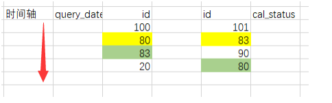

### Mysql死锁问题排查

mysql错误日志

```
2019-08-13 00:00:24 7ef2c4823700InnoDB: transactions deadlock detected, dumping detailed information.
2019-08-13 00:00:24 7ef2c4823700
*** (1) TRANSACTION:
TRANSACTION 19738601606, ACTIVE 0 sec starting index read
mysql tables in use 3, locked 3
LOCK WAIT 5 lock struct(s), heap size 1184, 129 row lock(s)
MySQL thread id 65417558, OS thread handle 0x7ef29d00d700, query id 27263465932 10.203.33.192 JR_debt_idc
Searching rows for update
UPDATE t_debt_worth_total
 SET cal_status = 3,


 error_count = 1,


 remark = '!batchNo=3503',

 update_time = NOW()
 WHERE query_date = '2019-08-13'
 AND batch_no = '3503'
 AND cal_status = 1
*** (1) WAITING FOR THIS LOCK TO BE GRANTED:
RECORD LOCKS space id 759 page no 20860 n bits 280 index `PRIMARY` of table `finance_debt_cs`.
`t_debt_worth_total` trx id 19738601606 lock_mode X locks rec but not gap waiting
Record lock, heap no 208 PHYSICAL RECORD: n_fields 15; compact format; info bits 0
*** (2) TRANSACTION:
TRANSACTION 19738601608, ACTIVE 0 sec updating or deleting
mysql tables in use 1, locked 1
4 lock struct(s), heap size 1184, 3 row lock(s), undo log entries 1
MySQL thread id 65396940, OS thread handle 0x7ef2c4823700, query id 27263465933 10.202.160.119 JR_debt_idc
updating
UPDATE t_debt_worth_total
 SET cal_status = 2,


 error_count = 0,


 remark = '',

 update_time = NOW()
 WHERE query_date = '2019-08-13'
 AND batch_no = '3539'
*** (2) HOLDS THE LOCK(S):
RECORD LOCKS space id 759 page no 20860 n bits 280 index `PRIMARY` of table `finance_debt_cs`.
`t_debt_worth_total` trx id 19738601608 lock_mode X locks rec but not gap
Record lock, heap no 208 PHYSICAL RECORD: n_fields 15; compact format; info bits 0
*** (2) WAITING FOR THIS LOCK TO BE GRANTED:
RECORD LOCKS space id 759 page no 20963 n bits 1160 index `idx_cal_status` of table `finance_debt_cs`.
`t_debt_worth_total` trx id 19738601608 lock_mode X locks rec but not gap waiting
Record lock, heap no 103 PHYSICAL RECORD: n_fields 2; compact format; info bits 0
 0: len 1; hex 81; asc ;;
 1: len 8; hex 8000000000cb2f38; asc /8;;
*** WE ROLL BACK TRANSACTION (2)
```

分析死锁日志，事务1和事务2都是更新 t_debt_worth_total 表。 更新获取的是X锁，可能更新的数据有冲突，获取锁的顺序不一样，导致死锁了。
因为MySQL从索引开始加锁，需要分析一下这张表的索引。

```
mysql> show index from t_debt_worth_total ;
+--------------------+------------+------------------------+--------------+-------------+-----------
+-------------+----------+--------+------+------------+---------+---------------+
| Table | Non_unique | Key_name | Seq_in_index | Column_name | Collation |
Cardinality | Sub_part | Packed | Null | Index_type | Comment | Index_comment |
+--------------------+------------+------------------------+--------------+-------------+-----------
+-------------+----------+--------+------+------------+---------+---------------+
| t_debt_worth_total | 0 | PRIMARY | 1 | id | A |
2395422 | NULL | NULL | | BTREE | | |
| t_debt_worth_total | 0 | uk_query_date_batch_no | 1 | query_date | A |
20 | NULL | NULL | | BTREE | | |
| t_debt_worth_total | 0 | uk_query_date_batch_no | 2 | batch_no | A |
2395422 | NULL | NULL | YES | BTREE | | |
| t_debt_worth_total | 0 | index_cal_status | 1 | cal_status | A |
6 | NULL | NULL | | BTREE | | |
+--------------------+------------+------------------------+--------------+-------------+-----------
+-------------+----------+--------+------+------------+---------+---------------+

```

该表有3个索引，其中 （query_date，batch_no ）组合索引，cal_status单独索引。
结合死锁信息分析。

原因很明确了，第一个事务根据cal_status索引查询并锁定，第二个事务根据组合索引查询并锁定，它们锁定的数据有冲突，并且获取锁的顺序不一样。就造成死锁了。

推演：
文字难以说明白，我们画个图演算一下：



假设事务1根据cal_status查询并获取锁，事务2根据组合索引查询并获取锁
它们都先取得了索引锁，然后，它们会返表获取行锁。
但是索引不同，根据索引获取的id顺序也是不一样的（如果是同样的索引，返表获取锁的顺序一样，会造成排队，不会死锁）
1、事务1锁定id=100，事务2锁定id=101
2、事务1锁定id=80，事务2锁定id=83
3、事务1获取锁id=83（得不到，这里就停下来排队了），事务2获取锁id=90
4、事务1暂停，事务2获取锁id=80， 这时候，MySQL锁关联图（wait-for graph）就会发现事务1和事务2冲突，死锁。
5、MySQL选择重要性比较小的事务回滚


####	问题原因

>因为创建了两个让MySQL都可能选中的索引，锁的顺序不一致造成死锁

#### 解决方案

> 删除cal_status锁，从此不再发生死锁。

#### 总结

- 状态字段不建议创建索引，非常不稳定，仅当status=? 查询到的行数非常少的时候生效，因此索引效果时有时无
- update条件中注意不要包含两个索引的条件，这样容易造成update走不同索引，锁定数据的顺序不一样，造成死锁